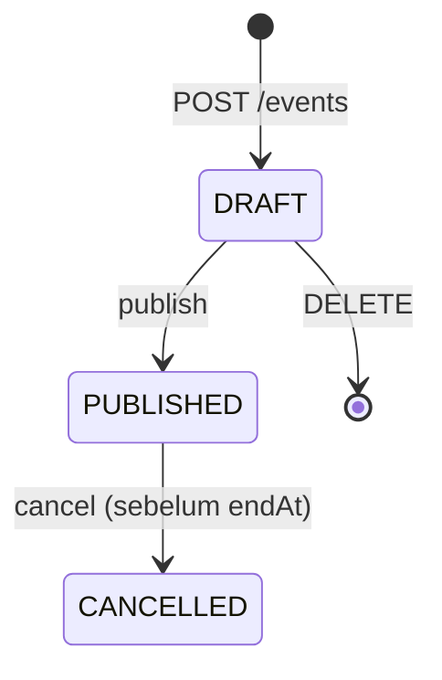
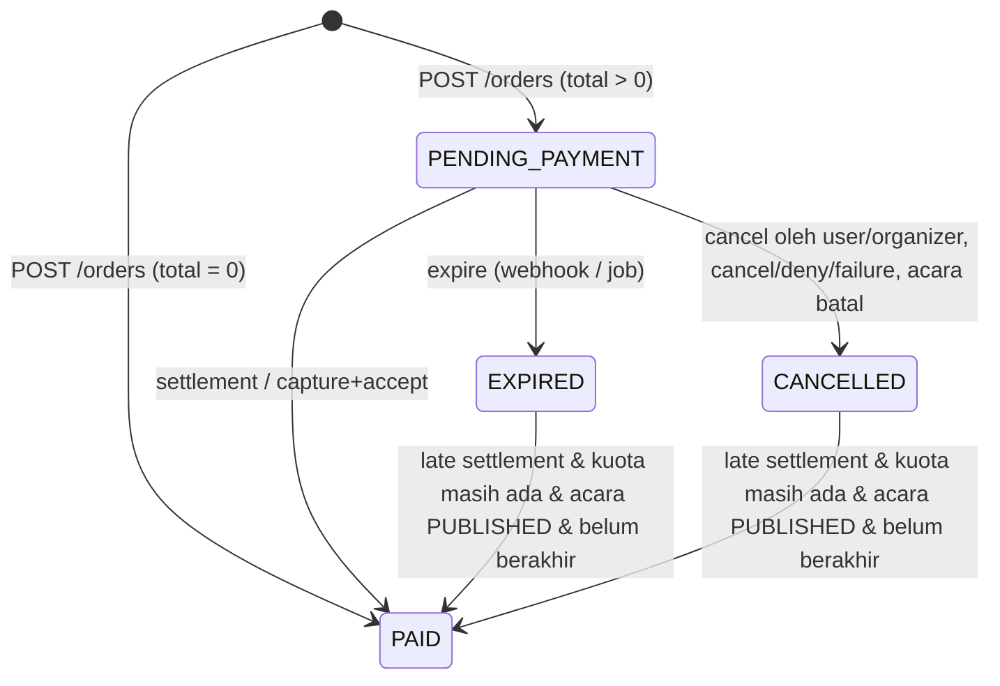
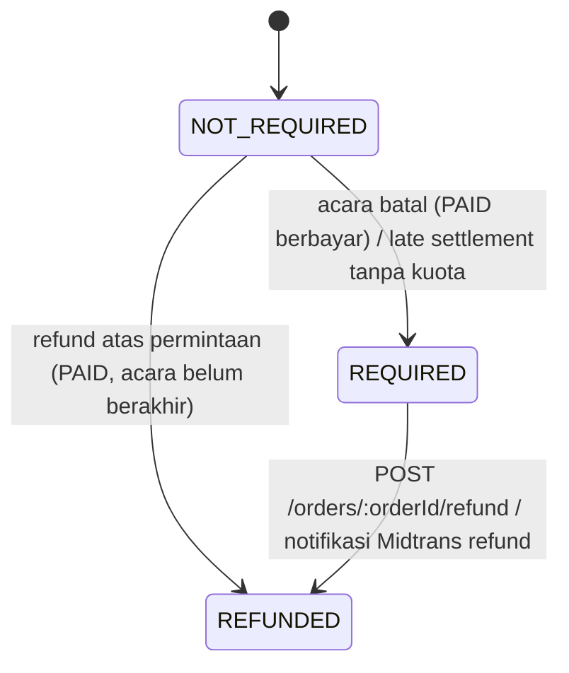
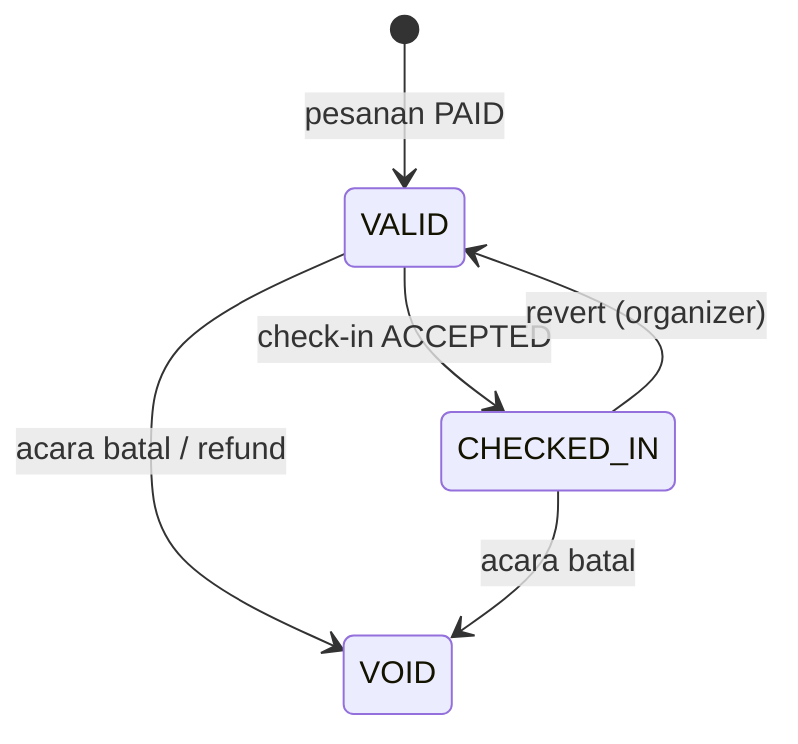

# API Contract — PassGo Backend

> Versi kontrak: **v1 (draft)** · Base URL: `/api/v1` · Terakhir diperbarui: 2026-09-25
> Konteks desain: [`architecture.md`](./architecture.md). Riwayat perubahan: [§14](#14-versioning--changelog).

## Daftar Isi
1. [Konvensi Umum](#1-konvensi-umum)
2. [Autentikasi & Otorisasi](#2-autentikasi--otorisasi)
3. [Format Error](#3-format-error)
4. [Pagination, Filter, Sort](#4-pagination-filter-sort)
5. [Idempotency](#5-idempotency)
6. [Concurrency Control](#6-concurrency-control)
7. [Rate Limiting](#7-rate-limiting)
8. [Skema Bersama](#8-skema-bersama)
9. [Endpoint](#9-endpoint)
   - [Health](#91-health) · [Auth](#92-auth) · [Me](#93-me) · [Users](#94-users) · [Events](#95-events) · [Ticket Types](#96-ticket-types) · [Event Staff](#97-event-staff) · [Orders](#98-orders) · [Midtrans Webhook](#99-midtrans-webhook) · [Tickets](#910-tickets) · [Attendees](#911-attendees) · [Check-ins](#912-check-ins) · [Reports](#913-reports) · [Audit Logs](#914-audit-logs)
10. [Ringkasan Endpoint](#10-ringkasan-endpoint)
11. [Enum & State Machine](#11-enum--state-machine)
12. [Kode Error](#12-kode-error)
13. [Di Luar Lingkup Kontrak Ini](#13-di-luar-lingkup-kontrak-ini)
14. [Versioning & Changelog](#14-versioning--changelog)

---

## 1. Konvensi Umum

| Aspek | Aturan |
|---|---|
| Protokol | HTTPS di produksi. HTTP hanya untuk `localhost`. |
| Media type | Request & response `application/json; charset=utf-8`. `PATCH` juga menerima `application/merge-patch+json` (§1.3). Pengecualian: upload poster `multipart/form-data` (§9.5), ekspor CSV/XLSX (§9.11), error (§3). |
| Penamaan field | `camelCase`. Pengecualian: body webhook Midtrans (format pihak ketiga). |
| Penamaan path | `kebab-case`, kata benda jamak (`/events`, `/ticket-types`, `/check-ins`). Aksi yang bukan CRUD memakai sub-resource kata kerja: `POST /events/:eventId/publish`. Parameter path diberi nama lengkap (`:eventId`, `:ticketTypeId`, `:orderId`), tidak pernah `:id` polos. |
| ID | UUID **v7** (RFC 9562) string. Terurut waktu → cursor & index lebih efisien. Konsekuensi: waktu pembuatan bisa diketahui dari ID (bukan data rahasia di sistem ini). |
| Kode yang terlihat manusia | `orderNumber` (`PG-7K2M9XDQ4R`) dan `Ticket.code` (`7K2M-9XDQ-4R8B-3N5P`) memakai Crockford base32. Keduanya **bukan** pengganti ID di path. |
| Uang | **Integer Rupiah** (`150000` = Rp150.000). Tidak ada desimal. |
| Timestamp | RFC 3339 UTC dengan `Z`, presisi milidetik: `2026-10-10T12:00:00.000Z`. Server **menerima** offset lain (`+07:00`) dan menormalisasi ke UTC. |
| Zona waktu | Setiap acara punya `timezone` (IANA, default `Asia/Jakarta`). FE menampilkan waktu acara dalam zona acara, bukan zona perangkat. |
| Tanggal (filter/laporan) | `YYYY-MM-DD`, ditafsirkan dalam `APP_TIMEZONE` (`Asia/Jakarta`), kecuali laporan per acara yang memakai zona acara. |
| Referensi antar-objek | Pada proyeksi memakai pasangan `<entitas>Id` + `<entitas>Name`/`Title`, mis. `ticketTypeId` + `ticketTypeName`, `eventId` + `eventTitle`. Referensi user memakai `UserRef` (§8). |
| Response | Setiap field di skema **selalu ada**; nilai kosong dikirim `null`, bukan dihilangkan. Field yang disembunyikan untuk peran tertentu juga dikirim `null` (dinyatakan di skema). |
| Field tak dikenal di request | Ditolak `422 validation-error` (mencegah *mass assignment*, mis. peserta mengirim `price` atau `status`). |
| String | Di-*trim*; string kosong setelah *trim* pada field *nullable* dianggap `null`. Email di-*lowercase*. |
| Envelope sukses | `{ "data": <objek|array>, "meta": { ... } }`. `meta` opsional pada resource tunggal. |
| Envelope error | `application/problem+json` (RFC 9457), §3 |
| Trailing slash | Tidak dipakai |
| Batas body | JSON 100 KB; multipart 2 MB. Lebih → `413 payload-too-large`. |

### 1.1 Header

| Header | Arah | Keterangan |
|---|---|---|
| `Authorization: Bearer <accessToken>` | Req | Endpoint bertanda 👤 / 🎟️ / 🧑‍💼 / 👑, dan opsional pada 🔓 yang hasilnya bergantung peran |
| `X-Request-Id` | Req/Res | Opsional di request; diterima hanya bila cocok `^[A-Za-z0-9-]{1,64}$` (selain itu diganti server, mencegah *log injection*). Selalu dikembalikan. Format bawaan server: UUID v7. |
| `Idempotency-Key` | Req | Wajib pada endpoint 🔁 (§5) |
| `If-Match` | Req | Wajib pada endpoint 🔒 (§6) |
| `If-None-Match` | Req | Opsional pada GET resource ber-`ETag` → `304` |
| `X-Requested-With: fetch` | Req | Wajib pada endpoint 🍪 (proteksi CSRF, §2.4) |
| `ETag` | Res | Versi resource (strong), §6 |
| `Location` | Res | URL resource baru pada `201 Created` |
| `RateLimit`, `RateLimit-Policy`, `Retry-After` | Res | §7 |
| `Idempotent-Replayed: true` | Res | §5 (non-standar, konvensi Stripe) |
| `WWW-Authenticate` | Res | Selalu ada pada `401` (RFC 9110 §15.5.2) |
| `Cache-Control` | Res | `no-store` pada semua response ber-`Authorization`; `public, max-age=60` pada katalog publik tanpa token (§9.5) |
| `Vary` | Res | `Authorization` pada endpoint 🔓 yang hasilnya bergantung peran |
| `Content-Disposition` | Res | Ekspor (§9.11) |
| `Deprecation`, `Sunset`, `Link` | Res | §14 |

### 1.2 Deployment & CORS

- **Frontend dan API wajib *same-site*** (satu *registrable domain*, mis. `passgo.id` + `api.passgo.id`), **atau** (direkomendasikan) FE mem-*proxy* `/api/*` lewat Next.js `rewrites` sehingga *same-origin*. Deployment lintas-site (mis. `*.vercel.app` → `*.railway.app`; `vercel.app` ada di Public Suffix List) **tidak didukung** karena cookie refresh `SameSite=Strict` tidak akan terkirim.
- Bila tidak di-*proxy* (cross-origin tapi same-site), server mengirim:
  - `Access-Control-Allow-Origin: <origin dari allowlist>` (tidak pernah `*`) dan `Access-Control-Allow-Credentials: true`
  - `Access-Control-Allow-Headers: Authorization, Content-Type, If-Match, X-If-Match, If-None-Match, Idempotency-Key, X-Request-Id, X-Requested-With`
  - `Access-Control-Expose-Headers: ETag, Location, RateLimit, RateLimit-Policy, Retry-After, X-Request-Id, Idempotent-Replayed, Deprecation, Sunset, Content-Disposition`

  Tanpa `Expose-Headers`, JavaScript tidak bisa membaca `ETag` sehingga alur `If-Match` gagal. Sebagai cadangan, setiap resource ber-versi juga mengembalikan `version` di body, dan `If-Match: "<version>"` boleh dibentuk FE dari field tersebut.
- Webhook Midtrans (§9.9) dipanggil *server-to-server*; tidak terkena CORS.

### 1.3 Semantik PATCH

`PATCH` mengikuti **JSON Merge Patch (RFC 7396)**: field tidak dikirim = tidak berubah; `null` = kosongkan (hanya untuk field *nullable*, mis. `mapsUrl`, `capacity`; `null` pada field wajib → `422`). `application/json` diterima dan diperlakukan identik dengan `application/merge-patch+json`. Body kosong `{}` → `422 validation-error`.

### 1.4 Status code

| Kode | Makna dalam API ini |
|---|---|
| 200 | Sukses dengan body |
| 201 | Resource dibuat (+ `Location`) |
| 202 | Diterima untuk diproses asinkron (email) |
| 204 | Sukses tanpa body |
| 304 | `If-None-Match` cocok |
| 400 | Body tidak bisa di-*parse*, atau `Idempotency-Key` hilang/tidak valid |
| 401 | Tidak terautentikasi (token tidak ada/invalid/kedaluwarsa/dicabut). Selalu dengan `WWW-Authenticate: Bearer realm="passgo"` (+ `error="invalid_token", error_description="token expired"` bila token ada tapi ditolak; RFC 6750 §3) |
| 403 | Terautentikasi tapi peran tidak berwenang; juga cek CSRF gagal, email belum diverifikasi, signature webhook invalid. `WWW-Authenticate: … error="insufficient_scope"` **tidak** dikirim, karena otorisasi berbasis peran, bukan OAuth scope |
| 404 | Resource tidak ada **atau** di luar cakupan akses pemanggil (menghindari kebocoran informasi, RFC 9110 §15.5.5) |
| 409 | Konflik state bisnis (kuota habis, tiket sudah dipakai, status tidak sesuai) |
| 412 | `If-Match` tidak cocok dengan versi terkini |
| 413 | Body/berkas terlalu besar |
| 415 | `Content-Type` tidak didukung (termasuk tipe berkas poster). Untuk `PATCH` disertai `Accept-Patch: application/merge-patch+json, application/json` |
| 422 | Validasi field / aturan bisnis pada input gagal |
| 428 | `If-Match` wajib tapi tidak dikirim (RFC 6585) |
| 429 | Rate limit |
| 500 | Error tak terduga |
| 502 | Payment gateway / storage gagal atau timeout |
| 503 | Dependency (DB) tidak siap |

**Aturan error implisit** (tidak diulang di tiap endpoint):
- Endpoint yang butuh login dapat mengembalikan `401`. Endpoint yang dibatasi peran dapat mengembalikan `403 forbidden` untuk peran lain.
- Endpoint dengan parameter path dapat mengembalikan `404 <resource>-not-found`. Parameter ID yang bukan UUID → `404` (bukan `422`).
- Endpoint dengan body dapat mengembalikan `400 malformed-request`, `413`, `415`, `422 validation-error`.
- Semua endpoint dapat mengembalikan `429`, `500`, `503`.
- Route yang tidak ada → `404 route-not-found`; method tidak didukung pada route yang ada → `405 method-not-allowed` + header `Allow` (Express 5 tidak melakukannya otomatis; ditangani handler per router).

---

## 2. Autentikasi & Otorisasi

### 2.1 Legenda akses

| Tanda | Arti |
|---|---|
| 🔓 | Publik (token opsional; bila dikirim dan valid, cakupan mengikuti peran) |
| 🍪 | Hanya butuh cookie refresh + header CSRF (§2.4); tanpa access token |
| 👤 | User login, peran apa pun |
| 🎟️ | Hanya `ATTENDEE` |
| 🧑‍💼 | `ORGANIZER`, atau `STAFF` yang **ditugaskan** pada acara di path (§2.5) |
| 👑 | Hanya `ORGANIZER` |
| 🔏 | Signature Midtrans (§9.9) |
| 🔁 | Butuh `Idempotency-Key` (§5) |
| 🔒 | Butuh `If-Match` (§6) |
| ✉️ | Butuh email terverifikasi (`403 email-not-verified`) |

### 2.2 Access token

- JWT, `alg: HS256`, header `typ: at+jwt` (mengikuti RFC 9068 secara parsial: klaim `client_id` tidak dipakai karena hanya ada satu klien first-party; ini bukan profil RFC 9068 penuh). Verifikasi dengan `algorithms: ['HS256']`, `issuer`, dan `audience` yang dipin (RFC 8725). `jsonwebtoken` tidak memeriksa `typ`, sehingga dipanggil dengan `complete: true` lalu `header.typ === 'at+jwt'` dicek manual (mencegah token jenis lain yang ditandatangani secret sama diterima sebagai access token). Secret acak ≥ 256 bit, bukan password.
- Klaim: `iss` (`passgo-api`), `aud` (`passgo`), `sub` (userId), `role`, `ver` (tokenVersion), `iat`, `exp` (+15 menit), `jti`.
- **Pencabutan instan:** middleware `authenticate` membaca user berdasarkan `sub` pada setiap request (di-index PK) dan menolak bila `isActive = false` atau `tokenVersion ≠ ver` → `401 token-revoked`. **Peran diambil dari DB, bukan dari klaim**; klaim `role` hanya untuk kebutuhan UI di FE.
- `tokenVersion` dinaikkan ketika: user dinonaktifkan, peran diubah, password diganti/di-reset, `logout-all`.
- FE menyimpan access token **di memori**, bukan `localStorage`.
- Pada endpoint 🔓, token yang **dikirim tetapi invalid** tetap menghasilkan `401` (bukan diperlakukan sebagai tamu), agar FE tahu harus refresh.

### 2.3 Refresh token

- String acak opak 256 bit; server hanya menyimpan hash SHA-256-nya.
- Cookie: `__Secure-refresh_token=<token>; HttpOnly; Secure; SameSite=Strict; Path=/api/v1/auth; Max-Age=604800` (7 hari). Prefix `__Host-` tidak dipakai karena mensyaratkan `Path=/`. `localhost` dianggap *secure context* oleh browser modern sehingga cookie `Secure` tetap berfungsi saat development.
- **Rotasi:** setiap `POST /auth/refresh` menerbitkan refresh token baru dan mencabut yang lama (RFC 9700 §4.14.2).
- **Deteksi pemakaian ulang:** token yang sudah dirotasi dipakai lagi → seluruh *family* dicabut, `401 refresh-token-reused`. Pengecualian: *grace period* **10 detik** untuk token tepat sebelumnya (menangani dua tab yang me-*refresh* bersamaan); server mengembalikan access token baru tanpa merotasi lagi.
- FE wajib melakukan refresh secara *single-flight* (satu refresh berjalan untuk semua request yang gagal; lintas tab via `BroadcastChannel`/Web Locks).
- FE memanggil refresh saat menerima `401` dengan `code` `token-expired`. Untuk `token-revoked` atau `refresh-token-*`, FE langsung ke halaman login.

### 2.4 CSRF

Endpoint 🍪 (`/auth/refresh`, `/auth/logout`) diautentikasi hanya dengan cookie, sehingga server mewajibkan:
1. Header `Origin` ada dan termasuk allowlist (`CSRF_ALLOWED_ORIGINS`), **dan**
2. Header `X-Requested-With: fetch` (header kustom memaksa *preflight* pada request lintas-origin).

Gagal → `403 csrf-check-failed`. Endpoint lain memakai `Authorization: Bearer` sehingga tidak rentan CSRF.

### 2.5 Otorisasi & pemaksaan cakupan

Otorisasi berlapis: (1) peran di tingkat route, (2) kepemilikan/penugasan di service.

- **🧑‍💼 (organizer atau staff yang ditugaskan):** untuk `STAFF`, `eventId` di path harus ada di `EventStaff` miliknya; bila tidak → `404 event-not-found` (bukan `403`), sehingga staff tidak bisa memetakan acara lain.
- **Kepemilikan:** ATTENDEE yang mengakses pesanan/tiket orang lain → `404 order-not-found` / `404 ticket-not-found`.
- **Pemaksaan filter diam-diam** (bukan `403`) agar FE bisa memakai komponen yang sama lintas peran. Filter yang benar-benar diterapkan dikembalikan di `meta.appliedFilters`.

| Endpoint | Pemaksaan |
|---|---|
| `GET /events` (tamu, ATTENDEE, STAFF) | `status=PUBLISHED,CANCELLED` |
| `GET /events/:eventId`, `GET /events/by-slug/:slug`, `GET /events/:eventId/ticket-types[/:ticketTypeId]` (non-organizer) | Acara `DRAFT` → `404 event-not-found`; tipe tiket `isActive=false` disembunyikan dari list dan → `404 ticket-type-not-found` pada GET tunggal |
| `GET /me/assigned-events` (STAFF) | Hanya acara `PUBLISHED`/`CANCELLED` tempat ia ditugaskan |
| `GET /orders` (ATTENDEE) | `userId=<dirinya>` |
| `GET /events/:eventId/attendees` (STAFF) | Field sensitif di-*mask* (§8 `Attendee`) |
| `GET /events/:eventId/check-ins[/:checkInId]` (STAFF) | `scannedById=<dirinya>` (check-in orang lain → `404 check-in-not-found`) |
| `GET /events/:eventId/reports/attendance` (STAFF) | Tidak dibatasi: agregat seluruh acara, tanpa data pribadi |

---

## 3. Format Error

Semua error memakai **RFC 9457 Problem Details**, `Content-Type: application/problem+json`.

```json
{
  "type": "https://github.com/gadicandra/PassGo/blob/main/docs/api-contract.md#quota-exceeded",
  "title": "Quota exceeded",
  "status": 409,
  "detail": "Kuota tiket VIP tidak mencukupi.",
  "instance": "urn:uuid:0192a3b4-5c6d-7e8f-9a0b-1c2d3e4f5a6b",
  "code": "quota-exceeded",
  "requestId": "0192a3b4-5c6d-7e8f-9a0b-1c2d3e4f5a6b",
  "errors": [
    { "pointer": "#/items/1/quantity", "detail": "Tersisa 1 tiket", "ticketTypeId": "0192…", "available": 1 }
  ]
}
```

| Member | Keterangan |
|---|---|
| `type` | URI dokumentasi jenis error: `<PROBLEM_TYPE_BASE>#<code>` (default menunjuk ke §12 dokumen ini). Stabil per `code`. |
| `title` | Ringkasan singkat (Inggris), stabil per `type` |
| `status` | Sama dengan status HTTP |
| `detail` | Penjelasan untuk manusia (Bahasa Indonesia), boleh berubah; jangan di-*parse* FE |
| `instance` | `urn:uuid:<requestId>`, identitas kejadian error ini |
| `code` | *Extension*: kode mesin untuk *branching* di FE (§12) |
| `requestId` | *Extension*: korelasi dengan log server |
| `errors[]` | *Extension*, opsional. Setiap elemen punya `pointer` (JSON Pointer RFC 6901 dalam bentuk fragmen URI, menunjuk ke body request; untuk query param: `pointer` diganti `parameter: "<nama>"`) dan `detail`; anggota tambahan per `code` didefinisikan di endpoint terkait |
| `current` | *Extension*, hanya pada `412` (§6) |
| *lainnya* | *Extension* spesifik per `code` didokumentasikan di endpoint (mis. `checkIn` pada `ticket-already-checked-in`, `orderId` pada `pending-order-exists`) |

Pada `NODE_ENV=production`, stack trace dan pesan error internal **tidak pernah** dikirim.

---

## 4. Pagination, Filter, Sort

### 4.1 Offset — untuk data yang dijelajah/diurutkan (`/users`, `/events`, `/events/:eventId/attendees`)
```
GET /events?page=2&pageSize=20&sort=startAt
```
| Param | Default | Batas |
|---|---|---|
| `page` | 1 | ≥ 1 |
| `pageSize` | 20 | 1–100 |
| `sort` | per endpoint | Field dipisah koma, awalan `-` = descending. Hanya field yang di-*whitelist* per endpoint; selain itu `422`. `id` selalu ditambahkan sebagai *tiebreaker*. |

```json
{ "data": [], "meta": { "page": 2, "pageSize": 20, "totalItems": 134, "totalPages": 7, "sort": "startAt", "appliedFilters": {} } }
```

### 4.2 Cursor — untuk data yang terus bertambah (`/orders`, `/tickets`, `/events/:eventId/check-ins`, `/audit-logs`)
```
GET /orders?limit=50&cursor=eyJpZCI6Ii4uLiJ9
```
| Param | Default | Batas |
|---|---|---|
| `limit` | 50 | 1–100 |
| `cursor` | – | Opak; ambil dari `meta.nextCursor`. Cursor terikat pada filter; filter berbeda → `422 cursor-invalid` |

Urutan tetap `id` descending (UUID v7 = urutan waktu pembuatan).
```json
{ "data": [], "meta": { "limit": 50, "nextCursor": "eyJ...", "hasMore": true, "appliedFilters": {} } }
```

### 4.3 Tanpa pagination
`/events/:eventId/ticket-types`, `/events/:eventId/staff`, `/me/assigned-events` mengembalikan seluruh data (jumlahnya kecil) dengan `meta.totalItems`.

### 4.4 Filter
Query param datar (`?status=PAID&eventId=...`). Nilai jamak dipisah koma (`status=PAID,EXPIRED`). Param yang sama diulang (`?status=PAID&status=EXPIRED`) → `422 validation-failed`; Express 5 mem-parse-nya menjadi array, dan validator menolak array agar hanya ada satu bentuk. Enum di query peka huruf besar (sama persis dengan §11). Rentang waktu: `from` & `to` (`YYYY-MM-DD`, inklusif, zona `APP_TIMEZONE`); `from > to` → `422`. Pencarian teks: `q` (min. 2 karakter, *case-insensitive*, *substring*).

---

## 5. Idempotency

Mengacu pada `draft-ietf-httpapi-idempotency-key-header-07`.

- Endpoint 🔁 **wajib** mengirim `Idempotency-Key: "<uuid>"` (Structured Field String; nilai tanpa tanda kutip juga diterima). FE membuat key baru **per aksi pengguna** (mis. per klik "Bayar"), dan memakai key yang sama untuk setiap *retry* aksi tersebut.
- Cakupan key: `(userId, method, path)`. *Fingerprint* request: SHA-256 dari body yang dikanonisasi.
- Response yang disimpan: status `2xx` dan `4xx` (kecuali `409 idempotency-in-progress` dan `429`). Response `5xx` (termasuk `502` Midtrans) **tidak** disimpan, sehingga retry diproses ulang.
- Masa simpan: 24 jam.

| Situasi | Perilaku |
|---|---|
| Key baru | Diproses normal |
| Key sama + fingerprint sama, sudah selesai | Response tersimpan dikembalikan apa adanya + `Idempotent-Replayed: true` |
| Key sama + fingerprint berbeda | `422 idempotency-key-reused` |
| Key sama, request pertama masih diproses | `409 idempotency-in-progress` + `Retry-After: 1` |
| Header tidak ada / bukan UUID | `400 idempotency-key-required` |

> Mengapa `POST /orders` wajib 🔁: jaringan HP peserta sering putus tepat setelah klik "Bayar". Tanpa key, retry membuat pesanan kedua yang menahan kuota (meskipun dibatasi `pending-order-exists`, peserta akan melihat error alih-alih pesanan pertamanya).

---

## 6. Concurrency Control

Resource yang bisa diedit bersamaan (**User, Event, TicketType, Ticket**) memiliki `version` (integer, naik tiap perubahan).

- GET mengembalikan `ETag: "<version>"` (strong ETag, RFC 9110 §8.8.3) dan mendukung `If-None-Match` → `304`. Respons `304` mengulang header `ETag` dan `Cache-Control` (RFC 9110 §15.4.5).
- ETag bawaan Express (weak, hash body) **dimatikan**: `app.set('etag', false)`. ETag hanya diset eksplisit oleh controller dari `version`, sehingga nilai yang dikirim ke `If-Match` selalu cocok dengan versi DB.
- Endpoint 🔒 wajib `If-Match: "<version>"`, dibandingkan secara *strong* (RFC 9110 §13.1.1); `W/"…"` tidak pernah cocok → `412`.
  - Tidak dikirim, atau `If-Match: *` → `428 precondition-required`. Menolak `*` adalah **kebijakan PassGo** (menyimpang dari RFC 9110, yang menganggap `*` cocok bila resource ada), agar klien tidak bisa melewati *lost-update protection*.
  - Tidak cocok → `412 precondition-failed`, dengan header `ETag` versi terkini dan body:
    ```json
    {
      "type": "…#precondition-failed", "title": "Precondition failed", "status": 412,
      "code": "precondition-failed", "detail": "Data telah diubah oleh pengguna lain.",
      "instance": "urn:uuid:…", "requestId": "…",
      "current": { "…": "resource utuh seperti response GET" }
    }
    ```
- Response list tidak menyertakan `ETag` per item; gunakan field `version` dari body (§1.2).
- `X-If-Match` adalah alias `If-Match` dengan format & aturan identik (dipakai bila `If-Match` absen). **Wajib dipakai pada deployment Vercel**: edge Vercel mengevaluasi sendiri setiap request ber-`If-Match` dan membalas `412 PRECONDITION_FAILED` (`text/plain`, header `x-vercel-error`) — bahkan untuk GET — sementara function tetap dijalankan sehingga write-nya tersimpan.

**Kuota dan check-in tidak memakai mekanisme ini.** `soldCount`/`reservedCount` dan status check-in diubah secara atomik oleh server (`findOneAndUpdate` kondisional) dan **tidak menaikkan `version`**, sehingga organizer yang sedang mengedit deskripsi tipe tiket tidak terkena `412` hanya karena ada penjualan.

---

## 7. Rate Limiting

Header mengikuti `draft-ietf-httpapi-ratelimit-headers-08` (Structured Fields, RFC 9651); draft berikutnya belum mengubah sintaks yang dipakai di sini. Implementasi: `express-rate-limit` dengan `standardHeaders: 'draft-8'`, `legacyHeaders: false`, `identifier: '<nama policy>'` (agar header memuat nama policy seperti contoh di bawah, bukan default `"<limit>-in-<window>"`).

- `keyGenerator` kustom per policy (mis. `login` = IP + email lower-case). IP dinormalisasi dengan helper `ipKeyGenerator` bawaan library (IPv6 dikelompokkan per `/56`, opsi `ipv6Subnet`), agar satu klien IPv6 tidak bisa berganti alamat untuk lolos limit.
- Backend di belakang proxy (Vercel rewrite / reverse proxy) → `app.set('trust proxy', 1)`, dan proxy wajib meneruskan `X-Forwarded-For`. Tanpa ini semua klien terlihat ber-IP sama dan satu limit dipakai bersama.

```
RateLimit-Policy: "api";q=300;w=60
RateLimit: "api";r=287;t=41
```
(`q` kuota, `w` jendela detik, `r` sisa, `t` detik hingga reset.) Bila lebih dari satu kebijakan berlaku, masing-masing menjadi anggota list.

| Policy | Scope | Kuota |
|---|---|---|
| `login` | `POST /auth/login` per IP + email | 5 / 15 menit |
| `login-ip` | `POST /auth/login` per IP (anti *password spraying*) | 20 / 15 menit |
| `register` | `POST /auth/register` per IP | 5 / jam |
| `auth-email` | `POST /auth/password-reset`, `POST /auth/email-verification` per IP + email | 3 / jam |
| `auth-confirm` | `POST /auth/email-verification/confirm`, `POST /auth/password-reset/confirm` per IP | 10 / 15 menit |
| `password-change` | `POST /me/password` per user | 5 / 15 menit |
| `refresh` | `POST /auth/refresh` per IP | 30 / menit |
| `public` | Endpoint 🔓 tanpa token, per IP (kecuali `/health*`) | 120 / menit |
| `api` | Endpoint ber-token, per user | 300 / menit |
| `order-create` | `POST /orders` per user | 10 / menit |
| `payment-sync` | `POST /orders/:orderId/payment/sync` per user | 6 / menit |
| `ticket-email` | `POST /orders/:orderId/ticket-email` per pesanan | 3 / jam |
| `check-in` | `POST /events/:eventId/check-ins` per user | 120 / menit (±2 pindaian/detik per panitia) |
| `export` | `GET /events/:eventId/attendees/export` per user | 10 / menit |
| – | Webhook Midtrans | Tidak dibatasi (diverifikasi signature) |

Terlampaui → `429 rate-limited` + `Retry-After` (detik).

---

## 8. Skema Bersama

Skema di bawah adalah satu-satunya definisi; endpoint merujuk ke nama skema ini. Contoh nilai bersifat ilustratif.

### `UserRef`
```json
{ "id": "uuid", "name": "Rina Kusuma" }
```

### `User`
```json
{
  "id": "uuid",
  "name": "Rina Kusuma",
  "email": "rina@example.com",
  "phone": "+6281234567890",
  "role": "ATTENDEE",
  "isActive": true,
  "emailVerified": true,
  "version": 1,
  "createdAt": "2026-09-25T03:00:00.000Z",
  "updatedAt": "2026-09-25T03:00:00.000Z"
}
```

### `EventSummary` (item pada list)
```json
{
  "id": "uuid",
  "slug": "workshop-cetak-cukil-k7q2",
  "title": "Workshop Cetak Cukil",
  "startAt": "2026-10-10T02:00:00.000Z",
  "endAt": "2026-10-10T06:00:00.000Z",
  "timezone": "Asia/Jakarta",
  "venueName": "Ruang Kreatif Kotabaru",
  "posterUrl": "https://<project>.supabase.co/storage/v1/object/public/posters/events/<uuid>/<rand>.webp",
  "status": "PUBLISHED",
  "isEnded": false,
  "priceFrom": 75000,
  "salesStatus": "ON_SALE",
  "stats": { "ticketsSold": 42, "ticketsReserved": 3, "totalQuota": 80, "checkedIn": 0 }
}
```
- `isEnded` = `endAt < now` (diturunkan, tidak disimpan).
- `priceFrom` = harga terendah di antara tipe tiket aktif; `null` bila belum ada.
- `salesStatus` = agregat tipe tiket (§11): `ON_SALE` bila ada satu tipe `ON_SALE`; selain itu `UPCOMING` bila ada yang `UPCOMING`; selain itu `SOLD_OUT` bila semua habis; selain itu `ENDED`. Untuk acara `CANCELLED`: `ENDED`.
- `stats` hanya untuk `ORGANIZER` (dan STAFF di `/me/assigned-events`); `null` untuk lainnya.

### `Event`
`EventSummary` ditambah:
```json
{
  "description": "Belajar teknik cetak cukil dari nol. Alat & bahan disediakan.",
  "venueAddress": "Jl. Faridan M. Noto No. 21, Yogyakarta",
  "mapsUrl": "https://maps.app.goo.gl/…",
  "checkInOpensAt": "2026-10-10T01:00:00.000Z",
  "checkInOpensAtIsDefault": false,
  "capacity": 80,
  "maxTicketsPerUser": 4,
  "publishedAt": "2026-09-25T05:00:00.000Z",
  "cancelledAt": null,
  "cancelReason": null,
  "ticketTypes": [ "TicketType" ],
  "createdBy": "UserRef",
  "version": 3,
  "createdAt": "2026-09-25T03:00:00.000Z",
  "updatedAt": "2026-09-25T05:00:00.000Z"
}
```
- `checkInOpensAt` di response selalu nilai **efektif** (bila tidak diisi organizer: `startAt − 2 jam`). `checkInOpensAtIsDefault` (`true` bila nilai tersebut hasil default) membantu form edit organizer.
- `ticketTypes` terurut `sortOrder`, lalu `price`. Untuk non-organizer hanya tipe `isActive = true`.
- `checkInOpensAtIsDefault`, `createdBy`, `version`, `createdAt`, `updatedAt` hanya untuk `ORGANIZER`; `null` untuk lainnya.

### `TicketType`
```json
{
  "id": "uuid",
  "eventId": "uuid",
  "name": "Presale",
  "description": "Termasuk totebag",
  "price": 75000,
  "quota": 30,
  "available": 4,
  "salesStartAt": "2026-09-25T05:00:00.000Z",
  "salesEndAt": "2026-10-01T16:59:59.000Z",
  "maxPerOrder": 5,
  "salesStatus": "ON_SALE",
  "isActive": true,
  "sortOrder": 0,
  "soldCount": 25,
  "reservedCount": 1,
  "version": 2
}
```
- `available = quota − soldCount − reservedCount` (≥ 0). Snapshot saat dibaca; kebenaran akhir ditentukan saat `POST /orders`.
- `salesStatus` diturunkan (§11): `PAUSED` bila `isActive=false`; `UPCOMING` bila `now < salesStartAt`; `ENDED` bila `now ≥ salesEndAt` atau acara batal/selesai; `SOLD_OUT` bila `available = 0`; selain itu `ON_SALE`.
- `soldCount`, `reservedCount`, `version` hanya untuk `ORGANIZER`; `null` untuk lainnya.

### `StaffAssignment`
```json
{ "eventId": "uuid", "user": { "id": "uuid", "name": "Bima", "email": "bima@example.com" }, "assignedBy": "UserRef", "assignedAt": "2026-09-25T05:00:00.000Z" }
```

### `OrderItem`
```json
{ "ticketTypeId": "uuid", "ticketTypeName": "Presale", "unitPrice": 75000, "quantity": 2, "lineTotal": 150000 }
```

### `OrderPayment`
```json
{
  "provider": "MIDTRANS",
  "status": "PENDING",
  "paymentType": null,
  "snapToken": "66e4fa55-fdac-4ef9-91b5-733b97d1b862",
  "snapRedirectUrl": "https://app.sandbox.midtrans.com/snap/v4/redirection/66e4fa55-…",
  "settledAt": null,
  "lastSyncedAt": "2026-09-25T05:10:00.000Z"
}
```
- `snapToken` dan `snapRedirectUrl` hanya untuk **pemilik** dan hanya saat pesanan `PENDING_PAYMENT`; selain itu `null`.
- `paymentType` berisi nilai mentah Midtrans (`qris`, `gopay`, `shopeepay`, `bank_transfer`, `echannel`, `credit_card`, …), `null` sampai peserta memilih metode. FE memperlakukannya sebagai string terbuka.

### `OrderSummary` (item pada list)
```json
{
  "id": "uuid",
  "orderNumber": "PG-7K2M9XDQ4R",
  "eventId": "uuid",
  "eventTitle": "Workshop Cetak Cukil",
  "eventStartAt": "2026-10-10T02:00:00.000Z",
  "status": "PAID",
  "total": 150000,
  "ticketCount": 2,
  "refundStatus": "NOT_REQUIRED",
  "buyer": "UserRef",
  "expiresAt": null,
  "createdAt": "2026-09-25T05:08:00.000Z"
}
```

### `Order`
`OrderSummary` ditambah:
```json
{
  "items": [ "OrderItem" ],
  "subtotal": 150000,
  "buyerName": "Rina Kusuma",
  "buyerEmail": "rina@example.com",
  "buyerPhone": "+6281234567890",
  "payment": "OrderPayment | null",
  "paidAt": "2026-09-25T05:12:00.000Z",
  "expiredAt": null,
  "cancelledAt": null,
  "cancelReason": null,
  "refundedAt": null,
  "refundAmount": null,
  "refundNote": null,
  "refundedBy": null,
  "ticketEmailStatus": "SENT",
  "tickets": [ "TicketSummary" ],
  "updatedAt": "2026-09-25T05:12:00.000Z"
}
```
- `payment` = `null` untuk pesanan gratis (`total = 0`).
- `expiresAt` = `null` untuk pesanan gratis.
- `tickets` kosong sampai `PAID`.
- `refundedBy` (`UserRef`) dan `refundNote` hanya untuk `ORGANIZER`.

### `TicketSummary`
```json
{
  "id": "uuid",
  "codeMasked": "••••-••••-••••-3N5P",
  "holderName": "Rina Kusuma",
  "ticketTypeId": "uuid",
  "ticketTypeName": "Presale",
  "status": "VALID",
  "checkedInAt": null
}
```

### `Ticket` (hanya untuk pemilik)
`TicketSummary` ditambah:
```json
{
  "code": "7K2M-9XDQ-4R8B-3N5P",
  "qrPayload": "PASSGO1:7K2M9XDQ4R8B3N5P",
  "orderId": "uuid",
  "orderNumber": "PG-7K2M9XDQ4R",
  "event": "EventSummary",
  "holderNameEditable": true,
  "voidedAt": null,
  "voidReason": null,
  "version": 1,
  "createdAt": "2026-09-25T05:12:00.000Z",
  "updatedAt": "2026-09-25T05:12:00.000Z"
}
```
- `qrPayload` adalah string yang di-encode FE menjadi QR (disarankan `errorCorrectionLevel: 'M'`, margin ≥ 4 modul). Server tidak menyediakan endpoint gambar QR karena `` tidak bisa mengirim header `Authorization`; FE merender dari `qrPayload`.
- `code` & `qrPayload` = `null` bila `status = VOID`.
- `holderNameEditable` = `status = VALID` dan `now < checkInOpensAt`.
- `voidReason` (§11): `EVENT_CANCELLED`, `ORDER_REFUNDED`.

### `Attendee` (proyeksi tiket untuk organizer/panitia)
```json
{
  "ticketId": "uuid",
  "codeMasked": "••••-••••-••••-3N5P",
  "holderName": "Rina Kusuma",
  "ticketTypeId": "uuid",
  "ticketTypeName": "Presale",
  "status": "CHECKED_IN",
  "checkedInAt": "2026-10-10T01:32:10.000Z",
  "checkedInBy": "UserRef",
  "buyerName": "Rina Kusuma",
  "buyerEmail": "rina@example.com",
  "buyerPhone": "+6281234567890",
  "orderId": "uuid",
  "orderNumber": "PG-7K2M9XDQ4R",
  "codeVersion": 1,
  "version": 1
}
```
Untuk `STAFF`: `codeVersion`, `version` = `null`; `buyerEmail` di-*mask* (`r***@example.com`), `buyerPhone`, `orderId`, `orderNumber` = `null`. Tiket `VOID` tidak termasuk kecuali difilter `status=VOID`.

### `CheckIn`
```json
{
  "id": "uuid",
  "eventId": "uuid",
  "result": "ACCEPTED",
  "method": "QR",
  "ticket": "TicketSummary | null",
  "scannedCodeMasked": null,
  "scannedBy": "UserRef",
  "revertedAt": null,
  "revertedBy": null,
  "revertReason": null,
  "createdAt": "2026-10-10T01:32:10.000Z"
}
```
- `ticket` = `null` bila `result` ∈ `NOT_FOUND`, `WRONG_EVENT` (tidak membocorkan data tiket acara lain); saat itu `scannedCodeMasked` berisi 4 karakter terakhir input yang sudah dinormalisasi. Untuk hasil lain `scannedCodeMasked` = `null`.
- `revertedBy` bertipe `UserRef | null`.

### `AuditLog`
```json
{
  "id": "uuid",
  "actor": "UserRef | null",
  "actorRole": "ORGANIZER",
  "action": "EVENT_PUBLISHED",
  "entityType": "Event",
  "entityId": "uuid",
  "eventId": "uuid",
  "before": { "status": "DRAFT" },
  "after": { "status": "PUBLISHED" },
  "ip": "203.0.113.7",
  "userAgent": "Mozilla/5.0 …",
  "createdAt": "2026-09-25T05:00:00.000Z"
}
```
`actor` = `null` dan `actorRole` = `SYSTEM` untuk aksi job/webhook.

---

## 9. Endpoint

### 9.1 Health

| Method & Path | Akses | Response |
|---|---|---|
| `GET /health` | 🔓 | `200 { "data": { "status": "ok" } }` — proses hidup; tidak menyentuh DB |
| `GET /health/ready` | 🔓 | `200 { "data": { "status": "ready", "checks": { "database": "ok" } } }` atau `503` (Problem Details, `code: service-unavailable`, `checks` sebagai extension) |

Keduanya dikecualikan dari rate limit dan log akses tingkat `info`.

### 9.2 Auth

#### `POST /auth/register` 🔓
Registrasi ATTENDEE.
```json
{ "name": "Rina Kusuma", "email": "rina@example.com", "phone": "+6281234567890", "password": "…" }
```
| Field | Aturan |
|---|---|
| `name` | 2–100 karakter |
| `email` | Email valid, ≤ 254 karakter, di-*lowercase* |
| `phone` | Opsional, E.164 Indonesia `^\+62[0-9]{8,13}$`. FE boleh mengirim `08…`; server menormalisasi ke `+62…` |
| `password` | 8–64 karakter **dan** ≤ 72 byte UTF-8 (batas bcrypt) |

Response: `202 { "data": { "message": "Cek email untuk verifikasi akun." } }`, **sama persis** baik email baru maupun sudah terdaftar (anti *user enumeration*). Bila sudah terdaftar, email yang dikirim berisi pemberitahuan "akun sudah ada" + tautan reset password. Pengguna login lewat `POST /auth/login` setelahnya.

#### `POST /auth/email-verification` 👤
Kirim ulang email verifikasi untuk akun yang login. `202`. Bila sudah terverifikasi → `409 email-already-verified`.

#### `POST /auth/email-verification/confirm` 🔓
```json
{ "token": "<dari tautan email>" }
```
`204`. Token berlaku 24 jam, sekali pakai. Invalid/kedaluwarsa/terpakai → `422 auth-token-invalid`. Tautan email menunjuk ke halaman FE (`${FRONTEND_URL}/verify-email?token=…`), yang kemudian memanggil endpoint ini (bukan GET di API, agar pemindai tautan email tidak memverifikasi secara tidak sengaja).

#### `POST /auth/login` 🔓
```json
{ "email": "rina@example.com", "password": "…" }
```
`200`:
```json
{ "data": { "accessToken": "eyJ…", "tokenType": "Bearer", "expiresIn": 900, "user": "User" } }
```
+ `Set-Cookie: __Secure-refresh_token=…`.
Error: `401 invalid-credentials`. Pesan dan waktu respons sama untuk email tidak ada, password salah, atau akun nonaktif (server tetap menjalankan `bcrypt.compare` terhadap *dummy hash* bila email tidak ditemukan). Email belum terverifikasi **tetap boleh login** (lihat ✉️).

#### `POST /auth/refresh` 🍪
Tanpa body. `200` dengan bentuk sama seperti login + cookie baru.
Error: `401 refresh-token-invalid` (tidak ada/kedaluwarsa/dicabut), `401 refresh-token-reused` (family dicabut), `403 csrf-check-failed`.

#### `POST /auth/logout` 🍪
Mencabut refresh token saat ini. `204` + `Set-Cookie` penghapus (`Max-Age=0`). Idempoten: cookie tidak ada/invalid tetap `204`.

#### `POST /auth/logout-all` 👤
Mencabut semua refresh token milik user dan menaikkan `tokenVersion`. `204` + cookie penghapus.

#### `POST /auth/password-reset` 🔓
```json
{ "email": "rina@example.com" }
```
Selalu `202` (anti *enumeration*). Token berlaku 30 menit, sekali pakai; token lama untuk user yang sama dibatalkan.

#### `POST /auth/password-reset/confirm` 🔓
```json
{ "token": "…", "newPassword": "…" }
```
`204`. Mencabut semua sesi (`tokenVersion++`, semua refresh token). Juga menandai email terverifikasi (pemilik terbukti menguasai email). Error: `422 auth-token-invalid`.

### 9.3 Me

| Method & Path | Akses | Keterangan |
|---|---|---|
| `GET /me` | 👤 | `200 User` + `ETag` |
| `PATCH /me` | 👤 🔒 | Field: `name`, `phone` (nullable). `200 User`. Email tidak bisa diubah di v1 |
| `POST /me/password` | 👤 | `{ "currentPassword", "newPassword" }` → `200` dengan bentuk seperti login + `Set-Cookie` refresh baru. Mencabut semua sesi **lain** (semua refresh token dicabut, `tokenVersion++`, lalu sesi baru diterbitkan untuk pemanggil). Error: `422 current-password-invalid` (bukan `401`, agar FE tidak memicu alur refresh/logout) |
| `GET /me/assigned-events` | 👤 (STAFF) | Acara tempat staff ditugaskan, `EventSummary[]` (dengan `stats`). Query: `when=upcoming\|past\|all` (default `upcoming`: `endAt ≥ now`). Untuk peran selain STAFF → `200` dengan `data: []` |

> `POST /me/password` mengembalikan `200` + token baru (bukan `204`), karena menaikkan `tokenVersion` akan membuat access token saat ini ikut ditolak.

### 9.4 Users

Semua 👑. Untuk mengelola akun `STAFF`/`ORGANIZER` dan melihat/menonaktifkan `ATTENDEE`.

| Method & Path | Akses | Keterangan |
|---|---|---|
| `GET /users` | 👑 | Offset. Filter: `role`, `isActive`, `q` (nama/email). Sort: `name`, `createdAt` (default `-createdAt`) |
| `POST /users` | 👑 🔁 | Buat `STAFF`/`ORGANIZER` |
| `GET /users/:userId` | 👑 | `User` + `ETag` |
| `PATCH /users/:userId` | 👑 🔒 | Field: `name`, `phone`, `role`, `isActive` |

`POST /users`:
```json
{ "name": "Bima", "email": "bima@example.com", "phone": null, "role": "STAFF", "password": "…" }
```
- `role` ∈ `STAFF`, `ORGANIZER` (`ATTENDEE` → `422`; peserta mendaftar sendiri).
- Akun langsung terverifikasi. Organizer menyampaikan password awal di luar sistem; pengguna disarankan menggantinya.
- `201 User` + `Location: /api/v1/users/:userId`. Email sudah dipakai → `409 email-taken` (aman dibocorkan ke organizer).

Aturan `PATCH /users/:userId`:
- Transisi `role` yang diizinkan hanya `STAFF` ↔ `ORGANIZER`. Mengubah `role` akun `ATTENDEE`, atau menjadikan akun apa pun `ATTENDEE`, → `422 validation-error`. Alasannya: akun peserta memiliki pesanan & tiket, sedangkan akun internal tidak boleh membeli tiket.
- Mengubah `role` atau `isActive=false` menaikkan `tokenVersion` (sesi langsung dicabut).
- Menurunkan/menonaktifkan `ORGANIZER` aktif terakhir → `409 last-organizer`.
- Mengubah `role` dari `STAFF` ke peran lain menghapus semua `EventStaff` user tersebut.
- Organizer tidak bisa mengubah `role`/`isActive` dirinya sendiri → `409 cannot-modify-self` (gunakan organizer lain; mencegah terkunci tanpa sengaja).
- Tidak ada `DELETE`; akun dinonaktifkan agar riwayat pesanan & check-in tetap utuh.

### 9.5 Events

| Method & Path | Akses | Keterangan |
|---|---|---|
| `GET /events` | 🔓 | Katalog / daftar acara |
| `GET /events/by-slug/:slug` | 🔓 | `Event` |
| `GET /events/:eventId` | 🔓 | `Event` + `ETag` (organizer) |
| `POST /events` | 👑 | Buat acara `DRAFT` |
| `PATCH /events/:eventId` | 👑 🔒 | Ubah acara |
| `DELETE /events/:eventId` | 👑 🔒 | Hanya `DRAFT` |
| `POST /events/:eventId/publish` | 👑 🔒 | `DRAFT` → `PUBLISHED` |
| `POST /events/:eventId/cancel` | 👑 🔒 🔁 | `PUBLISHED` → `CANCELLED` |
| `PUT /events/:eventId/poster` | 👑 🔒 | Upload/ganti poster (multipart) |
| `DELETE /events/:eventId/poster` | 👑 🔒 | Hapus poster |

#### `GET /events`
Offset. Query:
| Param | Keterangan |
|---|---|
| `status` | `DRAFT`, `PUBLISHED`, `CANCELLED` (jamak). Dipaksa `PUBLISHED,CANCELLED` untuk non-organizer (§2.5) |
| `when` | `upcoming` (default; `endAt ≥ now`), `past`, `all` |
| `from`, `to` | Rentang tanggal `startAt` |
| `q` | Judul / nama venue |
| `sort` | `startAt` (default untuk `upcoming`), `-startAt` (default untuk `past`), `createdAt`, `title` |

Response: `EventSummary[]`. Tanpa token: `Cache-Control: public, max-age=60`.

#### `POST /events`
```json
{
  "title": "Workshop Cetak Cukil",
  "description": "…",
  "venueName": "Ruang Kreatif Kotabaru",
  "venueAddress": "Jl. Faridan M. Noto No. 21, Yogyakarta",
  "mapsUrl": null,
  "startAt": "2026-10-10T09:00:00+07:00",
  "endAt": "2026-10-10T13:00:00+07:00",
  "timezone": "Asia/Jakarta",
  "checkInOpensAt": null,
  "capacity": 80,
  "maxTicketsPerUser": 4
}
```
| Field | Aturan |
|---|---|
| `title` | 3–150 karakter |
| `description` | ≤ 10.000 karakter; wajib saat publish (boleh `""` saat DRAFT) |
| `venueName` | 2–150 |
| `venueAddress` | ≤ 300; wajib saat publish |
| `mapsUrl` | Nullable, URL `https:` ≤ 500 |
| `startAt`, `endAt` | `endAt > startAt`; durasi ≤ 14 hari |
| `timezone` | Nama zona IANA valid (`Intl.supportedValuesOf('timeZone')`), default `Asia/Jakarta` |
| `checkInOpensAt` | Nullable; bila diisi `< endAt` |
| `capacity` | Nullable, 1–100.000 |
| `maxTicketsPerUser` | Nullable, 1–100 |

`201 Event` + `Location`. `slug` dibuat server dari `title` + 4 karakter acak.

#### `PATCH /events/:eventId`
Field sama dengan `POST /events`.
- Acara `CANCELLED` atau sudah berakhir → `409 event-not-editable`.
- Setelah `PUBLISHED`: `slug` tetap (tidak ikut berubah bila `title` diubah).
- Menurunkan `capacity` di bawah Σ `quota` tipe tiket → `422 capacity-exceeded`.
- Mengubah `startAt`/`endAt` acara yang sudah `PUBLISHED` dicatat di audit log. Notifikasi ke peserta di luar lingkup v1 (§13).
- `endAt` baru lebih awal dari `salesEndAt` suatu tipe tiket → `422 validation-error` dengan `pointer` ke `#/endAt`.

#### `DELETE /events/:eventId`
Hanya `DRAFT` (belum pernah ada pesanan, karena pesanan hanya mungkin pada acara `PUBLISHED`). Selain itu `409 event-not-deletable`. `204`; poster ikut dihapus dari storage.

#### `POST /events/:eventId/publish`
Tanpa body. Syarat (semua pelanggaran dikumpulkan di `errors[]`, `422 event-not-publishable`):
- `description` dan `venueAddress` terisi;
- `startAt > now`;
- minimal satu tipe tiket `isActive = true`;
- Σ `quota` ≤ `capacity` (bila `capacity` diisi).

Contoh elemen `errors[]`: `{ "pointer": "#/ticketTypes", "detail": "Minimal satu tipe tiket aktif" }` (pointer menunjuk ke representasi `Event`, bukan body request). Status bukan `DRAFT` → `409 event-not-draft`. `200 Event`.

Tidak ada *unpublish* di v1: begitu terbit, tautan mungkin sudah tersebar dan pesanan mungkin sudah masuk. Gunakan `cancel`.

#### `POST /events/:eventId/cancel`
```json
{ "reason": "Pemateri berhalangan hadir" }
```
`reason` 5–500 karakter. Efek (satu transaksi + tugas Midtrans, lihat arsitektur §7.4):
- Acara → `CANCELLED`. Penjualan dan check-in ditolak sejak saat itu.
- Pesanan `PENDING_PAYMENT` → `CANCELLED` (Midtrans `cancel` dipanggil *best effort*; pembayaran yang tetap masuk diproses sebagai *late settlement* → `refundStatus = REQUIRED`).
- Pesanan `PAID` dengan `total > 0` → `refundStatus = REQUIRED`; semua tiket `VALID` **dan** `CHECKED_IN` → `VOID` (`voidReason = EVENT_CANCELLED`; pembatalan di tengah acara tetap mewajibkan refund).
- Pesanan `PAID` gratis → tiket `VOID`, `refundStatus` tetap `NOT_REQUIRED`.
- Email `EVENT_CANCELLED` ke semua pembeli pesanan `PAID`/`PENDING_PAYMENT`.

Response `200`:
```json
{ "data": { "event": "Event", "affected": { "pendingOrdersCancelled": 3, "paidOrdersRequiringRefund": 41, "ticketsVoided": 58 } } }
```
Status bukan `PUBLISHED` → `409 event-not-cancellable`; acara sudah berakhir → `409 event-not-cancellable`.

#### `PUT /events/:eventId/poster`
`Content-Type: multipart/form-data`, tepat satu field berkas `poster`, tanpa field teks.
- Multer `memoryStorage` dengan `limits: { fileSize: 2 MB, files: 1, fields: 0, parts: 1 }`. Pemetaan error: `LIMIT_FILE_SIZE` → `413 payload-too-large`; `LIMIT_UNEXPECTED_FILE`/`LIMIT_FILE_COUNT`/`LIMIT_FIELD_COUNT`/`LIMIT_PART_COUNT`, atau berkas `poster` tidak ada → `422 validation-failed` (`errors[].pointer` = `"/poster"`).
- Berkas ≤ 2 MB diterima; lebih dari itu → `413`.
- Tipe `image/jpeg`, `image/png`, `image/webp`, diverifikasi dari *magic bytes*; tipe lain → `415 unsupported-media-type`.
- Dimensi minimal 600×600 piksel (dibaca dengan `sharp`), rasio disarankan 4:5 atau 1:1 (tidak dipaksa) → di bawah minimal: `422 poster-too-small`.
- Gambar di-*re-encode* ke WebP oleh `sharp`. Ini sekaligus membuang metadata EXIF (termasuk lokasi GPS) dan menetralkan payload yang disisipkan dalam berkas gambar.
- Unggah ke Supabase Storage:
  - Path acak `events/<eventId>/<uuid>.webp` dengan `upsert: false`.
  - `contentType: 'image/webp'` (dari hasil re-encode, bukan dari header klien) dan `cacheControl: '31536000'`. Aman di-*cache* lama karena path baru setiap kali unggah.
  - `posterUrl` dari `getPublicUrl` (sinkron, tanpa request jaringan).
- Urutan kerja: unggah → update DB → hapus berkas lama. Bila update DB gagal, berkas baru dihapus kembali. Gagal menghapus berkas lama hanya dicatat di log (menjadi *orphan*, dibersihkan job `cleanup`).
- Gagal unggah ke storage → `502 storage-error`.

`200 Event`. Menaikkan `version`.

#### `DELETE /events/:eventId/poster`
`200 Event` dengan `posterUrl: null`; menaikkan `version` (tetap 🔒: klien yang memegang versi lama menerima `412`). Poster yang sudah kosong → `200` tanpa perubahan versi.

### 9.6 Ticket Types

| Method & Path | Akses | Keterangan |
|---|---|---|
| `GET /events/:eventId/ticket-types` | 🔓 | `TicketType[]` tanpa pagination. Non-organizer hanya tipe aktif |
| `POST /events/:eventId/ticket-types` | 👑 | Tambah tipe tiket |
| `GET /events/:eventId/ticket-types/:ticketTypeId` | 🔓 | `TicketType` + `ETag` (organizer) |
| `PATCH /events/:eventId/ticket-types/:ticketTypeId` | 👑 🔒 | Ubah |
| `DELETE /events/:eventId/ticket-types/:ticketTypeId` | 👑 🔒 | Hanya bila belum pernah dipesan |

Body `POST`:
```json
{
  "name": "Presale",
  "description": "Termasuk totebag",
  "price": 75000,
  "quota": 30,
  "salesStartAt": "2026-09-25T12:00:00+07:00",
  "salesEndAt": "2026-10-01T23:59:59+07:00",
  "maxPerOrder": 5,
  "isActive": true,
  "sortOrder": 0
}
```
| Field | Aturan |
|---|---|
| `name` | 2–50 karakter, unik per acara (*case-insensitive*) → `409 ticket-type-name-taken` |
| `description` | Nullable, ≤ 500 |
| `price` | Integer `0` (gratis) atau 1.000–100.000.000. Nilai 1–999 → `422 validation-error`: beberapa metode Midtrans (mis. VA) punya nominal minimum, sehingga harga sekecil itu hampir pasti kesalahan input |
| `quota` | Integer 1–100.000; Σ quota ≤ `event.capacity` → `422 capacity-exceeded` |
| `salesStartAt`, `salesEndAt` | `salesStartAt < salesEndAt ≤ event.endAt` |
| `maxPerOrder` | 1–20, default 5 |
| `isActive` | Default `true` |
| `sortOrder` | Integer 0–999, default 0 |

Acara `CANCELLED` atau sudah berakhir → `409 event-not-editable`. `201 TicketType` + `Location`.

Aturan `PATCH`:
- `price` boleh diubah kapan saja; pesanan lama tidak terpengaruh (harga di-*snapshot*). Pesanan baru yang dibuat dengan `expectedUnitPrice` lama akan ditolak `409 price-changed`.
- `quota` tidak boleh di bawah `soldCount + reservedCount` → `409 quota-below-sold` (+ extension `minimumQuota`). Pengecekan atomik (`findOneAndUpdate` dengan filter `{ $expr: { $lte: [{ $add: ['$soldCount', '$reservedCount'] }, newQuota] } }`).
- Menaikkan `quota` di atas `capacity` → `422 capacity-exceeded`.
- `isActive=false` menjeda penjualan; pesanan yang sudah ada tidak terpengaruh.

`DELETE`: bila tipe sudah pernah ada di `OrderItem` → `409 ticket-type-not-deletable` (gunakan `isActive=false`). `204`.

### 9.7 Event Staff

| Method & Path | Akses | Keterangan |
|---|---|---|
| `GET /events/:eventId/staff` | 👑 | `StaffAssignment[]` |
| `PUT /events/:eventId/staff/:userId` | 👑 | Tugaskan. Idempoten: `201` bila baru, `200` bila sudah ada. Tanpa body |
| `DELETE /events/:eventId/staff/:userId` | 👑 | Cabut penugasan. `204`; idempoten |

- `userId` tidak ada, atau bukan user `STAFF` aktif → `422 user-not-staff` (satu kode untuk keduanya, tidak bisa dipakai untuk menebak ID user).
- Penugasan hanya untuk acara `PUBLISHED` yang belum berakhir; selain itu `409 event-not-editable`. Alasannya: STAFF tidak boleh melihat acara `DRAFT` (§2.5). Organizer menugaskan panitia setelah publish.
- Mencabut penugasan tidak membatalkan check-in yang sudah dilakukan staff tersebut.

> `PUT` dipilih (bukan `POST /staff` dengan body) karena penugasan adalah relasi dengan identitas alami `(eventId, userId)`, sehingga retry aman tanpa `Idempotency-Key`.

### 9.8 Orders

| Method & Path | Akses | Keterangan |
|---|---|---|
| `POST /orders` | 🎟️ ✉️ 🔁 | Buat pesanan + reservasi kuota |
| `GET /orders` | 👤 (ATTENDEE, ORGANIZER) | Cursor. ATTENDEE hanya miliknya |
| `GET /orders/:orderId` | 👤 (pemilik, ORGANIZER) | `Order` |
| `POST /orders/:orderId/cancel` | 👤 (pemilik, ORGANIZER) | Batalkan pesanan `PENDING_PAYMENT` |
| `POST /orders/:orderId/payment/sync` | 👤 (pemilik, ORGANIZER) | Sinkronkan status dari Midtrans |
| `POST /orders/:orderId/ticket-email` | 👤 (pemilik, ORGANIZER) | Kirim ulang email e-ticket |
| `POST /orders/:orderId/refund` | 👑 🔁 | Catat refund manual |

STAFF memanggil endpoint mana pun di atas → `403 forbidden`.

#### `POST /orders`
```json
{
  "eventId": "uuid",
  "items": [
    { "ticketTypeId": "uuid", "quantity": 2, "expectedUnitPrice": 75000 },
    { "ticketTypeId": "uuid", "quantity": 1, "expectedUnitPrice": 150000 }
  ],
  "buyerPhone": "+6281234567890"
}
```
| Field | Aturan |
|---|---|
| `eventId` | Acara `PUBLISHED`, belum berakhir → selain itu `409 event-not-on-sale` |
| `items` | 1–10 elemen, `ticketTypeId` unik (duplikat → `422`), semua milik `eventId` (selain itu `422` dengan pointer ke item) |
| `items[].quantity` | 1–`maxPerOrder` tipe tersebut → `422 max-per-order-exceeded` |
| `items[].expectedUnitPrice` | Wajib. Berbeda dari harga saat ini → `409 price-changed` (+ `errors[]` berisi `currentUnitPrice` per item) |
| `buyerPhone` | Opsional; default `User.phone`. Dipakai sebagai `customer_details.phone` Midtrans |

`buyerName` dan `buyerEmail` diambil dari akun (tidak bisa diisi klien), sehingga e-ticket selalu dikirim ke email terverifikasi.

Validasi & reservasi dilakukan dalam satu transaksi (arsitektur §7.1), berurutan:
1. Pesanan `PENDING_PAYMENT` lain milik user untuk acara yang sama → `409 pending-order-exists` + extension `orderId` (FE mengarahkan ke pesanan tersebut untuk dibayar atau dibatalkan).
2. `maxTicketsPerUser`: tiket `VALID` + `CHECKED_IN` milik user untuk acara ini + kuantitas baru > batas → `409 max-per-user-exceeded` + extension `remaining`.
3. Per item (urut `ticketTypeId`): tipe tidak aktif atau di luar jendela penjualan → `409 ticket-type-not-on-sale`; kuota tidak cukup → `409 quota-exceeded` (`errors[]` berisi `ticketTypeId` dan `available` per item yang gagal). **Seluruh pesanan gagal** bila satu item gagal (tidak ada pemenuhan sebagian).
4. Total `0` → pesanan langsung `PAID`, tiket terbit, email diantrikan; `payment = null`.
5. Total > 0 → transaksi Snap dibuat:
   - `transaction_details.order_id` = `orderNumber`, `gross_amount` = `total`
   - `item_details[]` = satu per `OrderItem` (`id` = `ticketTypeId`, `name` = `"<eventTitle> - <ticketTypeName>"` tanpa karakter `|`, dipotong 50 *code point*, `price` = `unitPrice`, `quantity`). Σ `price × quantity` wajib = `gross_amount`
   - `customer_details` = `first_name`, `email`, `phone`
   - `expiry` = `{ start_time: <createdAt, "YYYY-MM-DD HH:mm:ss +0700">, unit: "minutes", duration: ORDER_HOLD_MINUTES }`. `start_time` diformat dari instan `createdAt` yang sama dengan dasar `expiresAt`, agar batas waktu di Midtrans dan di DB identik
   - `callbacks.finish` = `${FRONTEND_URL}/orders/<orderId>`
   - `custom_field1` = `orderId`

   Gagal/timeout (10 detik) → seluruh transaksi di-*rollback* (reservasi dilepas) → `502 payment-gateway-error`.

Response `201 Order` + `Location: /api/v1/orders/:orderId`. FE membuka `window.snap.pay(payment.snapToken, …)` atau mengarahkan ke `payment.snapRedirectUrl`.

> Callback `onSuccess`/`onPending` Snap.js di FE **bukan** bukti pembayaran. FE memanggil `GET /orders/:orderId` (atau `payment/sync`) dan hanya mempercayai `status` dari server.

#### `GET /orders`
Cursor. Filter: `eventId`, `userId` (organizer), `status`, `refundStatus`, `ticketEmailStatus`, `from`/`to` (`createdAt`), `q` (organizer: `orderNumber`, nama/email pembeli). ATTENDEE dipaksa `userId=<dirinya>` (§2.5). Response `OrderSummary[]`.

#### `GET /orders/:orderId`
`Order`. Pesanan milik orang lain (untuk ATTENDEE) → `404 order-not-found`.

#### `POST /orders/:orderId/cancel`
```json
{ "reason": "Salah pilih tipe tiket" }
```
`reason` opsional (≤ 500) untuk pemilik, wajib untuk organizer.
- Hanya `PENDING_PAYMENT` → selain itu `409 order-not-cancellable`.
- Server lebih dulu mengecek status ke Midtrans (`GET /v2/:orderNumber/status`):
  - `settlement`/`capture`+`accept` → pesanan diproses sebagai `PAID` (perubahan ini **di-commit**, meski response-nya error), response `409 order-already-paid` + extension `order` (`Order` terkini).
  - `pending` → `POST /v2/:orderNumber/cancel` lalu lokal `CANCELLED`.
  - `pending` + cancel ditolak `412` ("Merchant cannot modify the status") → status diambil ulang lalu diterapkan (`settlement` → `409 order-already-paid`, `expire` → `EXPIRED`).
  - `404` (HTTP 404 / `status_code: "404"`, "Transaction doesn't exist", yaitu peserta belum memilih metode) → sesi Snap dimatikan lewat `POST /snap/v1/transactions/{snapToken}/cancel`, lalu lokal `CANCELLED`. Respons "Transaction is on progress" berarti peserta sedang membayar; status diambil ulang. "token already canceled"/"token not found" dianggap sukses. *Late settlement* tetap ditangani sebagai jaring pengaman terakhir.
  - Error Midtrans lain / timeout → `502 payment-gateway-error` (pesanan tidak berubah).
- Reservasi kuota dilepas. `200 Order`.

#### `POST /orders/:orderId/payment/sync`
Tanpa body. Mengambil status terkini dari Midtrans dan menerapkannya dengan logika yang sama seperti webhook (§9.9). Berguna di halaman *finish* bila webhook terlambat. Pesanan gratis atau status final (`PAID`/`EXPIRED`/`CANCELLED`) tanpa `refundStatus = REQUIRED` → `200 Order` tanpa memanggil Midtrans. `502 payment-gateway-error` bila Midtrans gagal. `200 Order`.

#### `POST /orders/:orderId/ticket-email`
Tanpa body. Mengantrikan ulang email e-ticket ke `buyerEmail` dengan kode tiket **terkini**. Hanya pesanan `PAID` dengan minimal satu tiket `VALID` → selain itu `409 ticket-email-unavailable`. `202 { "data": { "ticketEmailStatus": "PENDING" } }`.

#### `POST /orders/:orderId/refund`
Mencatat refund yang sudah dilakukan organizer di luar sistem (dashboard Midtrans / transfer).
```json
{ "amount": 150000, "note": "Refund via dashboard Midtrans, ref 8f1c…" }
```
| Field | Aturan |
|---|---|
| `amount` | Integer 1–`total` (v1: hanya refund penuh per pesanan; `amount ≠ total` → `422`) |
| `note` | 5–500 karakter, wajib |

Syarat: pesanan `total > 0` dan salah satu:
- `refundStatus = REQUIRED` (acara batal / *late settlement*), atau
- `status = PAID` dan acara belum berakhir (refund atas permintaan peserta). Semua tiket harus `VALID`; ada yang `CHECKED_IN` → `409 order-has-checked-in-tickets`.

Selain itu → `409 order-not-refundable`. Efek: `refundStatus = REFUNDED`, `refundedAt`, tiket `VALID` → `VOID` (`voidReason = ORDER_REFUNDED`), dan **kuota dikembalikan** (`soldCount -= jumlah tiket yang di-void`) bila acara masih `PUBLISHED`, dan email `ORDER_REFUNDED` diantrikan ke pembeli. `200 Order`.

### 9.9 Midtrans Webhook

#### `POST /payments/midtrans/notifications` 🔏
URL ini didaftarkan sebagai *Payment Notification URL* di dashboard Midtrans. Body mengikuti format Midtrans (snake_case), contoh:
```json
{
  "transaction_time": "2026-09-25 12:10:44",
  "transaction_status": "settlement",
  "transaction_id": "513f1f01-c9da-474c-9fc9-d5c64364b709",
  "status_code": "200",
  "signature_key": "…",
  "payment_type": "qris",
  "order_id": "PG-7K2M9XDQ4R",
  "gross_amount": "150000.00",
  "fraud_status": "accept",
  "currency": "IDR",
  "settlement_time": "2026-09-25 12:11:02"
}
```
Pemrosesan:
1. **Signature:** `SHA512(order_id + status_code + gross_amount + ServerKey)` dari **string mentah** body (tanpa konversi angka), dibandingkan dengan `crypto.timingSafeEqual` setelah kedua sisi di-*decode* hex dan panjangnya dicek (`timingSafeEqual` melempar error bila panjang berbeda). `signature_key` tidak ada atau salah → `403 webhook-signature-invalid`. Body webhook divalidasi longgar: field tak dikenal **diterima**, karena Midtrans bisa menambah field (pengecualian dari aturan §1).
2. `order_id` tidak dikenal → `200` (di-*log*; mencegah retry tanpa akhir, mis. notifikasi uji dari dashboard).
3. `gross_amount` ≠ `total` pesanan → `200`, tidak diproses, alarm log `error`.
4. **Konfirmasi ulang** ke `GET /v2/:order_id/status` (timeout 5 detik); status dari respons ini yang dipakai (melindungi dari *replay* notifikasi lama yang sah).
5. Transisi sesuai tabel di arsitektur §7.2, hanya maju; notifikasi duplikat/usang → `200` tanpa efek.
   - Dianggap lunas hanya bila `transaction_status` ∈ `settlement`, `capture` **dan** `fraud_status` = `accept` (bila field itu ada). `settlement` + `fraud_status=deny` tidak pernah menjadi `PAID`.
   - `authorize` dan status tak dikenal → `200` tanpa efek + log `warn`.
   - `refund` (penuh) — baik `refundStatus` sebelumnya `REQUIRED` maupun `NOT_REQUIRED` (organizer refund langsung dari dashboard Midtrans) — diproses dengan efek yang sama seperti `POST /orders/:orderId/refund`: `refundStatus = REFUNDED`, `refundAmount` = total, `refundedAt`, `refundedBy = null`, tiket `VALID` → `VOID` (`ORDER_REFUNDED`), kuota dikembalikan bila acara masih `PUBLISHED`; audit log `ORDER_REFUNDED` dengan `actorRole = SYSTEM`. Bila sudah `REFUNDED` lewat endpoint, hanya `Payment.status` yang diperbarui.
   - `partial_refund` hanya memperbarui `Payment.status = PARTIALLY_REFUNDED` dan mencatat log `warn`; refund sebagian di luar lingkup v1 (§13), sehingga organizer menyelesaikannya secara manual.
6. Semua langkah DB dalam satu transaksi. Gagal sementara (DB, atau langkah 4 timeout) → `503 service-unavailable`. Midtrans mengulang notifikasi ber-status 503 hingga 4 kali, sedangkan 500 hanya sekali (docs.midtrans.com/docs/https-notification-webhooks). Jaring pengaman berikutnya adalah job `expire-pending-orders` dan `payment/sync`.
7. **Anggaran waktu:** Midtrans memutus koneksi setelah 15 detik. Target seluruh pemrosesan < 5 detik; email tidak pernah dikirim di dalam request ini (outbox).

Response sukses: `200 { "data": { "received": true } }`. Endpoint ini tidak memakai `Authorization`, CSRF, idempotency key, maupun rate limit.

### 9.10 Tickets

| Method & Path | Akses | Keterangan |
|---|---|---|
| `GET /tickets` | 🎟️ | Tiket milik sendiri, cursor. Filter: `eventId`, `status`, `when=upcoming\|past\|all` (default `all`). Response `Ticket[]` |
| `GET /tickets/:ticketId` | 🎟️ | `Ticket` + `ETag` (pemilik saja) |
| `PATCH /tickets/:ticketId` | 🎟️ 🔒 | Ubah `holderName` |
| `POST /tickets/:ticketId/reissue` | 👑 🔒 | Terbitkan ulang kode |

`GET /tickets` default diurutkan `id` descending (cursor); FE mengelompokkan per acara. Tiket `VOID` tetap ditampilkan (dengan `code = null`) agar peserta tahu tiketnya dibatalkan.

#### `PATCH /tickets/:ticketId`
```json
{ "holderName": "Andi Pratama" }
```
`holderName` 2–100 karakter. Hanya bila `holderNameEditable = true`; selain itu `409 holder-name-locked`. `200 Ticket`.

> Mengubah nama pemegang **bukan** transfer tiket: pemilik akun tetap sama dan QR tetap dikirim ke pembeli. Ini untuk kasus "beli 2 tiket untuk saya dan teman", agar daftar hadir memuat nama yang benar.

#### `POST /tickets/:ticketId/reissue`
```json
{ "reason": "Screenshot tiket tersebar di media sosial" }
```
`reason` 5–500. Hanya `status = VALID` → selain itu `409 ticket-not-reissuable`. Kode baru dibuat, `codeVersion++`, `version++`, kode lama langsung tidak berlaku, email `TICKET_REISSUED` diantrikan ke pemilik. `If-Match` wajib (versi dari `Attendee.version`): klik ganda tidak menerbitkan ulang dua kali. Response `200 Attendee` dengan `codeMasked` baru (organizer tidak menerima kode lengkap; hanya pemilik yang melihatnya).

### 9.11 Attendees

| Method & Path | Akses | Keterangan |
|---|---|---|
| `GET /events/:eventId/attendees` | 🧑‍💼 | Daftar peserta (tiket), offset |
| `GET /events/:eventId/attendees/export` | 👑 | Unduh CSV/XLSX |

#### `GET /events/:eventId/attendees`
Query:
| Param | Keterangan |
|---|---|
| `status` | `VALID`, `CHECKED_IN`, `VOID` (jamak). Default `VALID,CHECKED_IN` |
| `ticketTypeId` | Filter tipe |
| `q` | Nama pemegang, nama/email pembeli, 4+ karakter terakhir kode tiket, atau `orderNumber` (organizer). Pencarian email oleh STAFF memakai email lengkap (hasil tetap di-*mask*) |
| `sort` | `holderName` (default), `checkedInAt`, `-checkedInAt`, `ticketTypeName` |

Response `Attendee[]` (proyeksi per peran, §8) + `meta.counts: { "valid": 40, "checkedIn": 12, "void": 2 }` (tanpa filter `status`/`q`, untuk header layar pintu masuk).

#### `GET /events/:eventId/attendees/export`
Query: `format=csv|xlsx` (wajib), `status` (default `VALID,CHECKED_IN`).
- CSV: `text/csv; charset=utf-8`, dengan BOM UTF-8 agar Excel membaca karakter non-ASCII; pemisah koma; *streaming*.
- XLSX: `application/vnd.openxmlformats-officedocument.spreadsheetml.sheet`.
- `Content-Disposition: attachment; filename="attendees-<slug>-<YYYYMMDD>.<csv|xlsx>"`. Setiap ekspor dicatat di audit log (`ATTENDEES_EXPORTED`).
- Kolom: `ticketCode` (lengkap: organizer butuh untuk pencocokan manual), `holderName`, `ticketTypeName`, `status`, `checkedInAt` (zona acara, `YYYY-MM-DD HH:mm`), `checkedInByName`, `buyerName`, `buyerEmail`, `buyerPhone`, `orderNumber`.
- **Anti formula injection:** sel yang diawali `=`, `+`, `-`, `@`, TAB, atau CR diberi prefiks `'`.
- `format` tidak valid → `422 validation-error` (`parameter: "format"`).

### 9.12 Check-ins

| Method & Path | Akses | Keterangan |
|---|---|---|
| `POST /events/:eventId/check-ins` | 🧑‍💼 | Pindai / check-in manual |
| `GET /events/:eventId/check-ins` | 🧑‍💼 | Log pemindaian, cursor |
| `GET /events/:eventId/check-ins/:checkInId` | 🧑‍💼 | `CheckIn` (target `Location`). STAFF hanya pindaiannya sendiri |
| `POST /events/:eventId/check-ins/:checkInId/revert` | 👑 | Batalkan check-in yang keliru |

#### `POST /events/:eventId/check-ins`
Tepat satu dari `code` atau `ticketId`:
```json
{ "code": "PASSGO1:7K2M9XDQ4R8B3N5P" }
```
```json
{ "ticketId": "uuid" }
```
| Field | Aturan |
|---|---|
| `code` | ≤ 64 karakter. Menerima payload QR (`PASSGO1:<code>`) atau kode ketik manual. Dinormalisasi: prefiks versi dibuang, spasi/`-` dibuang, huruf besar, `O`→`0`, `I`/`L`→`1`. Prefiks tidak dikenal (`PASSGO9:`) atau hasil bukan 16 karakter Crockford → `404 ticket-not-found` |
| `ticketId` | Check-in manual dari daftar peserta (`method = MANUAL`) |

Keduanya atau tidak satu pun → `422 validation-error`.

Hasil (setiap upaya tercatat sebagai `CheckIn`, termasuk yang gagal):
| Kondisi | Response | `CheckIn.result` |
|---|---|---|
| Tiket `VALID`, acara ini, dalam jendela check-in | `201 CheckIn` + `Location` | `ACCEPTED` |
| Acara bukan `PUBLISHED`, atau `now` di luar [`checkInOpensAt`, `endAt`] | `409 check-in-closed` + extension `checkInOpensAt`, `endAt` | `CHECK_IN_CLOSED` |
| Tiket sudah `CHECKED_IN` | `409 ticket-already-checked-in` + extension `checkIn: { "checkedInAt", "checkedInBy": UserRef, "holderName", "ticketTypeName" }` | `ALREADY_CHECKED_IN` |
| Tiket `VOID` | `409 ticket-void` + extension `voidReason` | `TICKET_VOID` |
| Kode milik acara lain | `409 ticket-wrong-event` (tanpa detail acara lain) | `WRONG_EVENT` |
| Kode tidak dikenal | `404 ticket-not-found` | `NOT_FOUND` |

- Urutan evaluasi bila beberapa kondisi terpenuhi: normalisasi → `NOT_FOUND` → `WRONG_EVENT` → `CHECK_IN_CLOSED` → `TICKET_VOID` → `ALREADY_CHECKED_IN` → `ACCEPTED`. Kode tak dikenal selalu `404` meski di luar jendela, sehingga pemindai tidak bisa dipakai untuk memeriksa validitas kode di luar jam acara.
- Keputusan akhir diambil dari satu `findOneAndUpdate` dengan filter `{ code, eventId, status: 'VALID' }` (arsitektur §7.3); dua pemindaian bersamaan menghasilkan tepat satu `201`.
- Endpoint ini **tidak** 🔁. Retry setelah jaringan putus menghasilkan `409 ticket-already-checked-in` dengan `checkedInBy` = diri sendiri dan `checkedInAt` beberapa detik lalu. FE memperlakukan kasus ini sebagai sukses ("baru saja di-check-in oleh Anda"), karena itu lebih sederhana daripada meminta pemindai membuat key per pindaian.
- Response sengaja memuat `holderName` & `ticketTypeName`, agar panitia bisa mencocokkan dengan orangnya (mis. VIP ke jalur khusus).
- `401`/`403`/`404 event-not-found` (staff tidak ditugaskan) **tidak** menghasilkan `CheckIn`.

#### `GET /events/:eventId/check-ins`
Cursor. Filter: `result` (jamak), `method`, `scannedById` (dipaksa diri sendiri untuk STAFF), `ticketId`. Response `CheckIn[]`.

#### `POST /events/:eventId/check-ins/:checkInId/revert`
```json
{ "reason": "Salah pindai tiket teman" }
```
`reason` 5–500.
- Sudah di-*revert* → `409 check-in-already-reverted`.
- Selain itu wajib semua: `result = ACCEPTED`, check-in ini adalah `ACCEPTED` **terakhir** untuk tiket tersebut, tiket saat ini `CHECKED_IN` (bukan `VOID`), dan acara `PUBLISHED`. Gagal salah satu → `409 check-in-not-revertible`.
- Tiket kembali `VALID` (`checkedInAt`, `checkedInBy` dikosongkan). Operasi atomik: `findOneAndUpdate` pada tiket dengan filter `{ status: 'CHECKED_IN' }`.

`200 CheckIn`.

### 9.13 Reports

| Method & Path | Akses | Keterangan |
|---|---|---|
| `GET /events/:eventId/reports/sales` | 👑 | Ringkasan penjualan |
| `GET /events/:eventId/reports/attendance` | 🧑‍💼 | Ringkasan kehadiran |

Angka dihitung saat request (tidak di-*cache*). `meta.generatedAt` menandai waktu perhitungan.

#### `GET /events/:eventId/reports/sales`
```json
{
  "data": {
    "eventId": "uuid",
    "timezone": "Asia/Jakarta",
    "totals": {
      "quota": 80, "ticketsSold": 42, "ticketsReserved": 3, "ticketsAvailable": 35,
      "grossRevenue": 3450000, "refundedAmount": 150000, "netRevenue": 3300000,
      "ordersByStatus": { "PENDING_PAYMENT": 2, "PAID": 30, "EXPIRED": 9, "CANCELLED": 4 },
      "refundsRequired": 0
    },
    "byTicketType": [
      { "ticketTypeId": "uuid", "ticketTypeName": "Presale", "price": 75000, "quota": 30, "ticketsSold": 30, "ticketsReserved": 0, "ticketsAvailable": 0, "grossRevenue": 2250000 }
    ],
    "daily": [
      { "date": "2026-09-25", "ordersPaid": 12, "ticketsSold": 18, "grossRevenue": 1350000 }
    ]
  },
  "meta": { "generatedAt": "2026-09-30T08:00:00.000Z" }
}
```
- `grossRevenue` = Σ `total` pesanan yang pernah `PAID` (termasuk yang kemudian di-refund); `refundedAmount` = Σ `refundAmount` **dari pesanan yang sama** (pesanan `PAID`); `netRevenue` = selisihnya (≥ 0). Uang *late settlement* pada pesanan yang tetap `EXPIRED`/`CANCELLED` tidak masuk pendapatan; jumlahnya dilaporkan terpisah di `totals.refundsRequired` (jumlah pesanan) dan dilacak lewat `GET /orders?refundStatus=REQUIRED`.
- `ticketsSold` dihitung dari status tiket: tiket dari pesanan `PAID` yang `VALID`/`CHECKED_IN`. Ini **bukan** `TicketType.soldCount`: `soldCount` adalah "kuota terpakai" dan tidak turun saat acara dibatalkan, karena penjualan sudah ditutup.
- `daily` per tanggal `paidAt` dalam zona acara, tanpa tanggal kosong.
- `byTicketType` mencakup tipe nonaktif.

#### `GET /events/:eventId/reports/attendance`
```json
{
  "data": {
    "eventId": "uuid",
    "ticketsValid": 28, "ticketsCheckedIn": 14, "ticketsVoid": 2,
    "byTicketType": [
      { "ticketTypeId": "uuid", "ticketTypeName": "VIP", "ticketsIssued": 10, "ticketsCheckedIn": 7 }
    ],
    "rejectedScans": { "ALREADY_CHECKED_IN": 3, "TICKET_VOID": 0, "WRONG_EVENT": 1, "NOT_FOUND": 2, "CHECK_IN_CLOSED": 0 },
    "lastCheckInAt": "2026-10-10T02:14:00.000Z"
  },
  "meta": { "generatedAt": "2026-10-10T02:15:00.000Z" }
}
```
`ticketsIssued` = tiket `VALID` + `CHECKED_IN` per tipe. Layar panitia memanggil endpoint ini secara berkala (disarankan ≥ 10 detik; masuk kuota `api`).

### 9.14 Audit Logs

#### `GET /audit-logs` 👑
Cursor. Filter: `eventId`, `actorId`, `action` (jamak), `entityType`, `entityId`, `from`/`to`. Response `AuditLog[]`.

Aksi yang dicatat (`action`): `USER_CREATED`, `USER_UPDATED`, `USER_ROLE_CHANGED`, `USER_DEACTIVATED`, `USER_REACTIVATED`, `EVENT_CREATED`, `EVENT_UPDATED`, `EVENT_DELETED`, `EVENT_PUBLISHED`, `EVENT_CANCELLED`, `EVENT_POSTER_UPDATED` (termasuk penghapusan poster; `after.posterUrl = null`), `TICKET_TYPE_CREATED`, `TICKET_TYPE_UPDATED`, `TICKET_TYPE_DELETED`, `STAFF_ASSIGNED`, `STAFF_UNASSIGNED`, `ORDER_CANCELLED`, `ORDER_PAID_LATE`, `ORDER_REFUND_REQUIRED`, `ORDER_REFUNDED`, `TICKET_REISSUED`, `CHECK_IN_REVERTED`, `ATTENDEES_EXPORTED`. Pembuatan pesanan, pembayaran normal, dan check-in biasa **tidak** masuk audit log karena sudah tercatat di tabel `Order`/`Payment`/`CheckIn`.

---

## 10. Ringkasan Endpoint

| # | Method | Path | Akses | Catatan |
|---|---|---|---|---|
| 1 | GET | `/health` | 🔓 | |
| 2 | GET | `/health/ready` | 🔓 | |
| 3 | POST | `/auth/register` | 🔓 | 202 |
| 4 | POST | `/auth/email-verification` | 👤 | 202 |
| 5 | POST | `/auth/email-verification/confirm` | 🔓 | 204 |
| 6 | POST | `/auth/login` | 🔓 | |
| 7 | POST | `/auth/refresh` | 🍪 | |
| 8 | POST | `/auth/logout` | 🍪 | 204 |
| 9 | POST | `/auth/logout-all` | 👤 | 204 |
| 10 | POST | `/auth/password-reset` | 🔓 | 202 |
| 11 | POST | `/auth/password-reset/confirm` | 🔓 | 204 |
| 12 | GET | `/me` | 👤 | ETag |
| 13 | PATCH | `/me` | 👤 🔒 | |
| 14 | POST | `/me/password` | 👤 | 200 + sesi baru |
| 15 | GET | `/me/assigned-events` | 👤 | STAFF |
| 16 | GET | `/users` | 👑 | offset |
| 17 | POST | `/users` | 👑 🔁 | 201 |
| 18 | GET | `/users/:userId` | 👑 | ETag |
| 19 | PATCH | `/users/:userId` | 👑 🔒 | |
| 20 | GET | `/events` | 🔓 | offset |
| 21 | GET | `/events/by-slug/:slug` | 🔓 | |
| 22 | GET | `/events/:eventId` | 🔓 | ETag (organizer) |
| 23 | POST | `/events` | 👑 | 201 |
| 24 | PATCH | `/events/:eventId` | 👑 🔒 | |
| 25 | DELETE | `/events/:eventId` | 👑 🔒 | 204, DRAFT |
| 26 | POST | `/events/:eventId/publish` | 👑 🔒 | |
| 27 | POST | `/events/:eventId/cancel` | 👑 🔒 🔁 | |
| 28 | PUT | `/events/:eventId/poster` | 👑 🔒 | multipart |
| 29 | DELETE | `/events/:eventId/poster` | 👑 🔒 | |
| 30 | GET | `/events/:eventId/ticket-types` | 🔓 | |
| 31 | POST | `/events/:eventId/ticket-types` | 👑 | 201 |
| 32 | GET | `/events/:eventId/ticket-types/:ticketTypeId` | 🔓 | ETag (organizer) |
| 33 | PATCH | `/events/:eventId/ticket-types/:ticketTypeId` | 👑 🔒 | |
| 34 | DELETE | `/events/:eventId/ticket-types/:ticketTypeId` | 👑 🔒 | 204 |
| 35 | GET | `/events/:eventId/staff` | 👑 | |
| 36 | PUT | `/events/:eventId/staff/:userId` | 👑 | 201/200 |
| 37 | DELETE | `/events/:eventId/staff/:userId` | 👑 | 204 |
| 38 | POST | `/orders` | 🎟️ ✉️ 🔁 | 201 |
| 39 | GET | `/orders` | 👤 | cursor; ATTENDEE/ORGANIZER, STAFF 403 |
| 40 | GET | `/orders/:orderId` | 👤 | pemilik/ORGANIZER, STAFF 403 |
| 41 | POST | `/orders/:orderId/cancel` | 👤 | pemilik/ORGANIZER, STAFF 403 |
| 42 | POST | `/orders/:orderId/payment/sync` | 👤 | pemilik/ORGANIZER, STAFF 403 |
| 43 | POST | `/orders/:orderId/ticket-email` | 👤 | 202; pemilik/ORGANIZER, STAFF 403 |
| 44 | POST | `/orders/:orderId/refund` | 👑 🔁 | |
| 45 | POST | `/payments/midtrans/notifications` | 🔏 | |
| 46 | GET | `/tickets` | 🎟️ | cursor |
| 47 | GET | `/tickets/:ticketId` | 🎟️ | ETag |
| 48 | PATCH | `/tickets/:ticketId` | 🎟️ 🔒 | |
| 49 | POST | `/tickets/:ticketId/reissue` | 👑 🔒 | |
| 50 | GET | `/events/:eventId/attendees` | 🧑‍💼 | offset |
| 51 | GET | `/events/:eventId/attendees/export` | 👑 | CSV/XLSX |
| 52 | POST | `/events/:eventId/check-ins` | 🧑‍💼 | 201 |
| 53 | GET | `/events/:eventId/check-ins` | 🧑‍💼 | cursor |
| 54 | GET | `/events/:eventId/check-ins/:checkInId` | 🧑‍💼 | |
| 55 | POST | `/events/:eventId/check-ins/:checkInId/revert` | 👑 | |
| 56 | GET | `/events/:eventId/reports/sales` | 👑 | |
| 57 | GET | `/events/:eventId/reports/attendance` | 🧑‍💼 | |
| 58 | GET | `/audit-logs` | 👑 | cursor |

---

## 11. Enum & State Machine

| Enum | Nilai |
|---|---|
| `User.role` | `ORGANIZER`, `STAFF`, `ATTENDEE` |
| `Event.status` | `DRAFT`, `PUBLISHED`, `CANCELLED` |
| `TicketType.salesStatus` / `EventSummary.salesStatus` (diturunkan) | `UPCOMING`, `ON_SALE`, `SOLD_OUT`, `PAUSED` (hanya tipe tiket), `ENDED` |
| `Order.status` | `PENDING_PAYMENT`, `PAID`, `EXPIRED`, `CANCELLED` |
| `Order.refundStatus` | `NOT_REQUIRED`, `REQUIRED`, `REFUNDED` |
| `Order.ticketEmailStatus` | `NOT_APPLICABLE`, `PENDING`, `SENT`, `FAILED` |
| `OrderPayment.provider` | `MIDTRANS` |
| `OrderPayment.status` | `PENDING`, `SETTLED`, `CHALLENGE`, `EXPIRED`, `CANCELLED`, `DENIED`, `FAILED`, `REFUNDED`, `PARTIALLY_REFUNDED` |
| `Ticket.status` | `VALID`, `CHECKED_IN`, `VOID` |
| `Ticket.voidReason` | `EVENT_CANCELLED`, `ORDER_REFUNDED` |
| `CheckIn.method` | `QR`, `MANUAL` |
| `CheckIn.result` | `ACCEPTED`, `ALREADY_CHECKED_IN`, `TICKET_VOID`, `WRONG_EVENT`, `NOT_FOUND`, `CHECK_IN_CLOSED` |
| `AuditLog.actorRole` | `ORGANIZER`, `STAFF`, `ATTENDEE`, `SYSTEM` |

### Transisi `Event.status`


### Transisi `Order.status`


### Transisi `Order.refundStatus`


### Transisi `Ticket.status`

Late settlement yang gagal syarat di atas: `status` tetap, `refundStatus = REQUIRED`.
`reissue` tidak mengubah status (tetap `VALID`); hanya `code` & `codeVersion`.

---

## 12. Kode Error

Setiap `code` di bawah bisa dirujuk lewat `type` = `<PROBLEM_TYPE_BASE>#<code>`. `PROBLEM_TYPE_BASE` adalah URI stabil yang menunjuk ke bagian ini (mis. `https://github.com/<org>/passgo/blob/main/docs/api-contract.md`). Setiap baris tabel diberi anchor `<a id="<code>"></a>` pada saat implementasi, agar fragmen `#<code>` benar-benar ter-*resolve*. Klien **tidak boleh** men-*dereference* `type` saat runtime; *branching* memakai `code`.

| Code | Status | Keterangan |
|---|---|---|
| `malformed-request` | 400 | JSON tidak valid |
| `idempotency-key-required` | 400 | Header `Idempotency-Key` hilang / bukan UUID |
| `unauthenticated` | 401 | Token tidak ada |
| `token-expired` | 401 | Access token kedaluwarsa → FE refresh |
| `token-invalid` | 401 | Signature/klaim tidak valid |
| `token-revoked` | 401 | `tokenVersion` berubah atau akun nonaktif |
| `invalid-credentials` | 401 | Login gagal |
| `refresh-token-invalid` | 401 | Refresh token tidak ada/kedaluwarsa/dicabut |
| `refresh-token-reused` | 401 | Pemakaian ulang terdeteksi, family dicabut |
| `forbidden` | 403 | Peran tidak berwenang |
| `csrf-check-failed` | 403 | `Origin` / `X-Requested-With` tidak valid |
| `email-not-verified` | 403 | Aksi ✉️ oleh akun yang belum verifikasi email |
| `webhook-signature-invalid` | 403 | Signature Midtrans salah |
| `route-not-found` | 404 | Route tidak ada |
| `user-not-found` | 404 | |
| `event-not-found` | 404 | Termasuk DRAFT untuk non-organizer & acara tak ditugaskan untuk STAFF |
| `ticket-type-not-found` | 404 | |
| `order-not-found` | 404 | Termasuk pesanan orang lain |
| `ticket-not-found` | 404 | Termasuk kode tak dikenal saat check-in |
| `check-in-not-found` | 404 | |
| `method-not-allowed` | 405 | + header `Allow` |
| `idempotency-in-progress` | 409 | Request dengan key sama masih diproses |
| `email-taken` | 409 | `POST /users` |
| `email-already-verified` | 409 | |
| `last-organizer` | 409 | Tidak boleh menurunkan/menonaktifkan organizer aktif terakhir |
| `cannot-modify-self` | 409 | Organizer mengubah peran/status dirinya |
| `event-not-editable` | 409 | Acara batal/berakhir |
| `event-not-draft` | 409 | Publish acara yang bukan DRAFT |
| `event-not-deletable` | 409 | Hapus acara non-DRAFT |
| `event-not-cancellable` | 409 | Batalkan acara non-PUBLISHED / sudah berakhir |
| `event-not-on-sale` | 409 | Pesan tiket acara yang tidak dijual |
| `ticket-type-name-taken` | 409 | |
| `ticket-type-not-deletable` | 409 | Sudah pernah dipesan |
| `ticket-type-not-on-sale` | 409 | Nonaktif / di luar jendela penjualan |
| `quota-below-sold` | 409 | + `minimumQuota` |
| `quota-exceeded` | 409 | + `errors[].available` |
| `price-changed` | 409 | + `errors[].currentUnitPrice` |
| `pending-order-exists` | 409 | + `orderId` |
| `max-per-user-exceeded` | 409 | + `remaining` |
| `order-not-cancellable` | 409 | |
| `order-already-paid` | 409 | + `order` |
| `order-not-refundable` | 409 | |
| `order-has-checked-in-tickets` | 409 | |
| `ticket-email-unavailable` | 409 | |
| `holder-name-locked` | 409 | |
| `ticket-not-reissuable` | 409 | |
| `check-in-closed` | 409 | + `checkInOpensAt`, `endAt` |
| `ticket-already-checked-in` | 409 | + `checkIn` |
| `ticket-void` | 409 | + `voidReason` |
| `ticket-wrong-event` | 409 | |
| `check-in-not-revertible` | 409 | |
| `check-in-already-reverted` | 409 | |
| `precondition-failed` | 412 | + `current` |
| `payload-too-large` | 413 | |
| `unsupported-media-type` | 415 | Termasuk tipe berkas poster |
| `validation-error` | 422 | + `errors[]` |
| `cursor-invalid` | 422 | |
| `idempotency-key-reused` | 422 | Key sama, body berbeda |
| `auth-token-invalid` | 422 | Token verifikasi/reset invalid/kedaluwarsa/terpakai |
| `current-password-invalid` | 422 | |
| `user-not-staff` | 422 | |
| `capacity-exceeded` | 422 | Σ kuota > kapasitas |
| `event-not-publishable` | 422 | + `errors[]` |
| `poster-too-small` | 422 | |
| `max-per-order-exceeded` | 422 | |
| `precondition-required` | 428 | `If-Match` wajib |
| `rate-limited` | 429 | + `Retry-After` |
| `internal-error` | 500 | |
| `payment-gateway-error` | 502 | Midtrans gagal/timeout |
| `storage-error` | 502 | Upload poster gagal |
| `service-unavailable` | 503 | DB tidak siap |

---

## 13. Di Luar Lingkup Kontrak Ini

- Voucher/kode promo, biaya layanan, pajak.
- Transfer tiket antar-akun; tiket komplimenter (v1.1).
- Void satu tiket tanpa refund pesanan (kasus penipuan/duplikat): v1 memakai `reissue` (menonaktifkan kode yang bocor) atau refund pesanan penuh.
- Refund otomatis via API Midtrans; refund sebagian.
- Notifikasi ke peserta saat jadwal/lokasi acara berubah.
- Check-in *offline* (QR bertanda tangan + sinkronisasi); notifikasi realtime (SSE/WebSocket).
- Tiket PDF, integrasi kalender (`.ics`).
- Ubah email akun, hapus akun (UU PDP: ditangani manual oleh organizer di v1).
- Multi-tenant (beberapa komunitas).

---

## 14. Versioning & Changelog

- Versi mayor di path (`/api/v1`). Perubahan *breaking* (hapus/ganti nama field, ubah tipe, ubah makna status code) → `/api/v2`, dengan cookie refresh ber-`Path` baru.
- Perubahan non-breaking di v1: menambah endpoint, field response, query param opsional, nilai `code`, nilai enum pada response. **FE wajib mengabaikan field tak dikenal dan menangani nilai enum tak dikenal secara aman.**
- Format `qrPayload` diversikan terpisah (`PASSGO1:`); format baru tidak membatalkan tiket lama.
- Endpoint yang akan dihapus diberi header `Deprecation: @<unix-epoch>` (RFC 9745), `Sunset: <HTTP-date>` (RFC 8594; waktunya wajib ≥ `Deprecation`), dan `Link: <…/docs/api-contract.md#14-versioning--changelog>; rel="deprecation"` (boleh ditambah `rel="sunset"`), minimal satu sprint sebelum dihapus.
- Setiap perubahan kontrak dicatat di bawah, dalam PR yang sama dengan implementasinya.

| Tanggal | Perubahan |
|---|---|
| 2026-09-25 | Draft v1 awal — domain tiket acara komunitas (menggantikan draft POS sebelumnya) |
| 2026-09-25 | rev. 2 — hasil audit konsistensi & kepatuhan standar: webhook `503` + `fraud_status`, pembatalan sesi Snap, ETag strong eksplisit, `If-Match: *` sebagai kebijakan, rate-limit `identifier`/`trust proxy`, pipeline upload poster (`sharp`), param query berulang → `422` |
