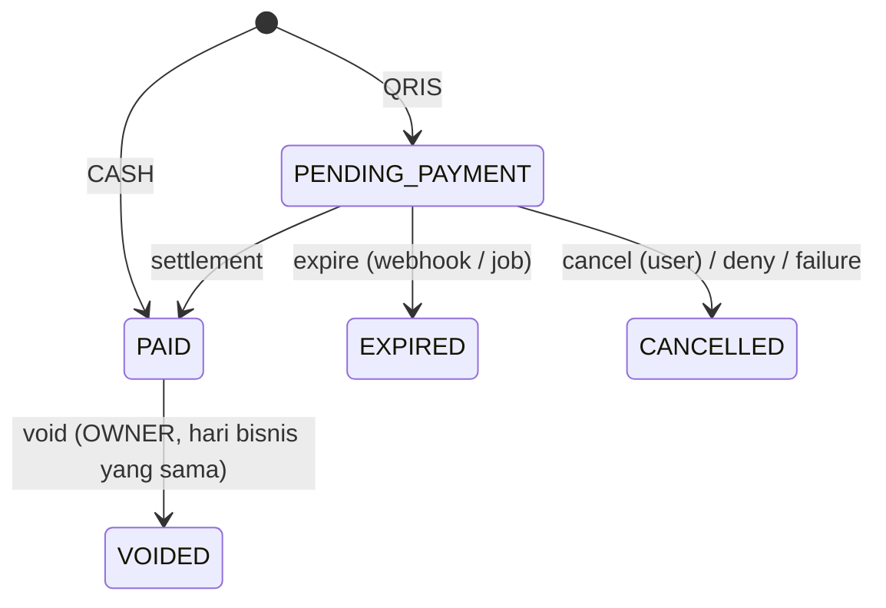
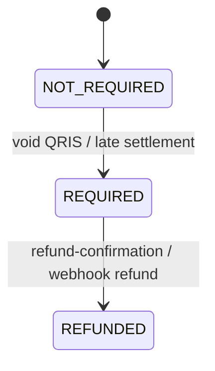

# API Contract — Berkah POS Backend

> Versi kontrak: **v1 (draft rev. 2)** · Base URL: `/api/v1` · Terakhir diperbarui: 2026-09-25
> Konteks desain: [`architecture.md`](./architecture.md). Riwayat perubahan: [§14](#14-versioning--changelog).

## Daftar Isi
1. [Konvensi Umum](#1-konvensi-umum)
2. [Autentikasi & Otorisasi](#2-autentikasi--otorisasi)
3. [Format Error](#3-format-error)
4. [Pagination, Filter, Sort](#4-pagination-filter-sort)
5. [Idempotency](#5-idempotency)
6. [Concurrency Control](#6-concurrency-control)
7. [Rate Limiting](#7-rate-limiting)
8. [Skema Bersama](#8-skema-bersama)
9. [Endpoint](#9-endpoint)
   - [Health](#91-health) · [Auth](#92-auth) · [Users](#93-users) · [Settings](#94-settings) · [Categories](#95-categories) · [Products](#96-products) · [Stock](#97-stock) · [Sales](#98-sales) · [Midtrans Webhook](#99-midtrans-webhook) · [Alerts](#910-alerts) · [Reports](#911-reports) · [Events (SSE)](#912-events-sse) · [Audit Logs](#913-audit-logs)
10. [Ringkasan Endpoint](#10-ringkasan-endpoint)
11. [Enum & State Machine](#11-enum--state-machine)
12. [Kode Error](#12-kode-error)
13. [Di Luar Lingkup Kontrak Ini](#13-di-luar-lingkup-kontrak-ini)
14. [Versioning & Changelog](#14-versioning--changelog)

---

## 1. Konvensi Umum

| Aspek | Aturan |
|---|---|
| Protokol | HTTPS di produksi. HTTP hanya untuk `localhost`. |
| Media type | Request & response `application/json; charset=utf-8`. `PATCH` juga menerima `application/merge-patch+json` (§1.3). Pengecualian: ekspor (§9.11), struk `text/plain` (§9.8), SSE (§9.12), error (§3). |
| Penamaan field | `camelCase`. Pengecualian: body webhook Midtrans (format pihak ketiga). |
| Penamaan path | `kebab-case`, kata benda jamak (`/products`, `/stock-movements`). Aksi yang bukan CRUD memakai sub-resource kata kerja: `POST /sales/:id/void`. |
| ID | UUID **v7** (RFC 9562) string. Terurut waktu → cursor & index lebih efisien. Konsekuensi: waktu pembuatan bisa diketahui dari ID (bukan data rahasia di sistem ini). |
| Uang | **Integer Rupiah** (`15000` = Rp15.000). Tidak ada desimal. |
| Timestamp | RFC 3339 UTC dengan `Z`, presisi milidetik: `2026-09-25T03:15:00.000Z` |
| Tanggal bisnis | `YYYY-MM-DD`, ditafsirkan dalam zona toko `Asia/Jakarta` (lihat `GET /settings`) |
| Referensi antar-objek | Pada proyeksi (bukan objek utuh) memakai pasangan `<entitas>Id` + `<entitas>Name`, mis. `productId`, `productName`, `categoryId`, `categoryName`. Referensi user memakai `UserRef` (§8). |
| Response | Setiap field di skema **selalu ada**; nilai kosong dikirim `null`, bukan dihilangkan. |
| Field tak dikenal di request | Ditolak `422 validation-error` (mencegah *mass assignment*, mis. kasir mengirim `price`). |
| Envelope sukses | `{ "data": <objek|array>, "meta": { ... } }`. `meta` opsional pada resource tunggal. |
| Envelope error | `application/problem+json` (RFC 9457), §3 |
| Trailing slash | Tidak dipakai |

### 1.1 Header

| Header | Arah | Keterangan |
|---|---|---|
| `Authorization: Bearer <accessToken>` | Req | Endpoint bertanda 👤 / 👑 |
| `X-Request-Id` | Req/Res | Opsional di request; diterima hanya bila cocok `^[A-Za-z0-9-]{1,64}$` (selain itu diganti server, mencegah *log injection*). Selalu dikembalikan. Format bawaan server: UUID v7. |
| `Idempotency-Key` | Req | Wajib pada endpoint 🔁 (§5) |
| `If-Match` | Req | Wajib pada endpoint 🔒 (§6) |
| `If-None-Match` | Req | Opsional pada GET resource ber-`ETag` → `304` |
| `X-Requested-With: fetch` | Req | Wajib pada endpoint 🍪 (proteksi CSRF, §2.4) |
| `ETag` | Res | Versi resource (strong), §6 |
| `Location` | Res | URL resource baru pada `201 Created` |
| `RateLimit`, `RateLimit-Policy`, `Retry-After` | Res | §7 |
| `Idempotent-Replayed: true` | Res | §5 (non-standar, konvensi Stripe) |
| `WWW-Authenticate` | Res | Selalu ada pada `401` (RFC 9110 §15.5.2) |
| `Deprecation`, `Sunset`, `Link` | Res | §14 |

### 1.2 Deployment & CORS

- **Frontend dan API wajib *same-site*** (satu *registrable domain*, mis. `app.berkah.id` + `api.berkah.id`), **atau** — direkomendasikan — FE mem-*proxy* `/api/*` lewat Next.js `rewrites` sehingga *same-origin*. Deployment lintas-site (mis. `*.vercel.app` → `*.railway.app`; `vercel.app` ada di Public Suffix List) **tidak didukung** karena cookie refresh `SameSite=Strict` tidak akan terkirim.
- Bila tidak di-*proxy* (cross-origin tapi same-site), server mengirim:
  - `Access-Control-Allow-Origin: <origin dari allowlist>` (tidak pernah `*`) dan `Access-Control-Allow-Credentials: true`
  - `Access-Control-Allow-Headers: Authorization, Content-Type, If-Match, If-None-Match, Idempotency-Key, X-Request-Id, X-Requested-With, Last-Event-ID`
  - `Access-Control-Expose-Headers: ETag, Location, RateLimit, RateLimit-Policy, Retry-After, X-Request-Id, Idempotent-Replayed, Deprecation, Sunset, Content-Disposition`

  Tanpa `Expose-Headers`, JavaScript tidak bisa membaca `ETag` sehingga alur `If-Match` gagal. Sebagai cadangan, setiap resource ber-versi juga mengembalikan `version` di body, dan `If-Match: "<version>"` boleh dibentuk FE dari field tersebut.

### 1.3 Semantik PATCH

`PATCH` mengikuti **JSON Merge Patch (RFC 7396)**: field tidak dikirim = tidak berubah; `null` = kosongkan (hanya untuk field *nullable*, mis. `sku`, `barcode`; `null` pada field wajib → `422`). `application/json` diterima dan diperlakukan identik dengan `application/merge-patch+json`.

### 1.4 Status code

| Kode | Makna dalam API ini |
|---|---|
| 200 | Sukses dengan body |
| 201 | Resource dibuat (+ `Location`) |
| 204 | Sukses tanpa body |
| 304 | `If-None-Match` cocok |
| 400 | Body tidak bisa di-*parse*, atau `Idempotency-Key` hilang/tidak valid |
| 401 | Tidak terautentikasi (token tidak ada/invalid/kedaluwarsa/dicabut). Selalu dengan `WWW-Authenticate: Bearer realm="berkah-pos"` (+ `error="invalid_token"` bila token ada tapi ditolak) |
| 403 | Terautentikasi tapi tidak berwenang; juga cek CSRF gagal, signature webhook invalid |
| 404 | Resource tidak ada **atau** di luar cakupan akses pemanggil (menghindari kebocoran informasi, RFC 9110 §15.5.5) |
| 406 | `Accept` tidak didukung (struk) |
| 409 | Konflik state bisnis |
| 412 | `If-Match` tidak cocok dengan versi terkini |
| 415 | `Content-Type` tidak didukung. Untuk `PATCH` disertai `Accept-Patch: application/merge-patch+json, application/json` |
| 422 | Validasi field / aturan bisnis pada input gagal |
| 428 | `If-Match` wajib tapi tidak dikirim (RFC 6585) |
| 429 | Rate limit |
| 500 | Error tak terduga |
| 502 | Payment gateway gagal/timeout |
| 503 | Dependency (DB) tidak siap |

**Aturan error implisit** (tidak diulang di tiap endpoint):
- Endpoint 👤/👑 dapat mengembalikan `401`. Endpoint 👑 dapat mengembalikan `403 forbidden` untuk `CASHIER`.
- Endpoint dengan `:id` dapat mengembalikan `404 <resource>-not-found`. Parameter `:id` yang bukan UUID → `404` (bukan `422`).
- Endpoint dengan body dapat mengembalikan `400`, `415`, `422 validation-error`.
- Semua endpoint dapat mengembalikan `429`, `500`, `503`.

---

## 2. Autentikasi & Otorisasi

### 2.1 Legenda akses

| Tanda | Arti |
|---|---|
| 🔓 | Publik |
| 🍪 | Hanya butuh cookie refresh + header CSRF (§2.4); tanpa access token |
| 👤 | User login, peran apa pun |
| 👑 | Hanya `OWNER` |
| 🎫 | Tiket SSE (§9.12) |
| 🔏 | Signature Midtrans (§9.9) |
| 🔁 | Butuh `Idempotency-Key` (§5) |
| 🔒 | Butuh `If-Match` (§6) |

### 2.2 Access token

- JWT, `alg: HS256`, header `typ: at+jwt` (RFC 9068). Verifikasi dengan `algorithms: ['HS256']`, `issuer`, dan `audience` yang dipin (RFC 8725). Secret acak ≥ 256 bit, bukan password.
- Klaim: `iss` (`berkah-pos-api`), `aud` (`berkah-pos`), `sub` (userId), `role`, `ver` (tokenVersion), `iat`, `exp` (+15 menit), `jti`.
- **Pencabutan instan:** middleware `authenticate` membaca user berdasarkan `sub` pada setiap request (tabel kecil, di-index PK) dan menolak bila `isActive = false` atau `tokenVersion ≠ ver` → `401 token-revoked`. **Peran diambil dari DB, bukan dari klaim**; klaim `role` hanya untuk kebutuhan UI di FE.
- `tokenVersion` dinaikkan ketika: user dinonaktifkan, peran diubah, password diganti/di-reset, `logout-all`.
- FE menyimpan access token **di memori**, bukan `localStorage`.

### 2.3 Refresh token

- String acak opak 256 bit; server hanya menyimpan hash SHA-256-nya.
- Cookie: `__Secure-refresh_token=<token>; HttpOnly; Secure; SameSite=Strict; Path=/api/v1/auth; Max-Age=604800` (7 hari). Prefix `__Host-` tidak dipakai karena mensyaratkan `Path=/`. `localhost` dianggap *secure context* oleh browser modern sehingga cookie `Secure` tetap berfungsi saat development.
- **Rotasi:** setiap `POST /auth/refresh` menerbitkan refresh token baru dan mencabut yang lama (RFC 9700 §4.14.2).
- **Deteksi pemakaian ulang:** token yang sudah dirotasi dipakai lagi → seluruh *family* dicabut, `401 refresh-token-reused`. Pengecualian: *grace period* **10 detik** untuk token tepat sebelumnya (menangani dua tab yang me-*refresh* bersamaan) — server mengembalikan access token baru tanpa merotasi lagi.
- FE wajib melakukan refresh secara *single-flight* (satu refresh berjalan untuk semua request yang gagal; lintas tab via `BroadcastChannel`/Web Locks).
- FE memanggil refresh saat menerima `401` dengan `code` `token-expired`. Untuk `token-revoked` atau `refresh-token-*`, FE langsung ke halaman login.

### 2.4 CSRF

Endpoint 🍪 (`/auth/refresh`, `/auth/logout`) diautentikasi hanya dengan cookie, sehingga server mewajibkan:
1. Header `Origin` ada dan termasuk allowlist, **dan**
2. Header `X-Requested-With: fetch` (header kustom memaksa *preflight* pada request lintas-origin).

Gagal → `403 csrf-check-failed`. Endpoint lain memakai `Authorization: Bearer` sehingga tidak rentan CSRF.

### 2.5 Otorisasi & pemaksaan cakupan

Otorisasi berlapis: (1) peran di tingkat route, (2) kepemilikan/cakupan di service. Untuk `CASHIER`, filter tertentu **dipaksa server secara diam-diam** (bukan `403`) agar FE bisa memakai komponen yang sama untuk kedua peran. Filter yang benar-benar diterapkan dikembalikan di `meta.appliedFilters`.

| Endpoint | Pemaksaan untuk `CASHIER` |
|---|---|
| `GET /products` | `status=active` |
| `GET /categories` | `includeArchived=false` |
| `GET /sales` | `cashierId=<dirinya>`, `from=to=<hari ini>` |
| `GET /sales/:id`, `/receipt`, `/payment` | Hanya transaksi milik sendiri dengan `businessDate` = hari ini; selain itu `404 sale-not-found` |

---

## 3. Format Error

Semua error memakai **RFC 9457 Problem Details**, `Content-Type: application/problem+json`.

```json
{
  "type": "https://github.com/gadicandra/PassGo/blob/main/docs/api-contract.md#validation-error",
  "title": "Validation failed",
  "status": 422,
  "detail": "Beberapa field tidak valid.",
  "instance": "urn:uuid:0192a3b4-5c6d-7e8f-9a0b-1c2d3e4f5a6b",
  "code": "validation-error",
  "requestId": "0192a3b4-5c6d-7e8f-9a0b-1c2d3e4f5a6b",
  "errors": [
    { "pointer": "#/price", "detail": "Harus bilangan bulat ≥ 0" },
    { "pointer": "#/items/0/quantity", "detail": "Minimal 1" }
  ]
}
```

| Member | Keterangan |
|---|---|
| `type` | URI dokumentasi jenis error: `<PROBLEM_TYPE_BASE>#<code>` (default menunjuk ke §12 dokumen ini). Stabil per `code`. |
| `title` | Ringkasan singkat (Inggris), stabil per `type` |
| `status` | Sama dengan status HTTP |
| `detail` | Penjelasan untuk manusia (Bahasa Indonesia), boleh berubah; jangan di-*parse* FE |
| `instance` | `urn:uuid:<requestId>` — identitas kejadian error ini |
| `code` | *Extension*: kode mesin untuk *branching* di FE (§12) |
| `requestId` | *Extension*: korelasi dengan log server |
| `errors[]` | *Extension*, opsional. Setiap elemen punya `pointer` (JSON Pointer RFC 6901 dalam bentuk fragmen URI, menunjuk ke body request) dan `detail`; bentuk tambahan per `code` didefinisikan di endpoint terkait |
| `current` | *Extension*, hanya pada `412` (§6) |

Pada `NODE_ENV=production`, stack trace dan pesan error internal **tidak pernah** dikirim.

---

## 4. Pagination, Filter, Sort

### 4.1 Offset — untuk data master (`/users`, `/products`, `/products/:id/price-history`)
```
GET /products?page=2&pageSize=20&sort=-updatedAt,name
```
| Param | Default | Batas |
|---|---|---|
| `page` | 1 | ≥ 1 |
| `pageSize` | 20 | 1–100 |
| `sort` | per endpoint | Field dipisah koma, awalan `-` = descending. Hanya field yang di-*whitelist* per endpoint; selain itu `422`. |

```json
{ "data": [], "meta": { "page": 2, "pageSize": 20, "totalItems": 134, "totalPages": 7, "sort": "-updatedAt,name" } }
```

### 4.2 Cursor — untuk data yang terus bertambah (`/sales`, `/stock-movements`, `/audit-logs`)
```
GET /sales?limit=50&cursor=eyJpZCI6Ii4uLiJ9
```
| Param | Default | Batas |
|---|---|---|
| `limit` | 50 | 1–100 |
| `cursor` | – | Opak; ambil dari `meta.nextCursor` |

Urutan tetap `id` descending (UUID v7 = urutan waktu pembuatan).
```json
{ "data": [], "meta": { "limit": 50, "nextCursor": "eyJ...", "hasMore": true } }
```

### 4.3 Tanpa pagination
`/categories` dan `/alerts/low-stock` mengembalikan seluruh data (jumlahnya kecil) dengan `meta.totalItems`.

### 4.4 Filter
Query param datar (`?categoryId=...&status=active`). Nilai jamak dipisah koma (`status=PAID,VOIDED`). Rentang tanggal: `from` & `to` (`YYYY-MM-DD`, inklusif, zona toko); `from > to` → `422`.

---

## 5. Idempotency

Mengacu pada `draft-ietf-httpapi-idempotency-key-header-07`.

- Endpoint 🔁 **wajib** mengirim `Idempotency-Key: "<uuid>"` (Structured Field String; nilai tanpa tanda kutip juga diterima). FE membuat key baru **per aksi pengguna**, dan memakai key yang sama untuk setiap *retry* aksi tersebut.
- Cakupan key: `(userId, method, path)`. *Fingerprint* request: SHA-256 dari body yang dikanonisasi.
- Response yang disimpan: status `2xx` dan `4xx` (kecuali `409 idempotency-in-progress` dan `429`). Response `5xx` **tidak** disimpan, sehingga retry diproses ulang.
- Masa simpan: 24 jam.

| Situasi | Perilaku |
|---|---|
| Key baru | Diproses normal |
| Key sama + fingerprint sama, sudah selesai | Response tersimpan dikembalikan apa adanya + `Idempotent-Replayed: true` |
| Key sama + fingerprint berbeda | `422 idempotency-key-reused` |
| Key sama, request pertama masih diproses | `409 idempotency-in-progress` + `Retry-After: 1` |
| Header tidak ada / bukan UUID | `400 idempotency-key-required` |

---

## 6. Concurrency Control

Resource yang bisa diedit bersamaan (**User, Category, Product, Settings**) memiliki `version` (integer, naik tiap perubahan).

- GET mengembalikan `ETag: "<version>"` (strong ETag, RFC 9110 §8.8.3) dan mendukung `If-None-Match` → `304`.
- Endpoint 🔒 wajib `If-Match: "<version>"`.
  - Tidak dikirim, atau `If-Match: *` → `428 precondition-required`
  - Tidak cocok → `412 precondition-failed`, dengan header `ETag` versi terkini dan body:
    ```json
    {
      "type": "…#precondition-failed", "title": "Precondition failed", "status": 412,
      "code": "precondition-failed", "detail": "Data telah diubah oleh pengguna lain.",
      "instance": "urn:uuid:…", "requestId": "…",
      "current": { "…": "resource utuh seperti response GET" }
    }
    ```
- Response list tidak menyertakan `ETag` per item; gunakan field `version` dari body (§1.2).

**Stok tidak memakai mekanisme ini.** Stok diubah secara atomik di server (§9.7, §9.8).

---

## 7. Rate Limiting

Header mengikuti `draft-ietf-httpapi-ratelimit-headers-11` (Structured Fields, RFC 9651). Implementasi: `express-rate-limit` dengan `standardHeaders: 'draft-8'`, `legacyHeaders: false` (sintaks draft-8 s.d. draft-11 identik).

```
RateLimit-Policy: "api";q=300;w=60
RateLimit: "api";r=287;t=41
```
(`q` kuota, `w` jendela detik, `r` sisa, `t` detik hingga reset.) Bila lebih dari satu kebijakan berlaku, masing-masing menjadi anggota list.

| Policy | Scope | Kuota |
|---|---|---|
| `login` | `POST /auth/login` per IP + username | 5 / 15 menit |
| `login-ip` | `POST /auth/login` per IP (anti *password spraying*) | 20 / 15 menit |
| `refresh` | `POST /auth/refresh` per IP | 30 / menit |
| `api` | Endpoint 👤/👑 per user | 300 / menit |
| `export` | `GET /reports/:type/export` per user | 10 / menit |
| – | Webhook Midtrans | Tidak dibatasi (diverifikasi signature) |

Terlampaui → `429 rate-limited` + `Retry-After` (detik).

---

## 8. Skema Bersama

Skema di bawah adalah satu-satunya definisi; endpoint merujuk ke nama skema ini.

### `UserRef`
```json
{ "id": "uuid", "name": "Siti Aminah" }
```

### `UserSummary`
```json
{ "id": "uuid", "name": "Siti Aminah", "username": "kasir1", "role": "CASHIER" }
```

### `User`
```json
{
  "id": "uuid",
  "name": "Siti Aminah",
  "username": "kasir1",
  "role": "CASHIER",
  "isActive": true,
  "version": 1,
  "createdAt": "2026-09-25T03:00:00.000Z",
  "updatedAt": "2026-09-25T03:00:00.000Z"
}
```

### `Settings`
```json
{
  "storeName": "Toko Kelontong Berkah",
  "address": "Jl. Kaliurang Km 5, Sleman",
  "phone": "0812-0000-0000",
  "receiptFooter": "Terima kasih, selamat berbelanja kembali",
  "timezone": "Asia/Jakarta",
  "defaultLowStockThreshold": 5,
  "maxCashierDiscount": 0,
  "qrisExpiryMinutes": 15,
  "version": 3,
  "updatedAt": "2026-09-25T03:00:00.000Z"
}
```
`timezone` read-only (dari konfigurasi server). `maxCashierDiscount` dalam Rupiah per transaksi; `0` = kasir tidak boleh memberi diskon.

### `Category`
```json
{
  "id": "uuid",
  "name": "Minuman",
  "activeProductCount": 24,
  "isArchived": false,
  "archivedAt": null,
  "version": 1,
  "createdAt": "2026-09-01T02:00:00.000Z",
  "updatedAt": "2026-09-01T02:00:00.000Z"
}
```

### `Product`
```json
{
  "id": "uuid",
  "sku": "MNM-001",
  "barcode": "8992761111117",
  "name": "Teh Botol Sosro 450ml",
  "categoryId": "uuid",
  "categoryName": "Minuman",
  "unit": "pcs",
  "price": 5000,
  "stock": 3,
  "lowStockThreshold": 5,
  "isLowStock": true,
  "isActive": true,
  "archivedAt": null,
  "version": 4,
  "createdAt": "2026-09-01T02:00:00.000Z",
  "updatedAt": "2026-09-25T03:10:00.000Z"
}
```
- `lowStockThreshold` = **stok minimum**. `isLowStock` = `stock <= lowStockThreshold` (dihitung server). Tafsiran "di bawah ambang" pada kebutuhan dibuat inklusif agar ambang dapat dibaca sebagai "sisa minimum yang diinginkan di rak".
- `isActive=false` ⇔ `archivedAt ≠ null`. Produk diarsipkan lewat endpoint `archive`, bukan lewat `PATCH`.

### `LowStockAlert`
```json
{
  "productId": "uuid",
  "productName": "Teh Botol Sosro 450ml",
  "categoryId": "uuid",
  "categoryName": "Minuman",
  "stock": 3,
  "lowStockThreshold": 5,
  "severity": "LOW"
}
```
`severity`: `OUT_OF_STOCK` bila `stock = 0`; `LOW` bila `0 < stock <= lowStockThreshold`.

### `StockMovement`
```json
{
  "id": "uuid",
  "productId": "uuid",
  "productName": "Teh Botol Sosro 450ml",
  "type": "ADJUSTMENT",
  "quantityChange": -2,
  "stockBefore": 22,
  "stockAfter": 20,
  "note": "Stok opname 25 Sep",
  "saleId": null,
  "createdBy": { "id": "uuid", "name": "Pak Budi" },
  "createdAt": "2026-09-25T10:00:00.000Z"
}
```
`createdBy` = `null` untuk perubahan oleh sistem (webhook/job, mis. `SALE_RELEASED`). `saleId` terisi untuk tipe `SALE`, `SALE_VOID`, `SALE_RELEASED`.

### `Payment`
```json
{
  "id": "uuid",
  "provider": "MIDTRANS",
  "method": "QRIS",
  "providerOrderId": "INV-20260925-0042",
  "providerTransactionId": "0d8178e1-…",
  "status": "PENDING",
  "providerStatus": "pending",
  "amount": 10000,
  "acquirer": "gopay",
  "qrString": "00020101021226…",
  "qrImageUrl": "https://api.sandbox.midtrans.com/v2/qris/0d8178e1-…/qr-code",
  "expiresAt": "2026-09-25T03:30:00.000Z",
  "settledAt": null,
  "createdAt": "2026-09-25T03:15:00.000Z",
  "updatedAt": "2026-09-25T03:15:00.000Z"
}
```
- `status` = status ternormalisasi (§11); `providerStatus` = nilai mentah `transaction_status` Midtrans terakhir.
- `qrImageUrl` diambil dari `actions[name="generate-qr-code"].url` pada response charge Midtrans, tidak dibentuk sendiri.

### `SaleItem`
```json
{ "id": "uuid", "productId": "uuid", "productName": "Teh Botol Sosro 450ml", "unitPrice": 5000, "quantity": 2, "lineTotal": 10000 }
```
`productName` dan `unitPrice` adalah **snapshot** saat transaksi dibuat; tidak ikut berubah bila produk diubah.

### `Sale`
```json
{
  "id": "uuid",
  "invoiceNumber": "INV-20260925-0042",
  "status": "PAID",
  "paymentMethod": "CASH",
  "items": [ "SaleItem" ],
  "subtotal": 10000,
  "discount": 0,
  "discountReason": null,
  "total": 10000,
  "cashReceived": 20000,
  "change": 10000,
  "payment": null,
  "cashier": { "id": "uuid", "name": "Siti Aminah" },
  "businessDate": "2026-09-25",
  "paidAt": "2026-09-25T03:15:00.000Z",
  "voidedAt": null,
  "voidedBy": null,
  "voidReason": null,
  "cancelledAt": null,
  "cancelledBy": null,
  "cancelReason": null,
  "expiredAt": null,
  "refundStatus": "NOT_REQUIRED",
  "refundedAt": null,
  "refundedBy": null,
  "refundNote": null,
  "createdAt": "2026-09-25T03:15:00.000Z",
  "updatedAt": "2026-09-25T03:15:00.000Z"
}
```
- `subtotal = Σ lineTotal`; `total = subtotal − discount`; `change = cashReceived − total` (hanya `CASH`, selain itu `null`).
- `payment` = `Payment` untuk `QRIS`, `null` untuk `CASH`.
- `businessDate` = tanggal (zona toko) saat transaksi **dibuat**, dan tidak pernah berubah, termasuk untuk QRIS yang dibayar setelah tengah malam.
- `voidedBy`, `cancelledBy`, `refundedBy`: `UserRef | null`. `cancelledBy = null` bila pembatalan berasal dari Midtrans (`deny`/`failure`).

### `SaleSummary` (item pada list)
`Sale` **tanpa** `items`, dengan `payment` diganti `paymentStatus` (`PaymentStatus | null`), ditambah:
- `lineCount`: jumlah baris item
- `totalQuantity`: Σ `quantity`

### `Receipt`
```json
{
  "store": { "name": "Toko Kelontong Berkah", "address": "Jl. Kaliurang Km 5, Sleman", "phone": "0812-0000-0000" },
  "saleId": "uuid",
  "invoiceNumber": "INV-20260925-0042",
  "status": "PAID",
  "isVoided": false,
  "transactionTimeLocal": "25/09/2026 10:15",
  "cashierName": "Siti Aminah",
  "items": [ { "productName": "Teh Botol Sosro 450ml", "quantity": 2, "unitPrice": 5000, "lineTotal": 10000 } ],
  "subtotal": 10000,
  "discount": 0,
  "total": 10000,
  "paymentMethod": "CASH",
  "cashReceived": 20000,
  "change": 10000,
  "footer": "Terima kasih, selamat berbelanja kembali",
  "printedAt": "2026-09-25T03:15:05.000Z"
}
```

### `TopProduct`
```json
{ "rank": 1, "productId": "uuid", "productName": "Indomie Goreng", "categoryId": "uuid", "categoryName": "Makanan", "quantity": 480, "grossRevenue": 1680000, "revenueShare": 0.0581 }
```
- `grossRevenue` = Σ `lineTotal` (sebelum diskon tingkat transaksi, karena diskon tidak bisa dialokasikan per produk secara objektif).
- `revenueShare` = `grossRevenue` produk ÷ Σ `grossRevenue` **semua** produk pada rentang yang sama; dibulatkan 4 desimal.

### `AuditLog`
```json
{
  "id": "uuid",
  "action": "PRODUCT_PRICE_CHANGED",
  "entityType": "PRODUCT",
  "entityId": "uuid",
  "actor": { "id": "uuid", "name": "Pak Budi" },
  "actorRole": "OWNER",
  "before": { "price": 4500 },
  "after": { "price": 5000 },
  "ip": "10.0.0.5",
  "userAgent": "Mozilla/5.0 …",
  "createdAt": "2026-09-25T03:10:00.000Z"
}
```
`actor`/`actorRole`/`ip`/`userAgent` = `null` untuk aksi sistem (webhook, job). `actorRole` adalah snapshot saat aksi terjadi.

---

## 9. Endpoint

### 9.1 Health

#### `GET /health` 🔓
Liveness. **200**
```json
{ "status": "ok", "uptime": 1234.5, "timestamp": "2026-09-25T03:15:00.000Z", "version": "1.0.0" }
```
(Endpoint health tidak memakai envelope `data`.)

#### `GET /health/ready` 🔓
Readiness. **200** `{ "status": "ready", "checks": { "database": "ok" } }` · **503** `{ "status": "not-ready", "checks": { "database": "down" } }`

---

### 9.2 Auth

#### `POST /auth/login` 🔓
```json
{ "username": "kasir1", "password": "rahasia123" }
```
| Field | Aturan |
|---|---|
| `username` | string 3–50; di-*trim* dan di-*lowercase* |
| `password` | string 1–128 (kebijakan password tidak diungkap saat login) |

**200** + `Set-Cookie: __Secure-refresh_token=…`
```json
{ "data": { "accessToken": "eyJhbGciOi…", "tokenType": "Bearer", "expiresIn": 900, "user": "UserSummary" } }
```
Error: `401 invalid-credentials` — pesan dan waktu respons sama untuk username tidak ada, password salah, atau akun nonaktif (server tetap menjalankan `bcrypt.compare` terhadap *dummy hash* bila username tidak ditemukan).

#### `POST /auth/refresh` 🍪
Tanpa body. **200** body sama dengan login + cookie baru.
Error: `401 refresh-token-invalid` (tidak ada/kedaluwarsa/dicabut), `401 refresh-token-reused` (family dicabut), `403 csrf-check-failed`.

#### `POST /auth/logout` 🍪
Mencabut refresh token pada cookie dan menghapus cookie. **204** selalu, termasuk bila cookie sudah tidak valid. Tidak butuh access token, karena access token mungkin sudah kedaluwarsa saat pengguna menekan logout.

#### `POST /auth/logout-all` 👤
Mencabut semua refresh token user dan menaikkan `tokenVersion` (semua access token langsung tidak berlaku). **204**.

#### `GET /auth/me` 👤
**200** `{ "data": User }` + `ETag`.

#### `PATCH /auth/me/password` 👤
```json
{ "currentPassword": "lama12345", "newPassword": "baru12345" }
```
| Field | Aturan |
|---|---|
| `newPassword` | 8–64 karakter **dan** ≤ 72 byte UTF-8 (batas bcrypt); tidak di-*trim*; tidak boleh sama dengan `currentPassword` |

**204**. Menaikkan `tokenVersion` dan mencabut semua refresh token lain; sesi saat ini menerima cookie refresh baru.
Error: `422 current-password-invalid` (bukan `401`, agar FE tidak memicu alur refresh/logout).

> Minimal 8 karakter adalah penyimpangan sadar dari NIST SP 800-63B-4 (≥ 15 untuk password faktor tunggal) demi kepraktisan kasir; diimbangi rate limit login dan pencabutan sesi.

---

### 9.3 Users
Semua 👑.

| Method & Path | Keterangan |
|---|---|
| `GET /users` | Query: `role`, `isActive`, `q` (cari `name`/`username`, partial, case-insensitive), `page`, `pageSize`, `sort` (`name`, `createdAt`; default `name`). **200** `User[]` (offset). |
| `POST /users` | Body: `name` (1–100), `username` (unik, `^[a-z0-9_.]{3,50}$`), `password` (aturan `newPassword`), `role` (`OWNER`\|`CASHIER`). **201** `User` + `Location` + `ETag`. Error: `409 username-taken`. |
| `GET /users/:id` | **200** `User` + `ETag` |
| `PATCH /users/:id` 🔒 | Merge patch: `name`, `role`, `isActive`. Perubahan `role` atau `isActive=false` menaikkan `tokenVersion` (efek langsung). **200** `User`. |
| `POST /users/:id/reset-password` | Body: `{ "newPassword": "…" }`. Tidak berlaku untuk diri sendiri (gunakan `/auth/me/password`) → `422`. Menaikkan `tokenVersion`. **204**. |

Aturan:
- **Minimal satu `OWNER` aktif harus selalu ada.** Perubahan apa pun (menurunkan peran atau menonaktifkan, terhadap diri sendiri maupun owner lain) yang membuat jumlah owner aktif menjadi 0 → `409 last-owner`.
- Tidak ada `DELETE`; user dirujuk oleh transaksi dan audit log.

---

### 9.4 Settings

#### `GET /settings` 👤
**200** `{ "data": Settings }` + `ETag`. Kasir perlu `maxCashierDiscount` dan `qrisExpiryMinutes` untuk UI.

#### `PATCH /settings` 👑 🔒
Merge patch: `storeName` (1–100), `address` (0–255), `phone` (0–30), `receiptFooter` (0–200), `defaultLowStockThreshold` (0–100.000), `maxCashierDiscount` (0–10.000.000), `qrisExpiryMinutes` (15–120; batas bawah mengikuti anjuran Midtrans). **200** `Settings`.

---

### 9.5 Categories

| Method & Path | Akses | Keterangan |
|---|---|---|
| `GET /categories` | 👤 | Query: `q`, `includeArchived` (default `false`; 👑 saja). Urut `name`. Tanpa pagination. **200** `Category[]`, `meta.totalItems`. |
| `GET /categories/:id` | 👤 | **200** `Category` + `ETag` |
| `POST /categories` | 👑 | Body `{ "name": "Minuman" }` (1–50, di-*trim*, unik case-insensitive termasuk yang diarsipkan). **201** + `Location` + `ETag`. Error: `409 category-name-taken`. |
| `PATCH /categories/:id` 🔒 | 👑 | Merge patch: `name`. **200** |
| `POST /categories/:id/archive` 🔒 | 👑 | Arsipkan. Error: `409 category-in-use` bila masih ada produk **aktif**; produk yang sudah diarsipkan tetap merujuk ke kategori ini. **200** `Category`. |
| `POST /categories/:id/restore` 🔒 | 👑 | **200** `Category` |

Kategori tidak pernah dihapus permanen. `POST`/`PATCH /products` dengan `categoryId` yang diarsipkan → `422 category-archived`.

---

### 9.6 Products

#### `GET /products` 👤
| Query | Keterangan |
|---|---|
| `q` | Cari `name` (partial), `sku` / `barcode` (awalan); case-insensitive |
| `categoryId` | UUID |
| `status` | `active` (default) \| `archived` \| `all`. `CASHIER` dipaksa `active`. |
| `lowStock` | `true` → hanya `isLowStock` |
| `sort` | `name`, `price`, `stock`, `updatedAt` (default `name`) |
| `page`, `pageSize` | §4.1 |

**200** `Product[]`, meta offset + `appliedFilters`.

#### `GET /products/:id` 👤
**200** `Product` + `ETag`. Kasir → `404` untuk produk yang diarsipkan.

#### `GET /products/barcode/:code` 👤
Lookup pemindai barcode. `code` harus cocok `^[A-Za-z0-9]{4,64}$` (selain itu `404`). Hanya produk aktif. **200** `Product` · `404 product-not-found`.
> Route ini didaftarkan **sebelum** `/products/:id`, dan `:id` divalidasi sebagai UUID.

#### `POST /products` 👑 🔁
```json
{
  "name": "Teh Botol Sosro 450ml",
  "categoryId": "uuid",
  "sku": "MNM-001",
  "barcode": "8992761111117",
  "unit": "pcs",
  "price": 5000,
  "initialStock": 24,
  "lowStockThreshold": 5
}
```
| Field | Wajib | Aturan |
|---|:-:|---|
| `name` | ✅ | 1–150, di-*trim* |
| `categoryId` | ✅ | UUID kategori aktif |
| `sku` | | `null` atau 1–50 `^[A-Za-z0-9._-]+$`, unik |
| `barcode` | | `null` atau `^[A-Za-z0-9]{4,64}$`, unik; bila 13 digit numerik divalidasi *checksum* EAN-13 |
| `unit` | | 1–20, default `pcs` |
| `price` | ✅ | integer 0–100.000.000 |
| `initialStock` | | integer 0–99.999, default 0 → `StockMovement` tipe `INITIAL` |
| `lowStockThreshold` | | integer 0–100.000, default `Settings.defaultLowStockThreshold` |

**201** `Product` + `Location` + `ETag`.
Error: `409 sku-taken` / `409 barcode-taken` — `errors[0]` berisi `{ "pointer": "#/barcode", "detail": "…", "conflictProductId": "uuid", "conflictProductName": "…", "conflictIsArchived": true }` agar FE dapat menawarkan *restore*. `422 category-archived`.

Keunikan `sku` dan `barcode` berlaku **global, termasuk produk yang diarsipkan**, sehingga *restore* tidak pernah bentrok.

#### `PATCH /products/:id` 👑 🔒
Merge patch: `name`, `categoryId`, `sku` (nullable), `barcode` (nullable), `unit`, `price`, `lowStockThreshold`. Aturan field sama dengan `POST`. Mengirim `stock`, `initialStock`, atau `isActive` → `422`.
Perubahan `price` menulis `PriceHistory` + `AuditLog` dan menyiarkan SSE `product.updated`. Transaksi lama tidak berubah (snapshot).
**200** `Product` + `ETag`. Error: `412`, `409 sku-taken`, `409 barcode-taken`, `422 category-archived`.

#### `POST /products/:id/archive` 👑 🔒
Mengarsipkan produk (`isActive=false`, `archivedAt` diisi). Produk hilang dari POS, tetapi tetap ada di transaksi dan laporan lama. Transaksi `PENDING_PAYMENT` yang memuat produk ini tetap diproses normal. **200** `Product`.

#### `POST /products/:id/restore` 👑 🔒
**200** `Product`. Error: `422 category-archived` (pulihkan kategorinya dulu).

#### `GET /products/:id/price-history` 👑
Offset pagination, urut `-changedAt`.
```json
{
  "data": [ { "id": "uuid", "oldPrice": 4500, "newPrice": 5000, "changedBy": { "id": "uuid", "name": "Pak Budi" }, "changedAt": "2026-09-25T03:10:00.000Z" } ],
  "meta": { "page": 1, "pageSize": 20, "totalItems": 3, "totalPages": 1, "sort": "-changedAt" }
}
```

---

### 9.7 Stock

Semua perubahan stok di luar penjualan hanya melalui endpoint ini dan tercatat di *ledger*. Tidak ada endpoint yang menulis `stock` secara langsung.

#### `POST /products/:id/stock-movements` 👑 🔁
Berlaku juga untuk produk yang diarsipkan (mis. opname barang arsip).

| `type` | Field | Efek |
|---|---|---|
| `RESTOCK` | `quantity` (1–99.999), `note` opsional | `stock += quantity` |
| `DAMAGED` | `quantity` (1–99.999), `note` wajib | `stock -= quantity` |
| `ADJUSTMENT` | `countedStock` (0–99.999), `expectedStock` (≥ 0), `note` wajib | `stock = countedStock` |

`note`: 1–255 karakter. `type` lain (`INITIAL`, `SALE`, `SALE_VOID`, `SALE_RELEASED`) → `422`.

```json
{ "type": "RESTOCK", "quantity": 48, "note": "Kulakan dari agen" }
```
```json
{ "type": "ADJUSTMENT", "countedStock": 20, "expectedStock": 22, "note": "Stok opname 25 Sep" }
```
`expectedStock` = stok sistem yang dilihat owner saat mulai menghitung. Bila stok saat ini ≠ `expectedStock` (ada penjualan di antara penghitungan dan pengiriman), server menolak dengan `409 stock-changed-since-count` + `current: { "stock": 21 }`, dan owner harus mengonfirmasi ulang. Ini mencegah penjualan yang terjadi di tengah opname ikut "terhapus". `countedStock = expectedStock` tetap dicatat (`quantityChange: 0`) sebagai jejak opname.

**201** + `Location: /api/v1/stock-movements/<id>`
```json
{ "data": "StockMovement", "meta": { "lowStockAlerts": [ "LowStockAlert" ] } }
```
Error: `409 insufficient-stock` (`DAMAGED` melebihi stok), `409 stock-changed-since-count`.

#### `GET /products/:id/stock-movements` 👑
Query: `type` (jamak), `from`, `to`, `limit`, `cursor`. **200** `StockMovement[]` (cursor).

#### `GET /stock-movements` 👑
Query: `productId`, `type`, `createdById`, `saleId`, `from`, `to`, `limit`, `cursor`. **200** `StockMovement[]` (cursor).

#### `GET /stock-movements/:id` 👑
**200** `StockMovement`.

---

### 9.8 Sales

#### `POST /sales` 👤 🔁
Membuat transaksi. Pengurangan stok, pembuatan transaksi, dan pencatatan ledger terjadi dalam **satu DB transaction** secara atomik.

```json
{
  "items": [
    { "productId": "uuid-a", "quantity": 2, "expectedUnitPrice": 5000 },
    { "productId": "uuid-b", "quantity": 1, "expectedUnitPrice": 3500 }
  ],
  "discount": 0,
  "discountReason": null,
  "paymentMethod": "CASH",
  "cashReceived": 20000
}
```
| Field | Wajib | Aturan |
|---|:-:|---|
| `items` | ✅ | 1–100 elemen; `productId` unik dalam satu request (FE menggabungkan qty) |
| `items[].productId` | ✅ | UUID produk aktif |
| `items[].quantity` | ✅ | integer 1–9.999 |
| `items[].expectedUnitPrice` | ✅ | Harga yang tampil di layar kasir. Beda dengan harga DB → `409 price-changed` |
| `discount` | | integer ≥ 0, ≤ subtotal, default 0. `CASHIER`: ≤ `Settings.maxCashierDiscount`, selain itu `403 discount-not-allowed` |
| `discountReason` | bila `discount > 0` | 3–100 karakter |
| `paymentMethod` | ✅ | `CASH` \| `QRIS` |
| `cashReceived` | `CASH` | integer ≥ `total`; harus `null`/tidak dikirim untuk `QRIS` |

Harga **selalu** diambil dari DB. `expectedUnitPrice` hanya berfungsi sebagai penjaga agar kasir tidak menagih harga lama tanpa sadar. Diskon > 0 dicatat di `AuditLog` (`SALE_DISCOUNT_APPLIED`).

**Nomor invoice** `INV-YYYYMMDD-NNNN` diambil dari *sequence* database yang tidak ikut di-*rollback*. Akibatnya nomor bisa melompat, tetapi **tidak pernah dipakai ulang**. Ini penting karena nomor invoice sekaligus menjadi `order_id` Midtrans.

**201 — CASH** → `status: PAID`.
**201 — QRIS** → `status: PENDING_PAYMENT`, stok sudah direservasi, `payment` terisi (`Payment` dengan `qrString`, `qrImageUrl`, `expiresAt`).

```json
{ "data": "Sale", "meta": { "lowStockAlerts": [ "LowStockAlert" ] } }
```
`meta.lowStockAlerts` hanya berisi produk yang **baru melewati** batas pada transaksi ini (`stockBefore > lowStockThreshold ≥ stockAfter`, atau baru mencapai 0), sehingga peringatan tidak berulang pada setiap penjualan. Daftar lengkap kondisi saat ini ada di `GET /alerts/low-stock`.

Error:
| Status | `code` | Kapan / bentuk `errors[]` |
|---|---|---|
| 403 | `discount-not-allowed` | Diskon kasir melebihi `maxCashierDiscount` |
| 409 | `insufficient-stock` | `{ pointer: "#/items/0", productId, productName, requested, available }` |
| 409 | `price-changed` | `{ pointer: "#/items/0/expectedUnitPrice", productId, productName, expectedUnitPrice, currentUnitPrice }` |
| 409 | `product-inactive` | `{ pointer: "#/items/0/productId", productId, productName }` |
| 422 | `insufficient-cash` | `cashReceived < total` |
| 502 | `payment-gateway-error` | Charge QRIS gagal/timeout; seluruh transaksi di-*rollback* dan stok tidak berkurang. Pada timeout, server lebih dulu memanggil `POST /v2/{order_id}/cancel` ke Midtrans (*best effort*) agar tidak ada QR yatim yang bisa dibayar. |

Detail charge QRIS ke Midtrans (Core API `POST /v2/charge`):
- `payment_type: "qris"`, `transaction_details: { order_id: invoiceNumber, gross_amount: total }`
- `custom_expiry: { expiry_duration: Settings.qrisExpiryMinutes, unit: "minute" }` agar `expiresAt` deterministik
- `qris: { acquirer: "gopay" }`
- `item_details` tidak dikirim (menghindari aturan Σ item = `gross_amount` ketika ada diskon)
- Header `X-Override-Notification: <MIDTRANS_NOTIFICATION_URL>` per environment
- `expiresAt` = `expiry_time` bila ada di response; jika tidak, `transaction_time` + durasi expiry (dikonversi dari WIB ke UTC)

#### `GET /sales` 👤
| Query | Keterangan |
|---|---|
| `from`, `to` | Tanggal bisnis. Default: hari ini. `CASHIER` dipaksa hari ini. Rentang maks. 366 hari. |
| `status` | `SaleStatus`, jamak |
| `paymentMethod` | `CASH` \| `QRIS` |
| `refundStatus` | `RefundStatus`, jamak (mis. `REQUIRED` untuk daftar yang perlu di-*refund*) |
| `cashierId` | 👑 saja; `CASHIER` dipaksa dirinya |
| `q` | Nomor invoice, pencocokan **awalan**, case-insensitive (`INV-20260925-00`) |
| `limit`, `cursor` | §4.2 |

**200** `SaleSummary[]`, meta cursor + `appliedFilters`.

#### `GET /sales/:id` 👤
**200** `Sale`. Cakupan `CASHIER` sesuai §2.5.

#### `GET /sales/:id/payment` 👤
*Polling* status QRIS (cadangan bila SSE terputus). Bila status lokal masih `PENDING` dan sinkronisasi terakhir > 5 detik yang lalu, server menyinkronkan status lewat Midtrans `GET /v2/{order_id}/status` dan menerapkan transisi yang sama dengan webhook.
```json
{ "data": { "saleId": "uuid", "saleStatus": "PAID", "payment": "Payment" } }
```
Error: `404 payment-not-found` untuk transaksi `CASH`.

#### `GET /sales/:id/receipt` 👤
Hanya untuk status `PAID` atau `VOIDED` (struk bertanda BATAL); status lain → `409 invalid-sale-status`.
- `Accept: application/json` (default) → **200** `{ "data": Receipt }`
- `Accept: text/plain` → teks siap cetak printer thermal; query `width=32|48` (default 32)
- `Accept` lain → `406 not-acceptable`
- Selalu `Vary: Accept`

#### `POST /sales/:id/cancel` 👤 🔁
Membatalkan QRIS `PENDING_PAYMENT` (pembeli batal bayar). `OWNER`: semua transaksi; `CASHIER`: milik sendiri (§2.5).
```json
{ "reason": "Pembeli batal" }
```
`reason` opsional, 3–200 karakter.

Urutan pemrosesan (mencegah *race* dengan pembayaran yang baru masuk):
1. Server mengecek status Midtrans `GET /v2/{order_id}/status`.
2. Bila sudah `settlement` → transaksi disinkronkan menjadi `PAID`; respons `409 sale-already-paid` dengan `current: Sale`.
3. Bila `expire` → transaksi menjadi `EXPIRED` dan stok dilepas; respons `409 invalid-sale-status` dengan `current: Sale`.
4. Bila masih `pending` → server memanggil `POST /v2/{order_id}/cancel`. Transaksi menjadi `CANCELLED`, stok dilepas (`SALE_RELEASED`).

**200** `Sale`. Error: `409 invalid-sale-status` (bukan `PENDING_PAYMENT`), `409 sale-already-paid`, `502 payment-gateway-error`.

#### `POST /sales/:id/void` 👑 🔁
```json
{ "reason": "Salah input jumlah" }
```
`reason` wajib, 5–200 karakter. Syarat: `status = PAID` dan `businessDate` = hari ini (zona toko). Stok dikembalikan (`SALE_VOID`).
- Untuk transaksi `QRIS`: dana **tidak** dikembalikan otomatis; `refundStatus` menjadi `REQUIRED`, lalu owner mengembalikan dana di luar sistem dan mengonfirmasinya lewat endpoint di bawah.

**200** `Sale` (`VOIDED`). Error: `409 invalid-sale-status`, `409 void-window-closed`.

#### `POST /sales/:id/refund-confirmation` 👑 🔁
Menandai bahwa dana QRIS sudah dikembalikan ke pembeli (untuk transaksi void QRIS atau *late settlement*, §9.9).
```json
{ "refundedAt": "2026-09-25T05:00:00.000Z", "note": "Transfer balik via GoPay ke 0812…" }
```
`refundedAt` wajib (≤ sekarang), `note` wajib 3–255. **200** `Sale` (`refundStatus: REFUNDED`). Error: `409 refund-not-required` bila `refundStatus ≠ REQUIRED`.

---

### 9.9 Midtrans Webhook

#### `POST /payments/midtrans/notifications` 🔏
Dipanggil server Midtrans (HTTP Notification). Body mengikuti format Midtrans (`snake_case`, angka sebagai string).

Pemrosesan:
1. **Verifikasi signature** memakai nilai string mentah dari body:
   `signature_key == SHA512(order_id + status_code + gross_amount + SERVER_KEY)`, dengan `gross_amount` berformat `"10000.00"`. Perbandingan memakai `crypto.timingSafeEqual`. Tidak cocok → `403 invalid-signature` (tanpa detail).
2. Cari `Payment` berdasarkan `order_id = providerOrderId`, lalu cocokkan `Math.round(parseFloat(gross_amount)) === amount`. Tidak cocok atau tidak ditemukan → catat log dan balas `200` (agar Midtrans berhenti *retry*).
3. **Konfirmasi ulang** lewat `GET /v2/{order_id}/status`; hasilnya yang dipakai, bukan isi notifikasi.
4. Terapkan transisi (hanya maju; notifikasi duplikat tidak berefek):

| `transaction_status` | `Payment.status` | Efek pada `Sale` | Stok |
|---|---|---|---|
| `pending` | `PENDING` | – | – |
| `settlement` | `SETTLED` | `PENDING_PAYMENT` → `PAID` (`paidAt`). Bila sale sudah `EXPIRED`/`CANCELLED` → **late settlement**: status tetap, `refundStatus = REQUIRED`, audit `PAYMENT_LATE_SETTLEMENT`, SSE `sale.refund_required` | – |
| `expire` | `EXPIRED` | → `EXPIRED` (`expiredAt`) | Dilepas (`SALE_RELEASED`) |
| `cancel` | `CANCELLED` | → `CANCELLED` | Dilepas |
| `deny`, `failure` | `DENIED` / `FAILED` | → `CANCELLED`, `cancelReason` = "Pembayaran ditolak (`<status>`)", `cancelledBy = null` | Dilepas |
| `refund`, `partial_refund` | `REFUNDED` / `PARTIALLY_REFUNDED` | Bila `refundStatus = REQUIRED` → `REFUNDED`; audit `PAYMENT_REFUNDED` | – |
| lainnya (`capture`, `authorize`, `chargeback`, …) | tidak berubah | Catat log, abaikan (tidak berlaku untuk QRIS) | – |

5. Balas **200** `{ "received": true }`.

Job `expire-pending-qris` (tiap menit) menjadi jaring pengaman bila notifikasi tidak sampai: untuk `Payment` yang `PENDING` dan sudah lewat `expiresAt`, job memanggil Midtrans `POST /v2/{order_id}/expire` (atau membaca status), lalu menerapkan transisi di atas. Stok **hanya** dilepas setelah Midtrans mengonfirmasi status final.

---

### 9.10 Alerts

#### `GET /alerts/low-stock` 👤
Seluruh produk **aktif** dengan `isLowStock = true`. Urutan: `severity` (`OUT_OF_STOCK` dulu), lalu `stock` naik, lalu `productName`. Query: `categoryId`.
```json
{
  "data": [ "LowStockAlert" ],
  "meta": { "totalItems": 2, "outOfStockCount": 1, "lowCount": 1 }
}
```

---

### 9.11 Reports
Semua 👑. Aturan umum:
- Tanggal = `businessDate` (zona toko). Jam = jam lokal dari `createdAt`.
- **Omzet hanya dari transaksi `PAID`.** `VOIDED`, `CANCELLED`, `EXPIRED`, `PENDING_PAYMENT` tidak dihitung, tetapi jumlahnya ditampilkan.
- `grossRevenue` = Σ `subtotal`; `discountTotal` = Σ `discount`; `netRevenue` = Σ `total` = `grossRevenue − discountTotal`.
- Rentang maksimal 366 hari → `422 date-range-too-large`. `to` tidak boleh di masa depan.
- Pembulatan: *round half up* ke Rupiah terdekat.

#### `GET /reports/daily`
Query: `date` (default hari ini).
```json
{
  "data": {
    "date": "2026-09-25",
    "timezone": "Asia/Jakarta",
    "isFinal": false,
    "transactionCount": 87,
    "itemsSold": 312,
    "grossRevenue": 1255000,
    "discountTotal": 5000,
    "netRevenue": 1250000,
    "averageTransactionValue": 14368,
    "byPaymentMethod": [
      { "paymentMethod": "CASH", "transactionCount": 70, "netRevenue": 900000 },
      { "paymentMethod": "QRIS", "transactionCount": 17, "netRevenue": 350000 }
    ],
    "voided": { "transactionCount": 2, "netRevenue": 23000 },
    "cancelled": { "transactionCount": 1, "netRevenue": 8000 },
    "expired": { "transactionCount": 1, "netRevenue": 15000 },
    "pending": { "transactionCount": 0, "netRevenue": 0 },
    "hourly": [ { "hour": 0, "transactionCount": 0, "netRevenue": 0 }, "… 24 elemen, jam 0–23 …" ],
    "topProducts": [ "TopProduct (maks. 5)" ],
    "generatedAt": "2026-09-25T14:00:00.000Z"
  }
}
```
- `itemsSold` = Σ `quantity` dari transaksi `PAID`.
- `averageTransactionValue` = `netRevenue ÷ transactionCount` (0 bila tidak ada transaksi).
- `isFinal = false` bila `date` = hari ini atau masih ada transaksi `PENDING_PAYMENT` pada tanggal tersebut. Laporan kemarin bisa berubah sedikit bila ada QRIS yang dibuat sebelum tengah malam dan dibayar setelahnya.
- `hourly` selalu 24 elemen (diisi 0).

#### `GET /reports/revenue`
Query: `from`, `to` (default 30 hari terakhir s.d. hari ini), `groupBy` = `day` (default) \| `week` \| `month`. Periode tanpa penjualan tetap muncul dengan nilai 0.

| `groupBy` | Format `period` | Batas periode |
|---|---|---|
| `day` | `2026-09-25` | – |
| `week` | `2026-W39` | ISO 8601, Senin–Minggu |
| `month` | `2026-09` | Bulan kalender |

Periode pertama/terakhir dipotong sesuai `from`/`to`; batas nyata ada di `periodStart`/`periodEnd`.
```json
{
  "data": [ { "period": "2026-09-24", "periodStart": "2026-09-24", "periodEnd": "2026-09-24", "transactionCount": 80, "grossRevenue": 1100000, "discountTotal": 0, "netRevenue": 1100000 } ],
  "meta": { "from": "2026-08-27", "to": "2026-09-25", "groupBy": "day", "transactionCount": 2010, "grossRevenue": 28950000, "discountTotal": 50000, "netRevenue": 28900000 }
}
```

#### `GET /reports/top-products`
Query: `from`, `to` (default 30 hari terakhir), `categoryId`, `sort` = `-quantity` (default) \| `-grossRevenue`, `top` (1–100, default 10).
```json
{
  "data": [ "TopProduct" ],
  "meta": { "from": "2026-08-27", "to": "2026-09-25", "sort": "-quantity", "top": 10, "grossRevenue": 28950000 }
}
```
`meta.grossRevenue` = penyebut `revenueShare`.

#### `GET /reports/slow-moving`
Produk aktif yang terjual ≤ `maxQuantity` dalam `days` hari terakhir; membantu owner memutuskan barang yang perlu dikulak atau tidak.
Query: `days` (1–365, default 30), `maxQuantity` (≥ 0, default 0), `categoryId`, `top` (1–100, default 20). Urutan: `quantitySold` naik, lalu `stock` turun.
```json
{
  "data": [ { "productId": "uuid", "productName": "Sabun Batang X", "categoryId": "uuid", "categoryName": "Kebersihan", "stock": 18, "quantitySold": 0, "lastSoldAt": null, "daysSinceLastSale": null } ],
  "meta": { "days": 30, "maxQuantity": 0, "top": 20, "from": "2026-08-27", "to": "2026-09-25" }
}
```

#### `GET /reports/stock-reconciliation`
Memeriksa invariant `Product.stock = Σ StockMovement.quantityChange`. **200** berisi daftar produk yang **tidak** cocok (idealnya kosong).
```json
{ "data": [ { "productId": "uuid", "productName": "…", "stock": 10, "ledgerStock": 12, "difference": -2 } ], "meta": { "totalItems": 1, "checkedAt": "…" } }
```

#### `GET /reports/:type/export`
`type` ∈ `daily` \| `revenue` \| `top-products` \| `slow-moving`. Query sama dengan endpoint laporan terkait, ditambah `format` = `csv` \| `xlsx` (wajib).

| Format | Header |
|---|---|
| `csv` | `Content-Type: text/csv; charset=utf-8; header=present`. RFC 4180 (CRLF, *quoting* `"`). Diawali BOM UTF-8 (konsesi agar Excel membaca UTF-8; di luar RFC 4180). |
| `xlsx` | `Content-Type: application/vnd.openxmlformats-officedocument.spreadsheetml.sheet` |

- `Content-Disposition: attachment; filename="laporan-<type>-<from>_<to>.<csv|xlsx>"` (untuk `daily`: `laporan-daily-2026-09-25.csv`). Nama file selalu ASCII sehingga `filename*` tidak diperlukan.
- **Anti formula injection:** sel teks yang diawali `=`, `+`, `-`, `@`, TAB, atau CR diberi awalan `'` (OWASP CSV Injection).
- Error tetap `application/problem+json`.

---

### 9.12 Events (SSE)

`EventSource` di browser tidak bisa mengirim header `Authorization`, dan access token tidak boleh diletakkan di query string (akan tercatat di log). Karena itu dipakai **tiket**.

#### `POST /events/ticket` 👤
**200** `{ "data": { "ticket": "opaque-256bit", "expiresIn": 30 } }`

#### `GET /events?ticket=…[&lastEventId=…]` 🎫
- Tiket harus dipakai untuk koneksi pertama dalam **30 detik**. Setelah terpakai, tiket terikat pada koneksi tersebut dan **tetap diterima untuk reconnect otomatis** (URL sama + header `Last-Event-ID`) selama user masih aktif dan `tokenVersion` tidak berubah, maksimal 12 jam.
- Bila FE membuat `EventSource` baru (tiket baru), posisi terakhir dikirim lewat `lastEventId` di query. Bila header `Last-Event-ID` juga ada, header yang diutamakan.
- Tiket tidak valid → `401 ticket-invalid` (EventSource berhenti; FE meminta tiket baru). Server mengirim `204` bila meminta klien berhenti (mis. sesi dicabut).
- Response header: `Content-Type: text/event-stream`, `Cache-Control: no-cache`, `X-Accel-Buffering: no`, tanpa kompresi.
- Stream diawali `retry: 3000`. *Heartbeat* komentar `: ping` setiap **15 detik**. Buffer *resume* 5 menit.
- Server menutup stream ketika user dinonaktifkan atau `logout-all` (didahului event `session.revoked`).

| `event` | Penerima | `data` |
|---|---|---|
| `stock.updated` | semua | `{ productId, stock, isLowStock }` |
| `stock.low` | semua | `LowStockAlert` — hanya saat melewati batas (aturan sama dengan `meta.lowStockAlerts`) |
| `product.updated` | semua | `{ productId, price, isActive, version }` — FE memperbarui harga di keranjang |
| `sale.created` | OWNER | `{ saleId, invoiceNumber, total, paymentMethod, cashierId }` |
| `sale.paid` | OWNER + kasir pemilik | `{ saleId, invoiceNumber, paidAt }` |
| `sale.expired` | OWNER + kasir pemilik | `{ saleId, invoiceNumber }` |
| `sale.cancelled` | OWNER + kasir pemilik | `{ saleId, invoiceNumber, cancelReason }` |
| `sale.voided` | OWNER | `{ saleId, invoiceNumber, voidReason }` |
| `sale.refund_required` | OWNER | `{ saleId, invoiceNumber, total, reason: "VOID" \| "LATE_SETTLEMENT" }` |
| `session.revoked` | user terkait | `{}` |

```
retry: 3000

id: 0192a3b4-5c6d-7e8f-9a0b-1c2d3e4f5a6b
event: stock.low
data: {"productId":"uuid","productName":"Indomie Goreng","categoryId":"uuid","categoryName":"Makanan","stock":3,"lowStockThreshold":10,"severity":"LOW"}

```

---

### 9.13 Audit Logs

#### `GET /audit-logs` 👑
Query: `action` (jamak), `entityType`, `entityId`, `actorId`, `from`, `to`, `limit`, `cursor`. **200** `AuditLog[]` (cursor). Daftar `action` dan `entityType` ada di §11.

---

## 10. Ringkasan Endpoint

| Method | Path | Akses | Flag |
|---|---|:-:|:-:|
| GET | `/health` | 🔓 | |
| GET | `/health/ready` | 🔓 | |
| POST | `/auth/login` | 🔓 | |
| POST | `/auth/refresh` | 🍪 | |
| POST | `/auth/logout` | 🍪 | |
| POST | `/auth/logout-all` | 👤 | |
| GET | `/auth/me` | 👤 | |
| PATCH | `/auth/me/password` | 👤 | |
| GET | `/users` | 👑 | |
| POST | `/users` | 👑 | |
| GET | `/users/:id` | 👑 | |
| PATCH | `/users/:id` | 👑 | 🔒 |
| POST | `/users/:id/reset-password` | 👑 | |
| GET | `/settings` | 👤 | |
| PATCH | `/settings` | 👑 | 🔒 |
| GET | `/categories` | 👤 | |
| GET | `/categories/:id` | 👤 | |
| POST | `/categories` | 👑 | |
| PATCH | `/categories/:id` | 👑 | 🔒 |
| POST | `/categories/:id/archive` | 👑 | 🔒 |
| POST | `/categories/:id/restore` | 👑 | 🔒 |
| GET | `/products` | 👤 | |
| GET | `/products/barcode/:code` | 👤 | |
| GET | `/products/:id` | 👤 | |
| POST | `/products` | 👑 | 🔁 |
| PATCH | `/products/:id` | 👑 | 🔒 |
| POST | `/products/:id/archive` | 👑 | 🔒 |
| POST | `/products/:id/restore` | 👑 | 🔒 |
| GET | `/products/:id/price-history` | 👑 | |
| POST | `/products/:id/stock-movements` | 👑 | 🔁 |
| GET | `/products/:id/stock-movements` | 👑 | |
| GET | `/stock-movements` | 👑 | |
| GET | `/stock-movements/:id` | 👑 | |
| POST | `/sales` | 👤 | 🔁 |
| GET | `/sales` | 👤 | |
| GET | `/sales/:id` | 👤 | |
| GET | `/sales/:id/payment` | 👤 | |
| GET | `/sales/:id/receipt` | 👤 | |
| POST | `/sales/:id/cancel` | 👤 | 🔁 |
| POST | `/sales/:id/void` | 👑 | 🔁 |
| POST | `/sales/:id/refund-confirmation` | 👑 | 🔁 |
| POST | `/payments/midtrans/notifications` | 🔏 | |
| GET | `/alerts/low-stock` | 👤 | |
| GET | `/reports/daily` | 👑 | |
| GET | `/reports/revenue` | 👑 | |
| GET | `/reports/top-products` | 👑 | |
| GET | `/reports/slow-moving` | 👑 | |
| GET | `/reports/stock-reconciliation` | 👑 | |
| GET | `/reports/:type/export` | 👑 | |
| POST | `/events/ticket` | 👤 | |
| GET | `/events` | 🎫 | |
| GET | `/audit-logs` | 👑 | |

---

## 11. Enum & State Machine

| Enum | Nilai |
|---|---|
| `Role` | `OWNER`, `CASHIER` |
| `SaleStatus` | `PENDING_PAYMENT`, `PAID`, `VOIDED`, `CANCELLED`, `EXPIRED` |
| `PaymentMethod` | `CASH`, `QRIS` |
| `PaymentStatus` | `PENDING`, `SETTLED`, `EXPIRED`, `CANCELLED`, `DENIED`, `FAILED`, `REFUNDED`, `PARTIALLY_REFUNDED` |
| `RefundStatus` | `NOT_REQUIRED`, `REQUIRED`, `REFUNDED` |
| `StockMovementType` | `INITIAL`, `RESTOCK`, `ADJUSTMENT`, `DAMAGED`, `SALE`, `SALE_VOID`, `SALE_RELEASED` |
| `AlertSeverity` | `OUT_OF_STOCK`, `LOW` |
| `AuditEntityType` | `USER`, `SETTINGS`, `CATEGORY`, `PRODUCT`, `SALE`, `PAYMENT` |
| `AuditAction` | `USER_CREATED`, `USER_UPDATED`, `USER_PASSWORD_RESET`, `SETTINGS_UPDATED`, `CATEGORY_CREATED`, `CATEGORY_UPDATED`, `CATEGORY_ARCHIVED`, `CATEGORY_RESTORED`, `PRODUCT_CREATED`, `PRODUCT_UPDATED`, `PRODUCT_PRICE_CHANGED`, `PRODUCT_ARCHIVED`, `PRODUCT_RESTORED`, `STOCK_ADJUSTED`, `STOCK_DAMAGED`, `SALE_DISCOUNT_APPLIED`, `SALE_CANCELLED`, `SALE_VOIDED`, `SALE_REFUND_CONFIRMED`, `PAYMENT_LATE_SETTLEMENT`, `PAYMENT_REFUNDED` |

Arti `StockMovementType`:
- `SALE`: penjualan (negatif)
- `SALE_VOID`: stok kembali karena void (positif)
- `SALE_RELEASED`: reservasi QRIS dilepas karena `EXPIRED` atau `CANCELLED` (positif)

### Transisi `Sale.status`


### Transisi `Sale.refundStatus`


---

## 12. Kode Error

| `code` | HTTP | Keterangan |
|---|---|---|
| `bad-request` | 400 | Body tidak bisa di-*parse* |
| `idempotency-key-required` | 400 | §5 |
| `unauthenticated` | 401 | Tidak ada token |
| `token-expired` | 401 | Access token kedaluwarsa → refresh |
| `token-revoked` | 401 | `tokenVersion` berubah / user nonaktif → login ulang |
| `invalid-credentials` | 401 | Login gagal |
| `refresh-token-invalid` | 401 | |
| `refresh-token-reused` | 401 | Seluruh sesi dicabut |
| `ticket-invalid` | 401 | Tiket SSE |
| `forbidden` | 403 | Peran tidak berwenang |
| `csrf-check-failed` | 403 | §2.4 |
| `discount-not-allowed` | 403 | Diskon kasir melebihi batas |
| `invalid-signature` | 403 | Webhook Midtrans |
| `not-found` | 404 | Route tidak ada |
| `user-not-found`, `category-not-found`, `product-not-found`, `sale-not-found`, `payment-not-found`, `stock-movement-not-found` | 404 | |
| `not-acceptable` | 406 | |
| `username-taken`, `sku-taken`, `barcode-taken`, `category-name-taken` | 409 | Duplikat |
| `category-in-use` | 409 | Arsip kategori dengan produk aktif |
| `last-owner` | 409 | Owner aktif terakhir |
| `insufficient-stock` | 409 | |
| `price-changed` | 409 | |
| `product-inactive` | 409 | |
| `stock-changed-since-count` | 409 | Opname kedaluwarsa |
| `invalid-sale-status` | 409 | Transisi status tidak valid |
| `sale-already-paid` | 409 | Cancel QRIS yang ternyata sudah dibayar |
| `void-window-closed` | 409 | Void di luar hari bisnis yang sama |
| `refund-not-required` | 409 | |
| `idempotency-in-progress` | 409 | |
| `precondition-failed` | 412 | |
| `unsupported-media-type` | 415 | |
| `validation-error` | 422 | |
| `insufficient-cash` | 422 | |
| `current-password-invalid` | 422 | |
| `category-archived` | 422 | |
| `date-range-too-large` | 422 | |
| `idempotency-key-reused` | 422 | |
| `precondition-required` | 428 | |
| `rate-limited` | 429 | |
| `internal-error` | 500 | |
| `payment-gateway-error` | 502 | |
| `service-unavailable` | 503 | |

---

## 13. Di Luar Lingkup Kontrak Ini

Didokumentasikan agar tidak dianggap terlupa:
- Impor produk via CSV (`POST /products/import`) → direncanakan v1.1, kontrak menyusul.
- Update massal ambang stok.
- Refund otomatis via API Midtrans; v1 hanya konfirmasi refund manual.
- Pembelian ke supplier, HPP/laba, multi-cabang.

---

## 14. Versioning & Changelog

- Versi mayor di path (`/api/v1`). Perubahan *breaking* (hapus/ganti nama field, ubah tipe, ubah makna status code) → `/api/v2`, dengan cookie refresh ber-`Path` baru.
- Perubahan non-breaking di v1: menambah endpoint, field response, query param opsional, nilai `code`, nilai enum pada response. **FE wajib mengabaikan field tak dikenal dan menangani nilai enum tak dikenal secara aman.**
- Endpoint yang akan dihapus diberi header `Deprecation: @<unix-epoch>` (RFC 9745), `Sunset: <HTTP-date>` (RFC 8594), dan `Link: <…/docs/api-contract.md#14-versioning--changelog>; rel="deprecation"`, minimal satu sprint sebelum dihapus.
- Setiap perubahan kontrak dicatat di bawah, dalam PR yang sama dengan implementasinya.

| Tanggal | Perubahan |
|---|---|
| 2026-09-25 | Draft v1 awal |
| 2026-09-25 | Rev. 2 — hasil review konsistensi & standar: skema bersama (§8) dan penamaan proyeksi seragam; `errors[]` memakai `pointer` (RFC 9457); `Idempotency-Key` hilang → 400; header RateLimit draft-11; `WWW-Authenticate`; klaim JWT `iss`/`aud`/`ver` + pencabutan instan; cookie `__Secure-` + CSRF + syarat same-site; CORS expose headers; diskon kasir dibatasi; `expectedUnitPrice` wajib; opname dengan `expectedStock`; archive/restore menggantikan DELETE; `CANCELLED` + `SALE_RELEASED`; alur refund; status Midtrans lengkap + signature string mentah; cancel cek status dulu; invoice tidak pernah dipakai ulang; `Settings`; laporan gross/net + `isFinal`; `slow-moving`, `stock-reconciliation`; SSE reconnect dengan tiket; anti CSV injection; UUID v7 |
