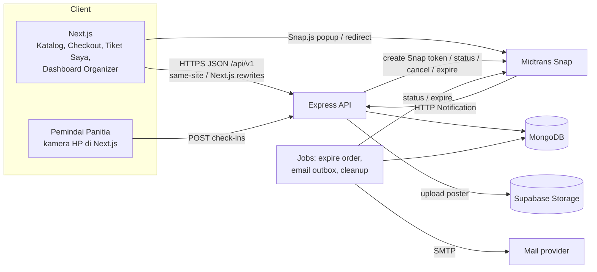
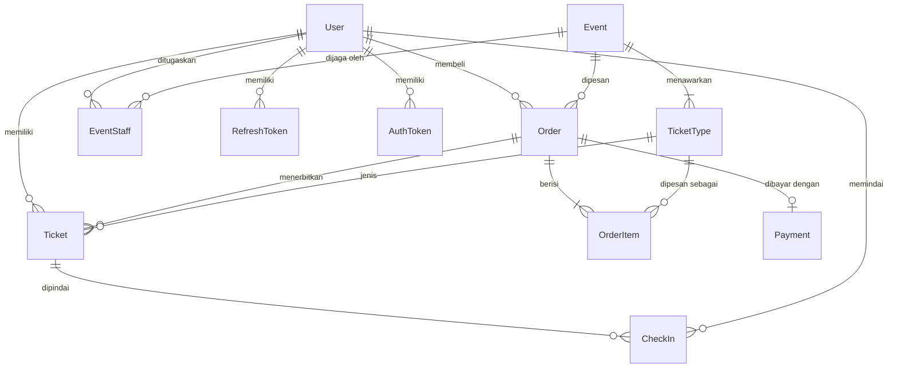
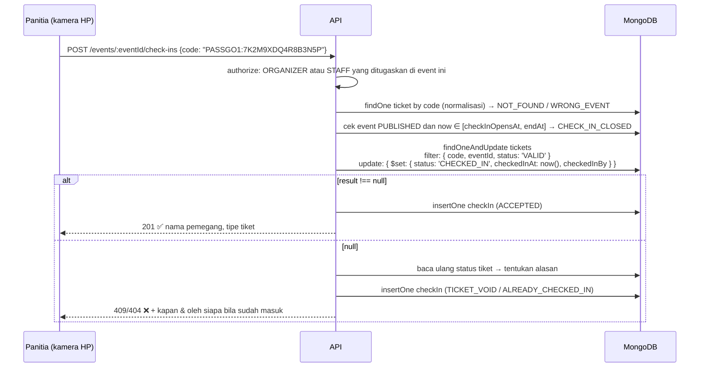

# Arsitektur Backend — PassGo: Tiket Acara Komunitas

> Status: **Draft v1** · Terakhir diperbarui: 2026-09-25
> Dokumen pendamping: [`api-contract.md`](./api-contract.md)

## 1. Latar Belakang

Sebuah komunitas kreatif rutin menggelar workshop dan pertunjukan berskala kecil (puluhan hingga beberapa ratus peserta per acara). Alur saat ini: formulir daring → transfer manual → konfirmasi satu per satu lewat WhatsApp → daftar hadir disusun manual.

| Masalah | Akar masalah | Jawaban sistem |
|---|---|---|
| Kuota terlampaui (*overselling*) | Pembayaran dan pencatatan slot terpisah; tidak ada penguncian kuota saat orang membayar | Kuota **direservasi secara atomik** saat pesanan dibuat (`UPDATE … WHERE sold + reserved + qty <= quota`); pembayaran hanya bisa terjadi untuk slot yang sudah direservasi |
| Panitia kewalahan cek bukti transfer | Verifikasi manual | Payment gateway (Midtrans Snap) + webhook: pesanan otomatis lunas |
| Daftar hadir disiapkan manual | Data pembeli tercecer di chat | Daftar peserta otomatis dari tiket yang terbit; bisa diekspor CSV/XLSX |
| Validasi di pintu masuk lambat / rawan tiket palsu atau dipakai dua kali | Tidak ada identitas tiket | Tiap tiket punya kode unik acak (QR); *check-in* atomik sehingga satu tiket hanya bisa masuk sekali |

Referensi produk sejenis: Loket.com, GoTix, Tiket.com (tipe tiket berkuota, e-ticket QR, check-in berbasis pemindaian).

## 2. Ruang Lingkup

### 2.1 Fitur inti (wajib)
1. **Manajemen acara** — judul, tanggal & jam, lokasi, deskripsi, poster; status `DRAFT` → `PUBLISHED` → (`CANCELLED`).
2. **Tipe tiket** per acara (mis. Presale, Reguler, VIP), masing-masing dengan harga, kuota, dan jendela penjualan sendiri.
3. **Penjualan tiket** dengan kuota yang **tidak mungkin terlampaui**, termasuk saat banyak orang membeli bersamaan.
4. **E-ticket berkode QR** unik per orang.
5. **Check-in** oleh panitia dengan memindai QR; satu tiket hanya bisa dipakai sekali.
6. **Otorisasi tiga peran**: `ORGANIZER` (penyelenggara), `STAFF` (panitia), `ATTENDEE` (peserta).

### 2.2 Nilai tambah
1. **Payment gateway** — Midtrans Snap (QRIS, e-wallet, virtual account).
2. **E-ticket via email** — dikirim otomatis setelah lunas, dengan QR tertanam; bisa dikirim ulang.
3. Ekspor daftar peserta (CSV/XLSX) dan ringkasan penjualan per acara.

### 2.3 Di luar lingkup (v1)
Multi-komunitas/*multi-tenant*, kursi bernomor (*seat map*), kode promo/voucher, transfer tiket antar-akun, refund otomatis via API Midtrans (v1: refund manual + pencatatan), check-in *offline*, acara daring, tiket PDF, notifikasi realtime (SSE/WebSocket), login sosial.

## 3. Aktor & Matriks Wewenang

| Aktor | Cara mendapat akun |
|---|---|
| `ATTENDEE` | Registrasi mandiri (`POST /auth/register`) + verifikasi email |
| `STAFF` | Dibuat oleh organizer, lalu **ditugaskan per acara** |
| `ORGANIZER` | Akun pertama dari *seed*; berikutnya dibuat oleh organizer lain |
| Tamu (tanpa login) | Hanya melihat katalog acara yang dipublikasikan |

| Kapabilitas | Tamu | ATTENDEE | STAFF | ORGANIZER |
|---|:-:|:-:|:-:|:-:|
| Lihat acara `PUBLISHED`/`CANCELLED` & tipe tiketnya | ✅ | ✅ | ✅ | ✅ |
| Lihat acara `DRAFT` | ❌ | ❌ | ❌ | ✅ |
| Buat / ubah / publikasikan / batalkan acara, kelola tipe tiket & poster | ❌ | ❌ | ❌ | ✅ |
| Tugaskan panitia ke acara | ❌ | ❌ | ❌ | ✅ |
| Beli tiket, lihat & batalkan pesanan sendiri | ❌ | ✅ | ❌ | ❌ |
| Lihat tiket & QR milik sendiri, ubah nama pemegang, kirim ulang email tiket | ❌ | ✅ | ❌ | ❌ |
| Lihat daftar peserta acara | ❌ | ❌ | ⚠️ acara yang ditugaskan, field terbatas | ✅ |
| Check-in (pindai QR / manual) | ❌ | ❌ | ⚠️ acara yang ditugaskan | ✅ |
| Batalkan check-in yang keliru | ❌ | ❌ | ❌ | ✅ |
| Terbitkan ulang kode tiket (hilang/bocor) | ❌ | ❌ | ❌ | ✅ |
| Lihat semua pesanan, batalkan pesanan `PENDING_PAYMENT` mana pun, catat refund, kirim ulang email pesanan mana pun | ❌ | ❌ | ❌ | ✅ |
| Laporan kehadiran & log pindaian | ❌ | ❌ | ⚠️ acara yang ditugaskan; log hanya pindaian sendiri | ✅ |
| Laporan penjualan & ekspor daftar peserta | ❌ | ❌ | ❌ | ✅ |
| Kelola akun STAFF/ORGANIZER, audit log | ❌ | ❌ | ❌ | ✅ |

> Keputusan:
> - **Satu komunitas = satu tenant.** Semua `ORGANIZER` berbagi akses ke semua acara, karena penyelenggara dalam satu komunitas biasanya bekerja sebagai tim. `createdBy` tetap dicatat untuk jejak audit.
> - **STAFF dibatasi per acara** (tabel `EventStaff`). Panitia workshop A tidak bisa memindai atau melihat peserta acara B. Inilah titik otorisasi *resource-level* yang paling penting selain kepemilikan tiket.
> - **Pembelian hanya oleh ATTENDEE.** Pemisahan peran membuat audit lebih jelas; organizer/panitia yang ingin ikut acara memakai akun peserta terpisah. Tiket komplimenter dari organizer masuk roadmap v1.1.

Otorisasi diterapkan berlapis:
1. **Route level** — `authorize('ORGANIZER')`, `authorize('ATTENDEE')`, `authorize('ORGANIZER','STAFF')`. Peran dibaca dari DB tiap request (bukan dari klaim JWT), sehingga penonaktifan dan perubahan peran berlaku seketika (`tokenVersion`, §10).
2. **Resource level** — di service:
   - ATTENDEE hanya melihat pesanan & tiket miliknya.
   - STAFF hanya mengakses acara yang ditugaskan kepadanya.

   Pelanggaran dijawab `404`, bukan `403`, agar keberadaan resource tidak bocor.
3. **Aturan global** — minimal satu `ORGANIZER` aktif harus selalu ada.

## 4. Tech Stack

| Lapisan | Pilihan | Alasan |
|---|---|---|
| Runtime | Node.js ≥ 22.18 (rekomendasi 24 LTS) | `--watch`, `--env-file`, `node:test` bawaan |
| Framework | Express 5 | Kesepakatan tim; v5 otomatis meneruskan *rejected promise* ke error handler |
| Modul | ESM (`"type": "module"`) | Standar modern |
| Database | MongoDB 7+ (Replica Set) | Dokumen fleksibel, horizontal scaling, transaksi multi-dokumen (sejak v4) untuk alur kritis. **Replica set wajib** agar transaksi dan change stream berfungsi; untuk development cukup `mongosh --replSet rs0` satu node atau `run-rs` |
| ODM | Mongoose 8 | Skema, validasi, middleware (hooks), plugin, population — ekosistem terluas untuk MongoDB + Node.js |
| Validasi | Zod 4 | Satu skema untuk validasi request & pesan error (Mongoose schema menangani validasi data layer) |
| Auth | JWT access token (Bearer, HS256) + refresh token opak di cookie `__Secure-` (dirotasi) | Access token pendek; pencabutan instan via `tokenVersion` |
| Hash password | bcryptjs | Pure JS, tanpa native build |
| Keamanan HTTP | helmet, cors, express-rate-limit | Header aman, allowlist origin, anti brute-force |
| Logging | pino + pino-http | JSON terstruktur, `requestId` per request |
| Payment | Midtrans **Snap** (`midtrans-client`) | Peserta membayar dari HP masing-masing: halaman pembayaran siap pakai dengan banyak metode (QRIS, e-wallet, VA) tanpa membangun UI per metode |
| Email | nodemailer (SMTP, *pooled*) + *outbox* di DB | Provider-agnostik (Mailpit/Gmail SMTP untuk dev, Brevo/Mailgun/SES untuk produksi); outbox membuat pengiriman tahan gagal |
| QR | `qrcode` | Server hanya merender PNG untuk email (`cid`). Web merender QR di FE dari `Ticket.qrPayload`, karena `` tidak bisa mengirim `Authorization` |
| Upload poster | multer (memory storage) → Supabase Storage (bucket publik) | Filesystem host (Vercel/Railway) bersifat *ephemeral*; object storage + CDN |
| Ekspor | exceljs (XLSX), CSV manual (streaming) | |
| Test | `node:test` + supertest | |

> Catatan MongoDB: development harus memakai replica set (minimal single-node) agar `session.startTransaction()` berfungsi. Gunakan `run-rs` atau `mongod --replSet rs0` + `rs.initiate()`. Koneksi memakai `mongoose.connect(MONGODB_URI)` dengan `MONGODB_URI` berformat `mongodb://…/passgo?replicaSet=rs0`.

## 5. Arsitektur Aplikasi

### 5.1 Gambaran sistem



### 5.2 Layered architecture

```
HTTP ─► routes ─► middlewares (requestId, authenticate, authorize, csrf, validate, idempotency, ifMatch, rateLimit, upload)
                     └─► controllers   (terjemahkan req → panggil service → bentuk response)
                            └─► services   (aturan bisnis, transaksi DB, otorisasi resource)
                                   └─► models/ (Mongoose), lib/db, lib/midtrans, lib/mailer, lib/storage, lib/qr
```

Aturan antar-lapisan:
- **Controller** tidak menyentuh Mongoose model langsung dan tidak berisi aturan bisnis.
- **Service** tidak mengenal `req`/`res`; menerima objek biasa dan melempar `AppError`.
- **Validator** (Zod, `strict`) dijalankan sebelum controller; controller menerima `req.validated`.
- Semua error dibentuk menjadi RFC 9457 Problem Details oleh satu error handler global.
- Efek samping eksternal yang boleh tertunda (email) **tidak dilakukan di dalam request**; service menulis ke `EmailOutbox` di transaksi DB yang sama, lalu job yang mengirimkannya.

> Opini: tanpa lapisan *repository*. Mongoose model sudah merupakan abstraksi data yang kaya (query builder, hooks, statics); repository hanya jadi *pass-through* untuk proyek sebesar ini.

### 5.3 Struktur folder backend

```
apps/backend/
├── src/
│   ├── config/                # env loader + validasi env (Zod), konstanta
│   ├── models/                # Mongoose schemas & models (user, event, ticket-type, order, ticket, check-in, dll.)
│   ├── controllers/           # health, auth, me, users, events, ticket-types, event-staff, orders, payments, tickets, check-ins, attendees, reports, audit-logs
│   ├── routes/                # satu router per resource + index.js (mount /api/v1)
│   ├── middlewares/           # requestId, authenticate, authorize, csrf, validate, idempotency, ifMatch, rateLimit, upload, errorHandler, notFound
│   ├── services/              # logika bisnis per domain
│   ├── validators/            # skema Zod per domain
│   ├── lib/                   # db (koneksi Mongoose), logger, midtrans, mailer, storage (Supabase), qr
│   ├── templates/
│   │   └── emails/            # template email (HTML + teks) per EmailOutbox.type
│   ├── utils/                 # AppError, money, date/zona waktu, pagination, csv, codes (kode tiket & nomor pesanan)
│   ├── jobs/                  # expire-pending-orders, email-outbox, cleanup
│   ├── app.js                 # rakit express app (tanpa listen) → bisa dites supertest
│   └── index.js               # entry point: listen + scheduler job + graceful shutdown
├── scripts/
│   └── seed.js                # akun organizer awal, acara contoh
├── tests/
│   ├── unit/
│   └── integration/
├── .env.example
└── package.json
```

## 6. Model Data

### 6.1 ERD



### 6.2 Koleksi & Dokumen

Semua `_id` menggunakan **UUID v7** (disimpan sebagai `String`, bukan ObjectId, agar terurut waktu dan lintas-sistem). Mongoose schema mendefinisikan `_id` sebagai `{ type: String, default: uuidv7 }` dan menyetel `toJSON: { virtuals: true, versionKey: false, transform: (_, ret) => { ret.id = ret._id; delete ret._id; } }` agar API tetap mengembalikan `id`.

Semua timestamp `Date` (UTC), semua uang **integer Rupiah**. Mongoose `timestamps: true` otomatis mengelola `createdAt`/`updatedAt`.

**User** — collection `users`
| Field | Tipe | Catatan |
|---|---|---|
| _id | String (UUID v7) | |
| name | String, maxlength 100 | |
| email | String, unique index dengan collation `{ locale: 'en', strength: 2 }` | Case-insensitive; login & tujuan e-ticket |
| phone | String, maxlength 20, nullable | Format E.164 (`+62…`); dikirim ke Midtrans `customer_details` |
| passwordHash | String | bcrypt cost 12 |
| role | String, enum `ORGANIZER`/`STAFF`/`ATTENDEE` | |
| isActive | Boolean, default true | Nonaktifkan, jangan hapus |
| emailVerifiedAt | Date, nullable | Wajib terisi sebelum ATTENDEE bisa membeli. Akun STAFF/ORGANIZER dibuat organizer → langsung terisi |
| tokenVersion | Number, default 0 | Naik saat nonaktif, ganti peran/password, `logout-all` |
| version | Number, default 0 | *Optimistic concurrency* (`If-Match`). Dikelola manual (bukan Mongoose `__v`), dinaikkan oleh service saat update |
| createdAt, updatedAt | Date (auto) | |

**Event** — collection `events`
| Field | Tipe | Catatan |
|---|---|---|
| _id | String (UUID v7) | |
| slug | String, unique index | URL publik; dibuat dari judul + sufiks acak, tidak berubah setelah publish |
| title | String, maxlength 150 | |
| description | String, maxlength 10000 | Teks biasa/Markdown; di-*escape*/di-*sanitize* oleh FE |
| venueName, venueAddress | String (150), String (300) | Lokasi; `venueAddress` boleh kosong selama `DRAFT`, wajib saat publish |
| mapsUrl | String, maxlength 500, nullable | Hanya `https:` |
| startAt, endAt | Date | `endAt > startAt` |
| timezone | String, maxlength 40 | IANA, default `Asia/Jakarta`; untuk tampilan & email |
| checkInOpensAt | Date, nullable | Bila `null`, efektif `startAt − 2 jam` |
| posterUrl, posterPath | String, nullable | URL publik & path objek di storage |
| capacity | Number, nullable | Kapasitas venue; bila diisi, Σ `quota` tipe tiket ≤ capacity |
| maxTicketsPerUser | Number, nullable | Batas tiket per akun untuk acara ini (lintas tipe) |
| status | String, enum `DRAFT`, `PUBLISHED`, `CANCELLED` | "Selesai" diturunkan dari `endAt < now` (tidak disimpan) |
| publishedAt, cancelledAt | Date, nullable | |
| cancelReason | String, nullable | |
| createdBy | String (ref User) | |
| version | Number, default 0 | |
| createdAt, updatedAt | Date (auto) | |

**TicketType** — collection `ticketTypes`
| Field | Tipe | Catatan |
|---|---|---|
| _id | String (UUID v7) | |
| eventId | String (ref Event) | |
| name | String, maxlength 50 | "Presale", "Reguler", "VIP"; unik per event (compound unique index `{ eventId, name }` dengan collation case-insensitive) |
| description | String, maxlength 500, nullable | Benefit, mis. "Termasuk merchandise" |
| price | Number, min 0 | `0` = gratis (tidak lewat payment gateway); 1–999 ditolak oleh validasi Zod |
| quota | Number, min 1 | |
| soldCount | Number, min 0, default 0 | "Kuota terpakai" oleh pesanan `PAID`. Turun hanya saat refund pada acara `PUBLISHED`; tidak turun saat acara batal |
| reservedCount | Number, min 0, default 0 | Tiket dari pesanan `PENDING_PAYMENT` |
| salesStartAt, salesEndAt | Date | `salesStartAt < salesEndAt ≤ event.endAt` |
| maxPerOrder | Number, min 1, max 20, default 5 | |
| isActive | Boolean, default true | Organizer bisa menjeda penjualan tipe ini |
| sortOrder | Number, default 0 | Urutan tampil |
| version | Number, default 0 | |
| createdAt, updatedAt | Date (auto) | |

> **Invariant kuota** dijaga oleh **`findOneAndUpdate` kondisional** pada service layer. Alih-alih `CHECK` constraint (tidak ada di MongoDB), setiap operasi yang mengubah `soldCount`/`reservedCount` memakai filter `{ $expr: { $lte: [{ $add: ['$soldCount', '$reservedCount', qty] }, '$quota'] } }` sehingga update hanya berhasil bila invariant terpenuhi. Mongoose validator (`validate` pada path `soldCount` dan `reservedCount`) menambah pertahanan kedua untuk operasi `save()`. `available = quota − soldCount − reservedCount` dihitung saat dibaca (Mongoose virtual).

**EventStaff** — collection `eventStaffs`
- `_id` (UUID v7), `eventId` (ref Event), `userId` (ref User), `assignedBy` (ref User), `assignedAt` (Date).
- Compound unique index `{ eventId, userId }`. Hanya user ber-peran `STAFF`.

**Order** — collection `orders`
| Field | Tipe | Catatan |
|---|---|---|
| _id | String (UUID v7) | |
| orderNumber | String, unique index | `PG-` + 10 karakter Crockford base32 acak (mis. `PG-7K2M9XDQ4R`). Acak, bukan urut, agar volume penjualan tidak terbaca. Dipakai sebagai `order_id` Midtrans, **tidak pernah dipakai ulang** |
| userId | String (ref User) | Pembeli |
| eventId | String (ref Event) | Satu pesanan = satu acara |
| status | String, enum `PENDING_PAYMENT`, `PAID`, `EXPIRED`, `CANCELLED` | |
| subtotal, total | Number | v1 tanpa biaya layanan/diskon, `total = subtotal`; dipisah agar siap untuk voucher |
| items | `[OrderItemSchema]` (sub-dokumen) | |
| buyerName, buyerEmail, buyerPhone | String (snapshot) | Data pembeli saat checkout |
| expiresAt | Date, nullable | Batas waktu bayar = `createdAt + ORDER_HOLD_MINUTES`; `null` untuk pesanan gratis |
| paidAt, expiredAt, cancelledAt | Date, nullable | |
| cancelReason | String, nullable | |
| refundStatus | String, enum `NOT_REQUIRED`, `REQUIRED`, `REFUNDED` | `REQUIRED` karena acara batal atau *late settlement* yang tidak bisa dipenuhi |
| refundedAt | Date, nullable | |
| refundAmount, refundNote | nullable | Refund manual v1 |
| refundedBy | String (ref User), nullable | |
| ticketEmailStatus | String, enum `NOT_APPLICABLE`, `PENDING`, `SENT`, `FAILED` | `NOT_APPLICABLE` selama pesanan belum/tidak `PAID` |
| createdAt, updatedAt | Date (auto) | |

Index penting: **partial unique index** `{ userId: 1, eventId: 1 }, { unique: true, partialFilterExpression: { status: 'PENDING_PAYMENT' } }` — **satu pesanan menggantung per user per acara**, mencegah satu orang menahan kuota lewat banyak pesanan yang tidak dibayar. MongoDB mendukung partial index secara native.

> Refund dimodelkan sebagai sumbu terpisah (`refundStatus`), bukan status pesanan, karena pesanan `PAID` yang di-refund dan pesanan `EXPIRED` yang terlanjur dibayar (*late settlement*) sama-sama perlu dilacak tanpa kehilangan status asalnya.

**OrderItem** — sub-dokumen (`embedded`) di dalam `Order.items[]`:
- `ticketTypeId` (String, ref TicketType), `ticketTypeName` (snapshot), `unitPrice` (snapshot), `quantity`, `lineTotal`.

> Keputusan embed: `OrderItem` selalu dibaca bersama `Order` dan tidak pernah di-query mandiri. Embedding menghindari join/populate tambahan.

**Payment** — collection `payments`
- `_id` (UUID v7), `orderId` (String, unique index, ref Order), `provider` (`MIDTRANS`), `providerOrderId` (= `orderNumber`), `snapToken`, `snapRedirectUrl`, `providerTransactionId`, `paymentType` (mis. `qris`, `gopay`, `bank_transfer`), `status` ternormalisasi (`PENDING`, `SETTLED`, `CHALLENGE`, `EXPIRED`, `CANCELLED`, `DENIED`, `FAILED`, `REFUNDED`, `PARTIALLY_REFUNDED`), `providerStatus` (mentah), `amount`, `settledAt`, `lastSyncedAt`, `rawNotification` (Mixed/Object), timestamps. Tidak ada untuk pesanan gratis.

**Ticket** — collection `tickets`
| Field | Tipe | Catatan |
|---|---|---|
| _id | String (UUID v7) | |
| code | String, unique index | 80 bit acak (CSPRNG), Crockford base32 huruf besar, disimpan tanpa tanda hubung. Tampil sebagai `XXXX-XXXX-XXXX-XXXX` |
| orderId | String (ref Order) | |
| eventId | String (ref Event) | Didenormalisasi agar check-in cukup satu lookup |
| ticketTypeId | String (ref TicketType) | |
| ownerId | String (ref User) | |
| holderName | String, maxlength 100 | Nama di tiket; default nama pembeli, bisa diubah pemilik sebelum check-in dibuka |
| status | String, enum `VALID`, `CHECKED_IN`, `VOID` | |
| checkedInAt | Date, nullable | |
| checkedInBy | String (ref User), nullable | |
| voidedAt | Date, nullable | |
| voidReason | String, nullable | `EVENT_CANCELLED`, `ORDER_REFUNDED` |
| codeVersion | Number, default 1 | Naik saat kode diterbitkan ulang |
| version | Number, default 0 | |
| createdAt, updatedAt | Date (auto) | |

> Opini: kode tiket disimpan *plaintext* (bukan hash). Pemilik harus bisa melihat ulang QR-nya kapan saja, dan kode tidak memberi akses selain masuk ke satu acara. Kebocoran DB berarti kebocoran data peserta secara umum, dan mitigasinya adalah penerbitan ulang massal.

**CheckIn** — collection `checkIns` (log pemindaian, *append-only*):
- `_id` (UUID v7), `eventId` (ref Event), `ticketId` (ref Ticket, nullable bila kode tidak dikenal).
- `scannedCodeMasked` — 4 karakter terakhir input ternormalisasi, hanya untuk `NOT_FOUND`/`WRONG_EVENT`; `null` untuk hasil lain.
- `method` — `QR`/`MANUAL`.
- `result` — `ACCEPTED`, `ALREADY_CHECKED_IN`, `TICKET_VOID`, `WRONG_EVENT`, `NOT_FOUND`, `CHECK_IN_CLOSED`.
- `scannedBy` (ref User), `revertedAt`, `revertedBy` (ref User, nullable), `revertReason`, `createdAt`.

Semua upaya, termasuk yang gagal, dicatat untuk investigasi tiket palsu/ganda.

**EmailOutbox** — collection `emailOutbox`
- `_id` (UUID v7), `type` (enum), `to`, `payload` (Mixed), `status` (`PENDING`, `SENT`, `FAILED`), `attempts`, `nextAttemptAt`, `lastError`, `sentAt`, `orderId` (nullable), `createdAt`.

**RefreshToken** — collection `refreshTokens`
- `_id` (UUID v7), `userId` (ref User), `tokenHash` (SHA-256), `familyId`, `expiresAt`, `revokedAt`, `replacedBy` (ref RefreshToken, nullable), `userAgent`, `ip`, `createdAt`.
- TTL index pada `expiresAt` agar MongoDB otomatis menghapus token kedaluwarsa (opsional; job `cleanup` tetap ada sebagai jaring pengaman).

**AuthToken** — collection `authTokens` (verifikasi email & reset password)
- `_id` (UUID v7), `userId` (ref User), `purpose` (`EMAIL_VERIFICATION`/`PASSWORD_RESET`), `tokenHash`, `expiresAt`, `usedAt`, `createdAt`. Token asli hanya ada di tautan email.
- TTL index pada `expiresAt`.

**IdempotencyKey** — collection `idempotencyKeys`
- Compound unique index `{ userId, method, path, key }`. Field: `requestHash`, `state`, `responseStatus`, `responseHeaders`, `responseBody` (Mixed), `expiresAt` (TTL index, 24 jam).

**AuditLog** — collection `auditLogs`
- `_id` (UUID v7), `actorId` (ref User, nullable untuk sistem), `actorRole`, `action`, `entityType`, `entityId`, `eventId` (nullable), `before` (Mixed), `after` (Mixed), `ip`, `userAgent`, `createdAt`.

### 6.3 Index penting
- `events: { status: 1, startAt: 1 }` — katalog publik.
- `ticketTypes: { eventId: 1, sortOrder: 1 }`.
- `ticketTypes: { eventId: 1, name: 1 }` unique, collation case-insensitive.
- `orders: { userId: 1, _id: -1 }`, `orders: { eventId: 1, status: 1 }`, `orders: { status: 1, expiresAt: 1 }` — job expire.
- Partial unique `orders: { userId: 1, eventId: 1 }` dengan `partialFilterExpression: { status: 'PENDING_PAYMENT' }`.
- `tickets: { code: 1 }` unique, `tickets: { eventId: 1, status: 1 }`, `tickets: { ownerId: 1, _id: -1 }`.
- `tickets: { holderName: 'text' }` (MongoDB text index) untuk pencarian manual di pintu.
- `checkIns: { eventId: 1, _id: -1 }`.
- `emailOutbox: { status: 1, nextAttemptAt: 1 }`.
- TTL indexes pada `refreshTokens.expiresAt`, `authTokens.expiresAt`, `idempotencyKeys.expiresAt`.

## 7. Alur Bisnis Kritis

### 7.1 Membuat pesanan & reservasi kuota (inti anti-overselling)

```mermaid
sequenceDiagram
  participant P as Peserta (FE)
  participant A as API
  participant D as MongoDB
  participant M as Midtrans Snap
  P->>A: POST /orders (Idempotency-Key, eventId, items[])
  A->>D: session.startTransaction()
  A->>D: findOneAndUpdate order PENDING_PAYMENT (userId, eventId) → 409 pending-order-exists
  A->>D: cek maxTicketsPerUser (tiket VALID + CHECKED_IN + kuantitas baru)
  loop tiap item (urut ticketTypeId → hindari deadlock)
    A->>D: findOneAndUpdate ticketTypes<br/>filter: { _id, eventId, isActive, salesStartAt lte now, salesEndAt gt now,<br/>$expr: soldCount + reservedCount + qty lte quota }<br/>update: { $inc: { reservedCount: qty } }<br/>options: { session }
    alt null result
      A->>D: session.abortTransaction()
      A-->>P: 409 quota-exceeded / ticket-type-not-on-sale
    end
  end
  A->>D: insertOne order (PENDING_PAYMENT, expiresAt, items embedded)
  A->>M: POST /snap/v1/transactions {order_id, gross_amount, item_details, customer_details, expiry, callbacks.finish}
  alt gagal / timeout
    A->>D: session.abortTransaction() (reservasi batal)
    A-->>P: 502 payment-gateway-error
  end
  A->>D: insertOne payment (snapToken, redirectUrl); session.commitTransaction()
  A-->>P: 201 order + payment.snapToken
  P->>M: snap.pay(token) → peserta memilih QRIS/e-wallet/VA
```

Keputusan penting:
- **Reservasi, bukan "cek lalu kurangi".** Kondisi kuota ada di filter `findOneAndUpdate`, sehingga dua pembeli slot terakhir tidak bisa sama-sama berhasil: MongoDB WiredTiger memberikan *document-level locking*, dan `$expr` mengevaluasi kondisi secara atomik dalam satu operasi. Mongoose validator pada `soldCount`/`reservedCount` menjadi pertahanan kedua. Inilah jawaban langsung untuk masalah "beberapa orang membayar slot yang sama".
- **Kuota ditahan selama `ORDER_HOLD_MINUTES`** (default 30 menit, cukup untuk bayar VA). `expiry` Snap diset sama agar Midtrans menolak pembayaran setelah batas itu. Pesanan yang tidak dibayar dilepas oleh webhook `expire` atau job.
- **Pemanggilan Snap di dalam transaksi DB** membuat transaksi terbuka ±1 detik. Tradeoff ini diterima di skala komunitas demi kesederhanaan (tidak ada state "pesanan tanpa token"). Bila Snap timeout tetapi transaksinya sempat dibuat di Midtrans, tidak ada yang bisa membayarnya karena token tidak pernah sampai ke peserta, dan `orderNumber` acak tidak dipakai ulang. Snap memakai timeout 10 detik.
- **Pesanan gratis** (`total = 0`) langsung `PAID` tanpa Midtrans; tiket langsung terbit.
- **Harga dari server.** Klien mengirim `expectedUnitPrice`; bila berbeda dengan harga saat ini → `409 price-changed`.
- **Batas per akun** (`maxTicketsPerUser`) dihitung dalam transaksi MongoDB (`session`). Partial unique index `(userId, eventId) WHERE status='PENDING_PAYMENT'` menjamin tidak ada dua pesanan menggantung bersamaan. Untuk mencegah *race condition* dua tab yang membuat pesanan bersamaan, service membuat pesanan baru dengan `insertOne` yang memicu unique index violation (ditangkap sebagai `pending-order-exists`), **atau** alternatif: `findOneAndUpdate` dengan `upsert: false` pada partial unique index sudah cukup karena transaksi mengisolasi operasi.
- **Bayar ulang:** bila popup Snap tertutup, FE memakai `payment.snapToken`/`snapRedirectUrl` yang sama selama pesanan masih `PENDING_PAYMENT`. Tidak ada endpoint "buat token baru" karena satu `order_id` hanya bisa punya satu transaksi Snap.

### 7.2 Pembayaran & penerbitan tiket

```mermaid
sequenceDiagram
  participant M as Midtrans
  participant A as API
  participant D as MongoDB
  participant J as Job email-outbox
  M->>A: POST /payments/midtrans/notifications
  A->>A: verifikasi signature (SHA512, string mentah, timingSafeEqual) + cek nominal
  A->>M: GET /v2/{order_id}/status (konfirmasi ulang)
  A->>D: session.startTransaction()
  A->>D: order PENDING_PAYMENT → PAID
  A->>D: ticketTypes: $inc reservedCount -qty, soldCount +qty
  A->>D: insertMany tickets (1 per kuantitas, kode acak)
  A->>D: insertOne emailOutbox (ORDER_TICKETS); session.commitTransaction()
  A-->>M: 200
  J->>D: findOneAndUpdate outbox PENDING (atomic claim)
  J->>J: render email + QR PNG (cid) per tiket
  J-->>D: SENT / attempts++ + backoff
```

| Status Midtrans | Efek |
|---|---|
| `settlement` / `capture` + `fraud_status=accept` (atau `fraud_status` tidak ada) | `PAID`, tiket terbit, email diantrikan |
| `settlement`/`capture` + `fraud_status=deny` | Diperlakukan seperti `deny` |
| `pending` | Tidak berubah (peserta sudah memilih metode, belum bayar) |
| `capture` + `fraud_status=challenge` | *Legacy* (Midtrans kini jarang mengirimnya): `Payment.status = CHALLENGE`; `Order` tidak berubah, menunggu keputusan di dashboard Midtrans (notifikasi berikutnya) |
| `authorize`, status tak dikenal | Tidak berubah + log `warn` (PassGo tidak memakai *pre-authorization*) |
| `expire` | `EXPIRED`, reservasi dilepas |
| `cancel`, `deny`, `failure` | `CANCELLED`, reservasi dilepas |
| `refund` | `Payment.status = REFUNDED`. Bila pesanan belum `REFUNDED` (baik `REQUIRED` maupun `NOT_REQUIRED`, yaitu refund langsung dari dashboard): efek sama dengan `POST /orders/:orderId/refund` (tiket `VALID` → `VOID`, kuota kembali bila acara `PUBLISHED`), actor `SYSTEM` |
| `partial_refund` | `Payment.status = PARTIALLY_REFUNDED` + log `warn`; ditangani manual (refund sebagian di luar lingkup v1) |

- Transisi hanya maju; notifikasi duplikat tidak berefek.
- Gagal sementara saat memproses webhook → `503`. Midtrans mengulang notifikasi 503 hingga 4 kali (≈ 2, 10, 30, 90 menit), sedangkan `500` hanya sekali. Seluruh pemrosesan harus selesai jauh di bawah batas 15 detik Midtrans (panggilan status 5 detik, email lewat outbox).
- **Job `expire-pending-orders`** (tiap menit) menjadi jaring pengaman untuk notifikasi yang hilang. Pesanan `PENDING_PAYMENT` yang lewat `expiresAt` + 2 menit dicek statusnya ke Midtrans:
  - `404` (peserta belum memilih metode) → matikan sesi Snap (`POST /snap/v1/transactions/{snapToken}/cancel`), lalu expire lokal
  - `pending` → panggil `POST /v2/{order_id}/expire`; bila Midtrans menolak (`412`), status diambil ulang lalu diterapkan
  - Error lain / timeout → dilewati, dicoba lagi pada putaran berikutnya
  - `settlement` → diproses sebagai lunas

  Kuota hanya dilepas setelah status final dipastikan.
- **Late settlement** (pembayaran masuk setelah pesanan `EXPIRED`/`CANCELLED`, mis. VA dibayar di detik terakhir):
  - Sistem mencoba **mereservasi ulang** kuota dengan `UPDATE` kondisional yang sama (langsung ke `soldCount`). Bila berhasil → `PAID` dan tiket terbit, pengalaman terbaik bagi peserta.
  - Syarat re-reservasi: acara `PUBLISHED` dan belum berakhir.
  - Bila kuota sudah habis, acara batal, atau acara sudah berakhir → status tetap, `refundStatus = REQUIRED`, email `REFUND_REQUIRED`, dan organizer mengembalikan dana.
  - Dengan begitu, *overselling* tetap mustahil.

### 7.3 Check-in di pintu masuk



- Hasil gagal pada langkah awal (`NOT_FOUND`, `WRONG_EVENT`, `CHECK_IN_CLOSED`) juga dicatat sebagai `CheckIn`. Urutan evaluasi lengkap ada di api-contract §9.12.
- **Satu `findOneAndUpdate` kondisional** menjamin bahwa bila dua panitia di dua pintu memindai tiket yang sama bersamaan, hanya satu yang `ACCEPTED` (MongoDB *document-level lock* pada WiredTiger).
- Payload QR: `PASSGO1:<code>`. Prefix memungkinkan pemindai langsung menolak QR asing, dan versi `1` memberi ruang format baru (mis. tiket bertanda tangan untuk check-in *offline*) tanpa memutus tiket lama. Server juga menerima kode mentah (dengan/tanpa tanda hubung, huruf kecil, `O`→`0`, `I`/`L`→`1` sesuai Crockford) untuk input ketik manual.
- **Kode acak 80 bit, bukan data yang ditandatangani.** Validasi selalu ke DB, sehingga pembatalan, *void*, dan penerbitan ulang langsung berlaku. Menebak kode tidak praktis (2⁸⁰ kemungkinan + rate limit).
- **Check-in manual** untuk peserta yang HP-nya mati: panitia mencari nama/email di daftar peserta, lalu check-in dengan `ticketId` (tercatat `method = MANUAL`).
- Jendela check-in: `checkInOpensAt` s.d. `endAt`, dan acara harus `PUBLISHED`. Di luar itu → `409 check-in-closed`.
- Check-in yang keliru dibatalkan oleh organizer (`revert`), bukan dengan menghapus log.

### 7.4 Pembatalan acara
Organizer → `POST /events/:eventId/cancel` (alasan wajib):
1. Status acara `CANCELLED`; penjualan & check-in diblokir.
2. Pesanan `PENDING_PAYMENT` → dibatalkan di Midtrans (*best effort*: `POST /v2/{order_id}/cancel`, atau cancel sesi Snap bila transaksi belum ada) dan lokal, kuota dilepas. Pembayaran yang tetap masuk ditangani sebagai *late settlement* (acara batal → `refundStatus = REQUIRED`).
3. Pesanan `PAID` berbayar → `refundStatus = REQUIRED`. Pesanan `PAID` gratis → `refundStatus` tetap `NOT_REQUIRED`. Semua tiket `VALID`/`CHECKED_IN` menjadi `VOID` (`voidReason = EVENT_CANCELLED`).
4. Email `EVENT_CANCELLED` ke pembeli pesanan `PAID` dan `PENDING_PAYMENT` (lewat outbox).

Refund v1 dilakukan organizer di luar sistem (dashboard Midtrans atau transfer), lalu dicatat lewat `POST /orders/:orderId/refund`, yang juga mengirim email `ORDER_REFUNDED` ke pembeli. Refund otomatis via API Midtrans ditunda karena tidak didukung semua metode pembayaran (mis. VA).

### 7.5 Penerbitan ulang kode tiket
Bila peserta melaporkan tiketnya bocor (mis. screenshot tersebar), organizer menerbitkan ulang: `code` baru, `codeVersion++`, kode lama langsung tidak berlaku, dan email `TICKET_REISSUED` dikirim ke pemilik.

### 7.6 Perubahan tipe tiket setelah terjual
- `price` boleh berubah; pesanan lama tidak terpengaruh karena harga di-*snapshot* di embedded `OrderItem`.
- `quota` boleh diturunkan hanya sampai `soldCount + reservedCount` (`findOneAndUpdate` dengan filter `{ $expr: { $lte: [{ $add: ['$soldCount', '$reservedCount'] }, newQuota] } }`), selain itu `409 quota-below-sold`.
- Tipe tiket yang sudah punya pesanan tidak bisa dihapus; nonaktifkan (`isActive=false`).

## 8. Email

- **Outbox pattern:** dokumen `EmailOutbox` ditulis dalam transaksi MongoDB yang sama (`session`) dengan perubahan bisnisnya, lalu job `email-outbox` (tiap 30 detik) mengirim lewat SMTP.
  - Webhook pembayaran tidak pernah gagal atau lambat karena SMTP down.
  - Email tidak hilang bila server restart.
- Retry dengan *exponential backoff* (1, 2, 4 … menit, maks. 8 percobaan), lalu `FAILED` dan `Order.ticketEmailStatus = FAILED` agar organizer tahu. Error permanen (`EENVELOPE`, alamat ditolak) langsung `FAILED`.
- Pengiriman *at-least-once*: email ganda mungkin terjadi pada kondisi langka (crash setelah SMTP menerima, sebelum status disimpan). Diterima karena tidak berbahaya. Job mengklaim pesan secara atomik dengan `findOneAndUpdate({ status: 'PENDING', nextAttemptAt: { $lte: now } }, { $set: { status: 'PROCESSING' } })` agar dua instance job tidak memproses email yang sama.
- Email tiket memuat, per tiket, QR PNG *inline* (`cid`, `errorCorrectionLevel: 'M'`), nama pemegang, tipe tiket, dan kode teks, plus tautan ke "Tiket Saya" di web. QR tidak di-*hosting* publik.
- QR di-render saat job berjalan dari data tiket **terkini**, bukan disimpan di payload outbox, sehingga email kirim-ulang setelah penerbitan ulang selalu memuat kode baru.
- Transporter nodemailer dibuat **sekali** dengan `pool: true`.

## 9. Laporan

Per acara (untuk organizer):
- **Penjualan per tipe tiket:** kuota, terjual, direservasi, tersisa, pendapatan (`Σ lineTotal` dari pesanan `PAID`).
- **Pesanan per status**, pendapatan kotor, dan refund.
- **Seri harian penjualan** (tanggal di zona acara), untuk melihat efek Presale.
- **Kehadiran:** tiket valid vs sudah check-in per tipe; jumlah pindaian ditolak per alasan.
- **Ekspor daftar peserta** (CSV/XLSX): kode tiket, nama pemegang, email pembeli, tipe tiket, status, waktu check-in. Menggantikan daftar hadir manual.

Agregasi *on-the-fly* dengan index di atas cukup untuk skala ratusan tiket per acara.

## 10. Keamanan

| Aspek | Penerapan |
|---|---|
| Autentikasi | Access token JWT 15 menit (`Authorization: Bearer`, `typ: at+jwt`, `iss`/`aud`/`algorithms` dipin); refresh token opak 7 hari di cookie `__Secure-refresh_token; HttpOnly; Secure; SameSite=Strict; Path=/api/v1/auth`. Cookie penghapus (logout) wajib memakai nama, `Path`, dan `Secure` yang sama. Catatan dev: Safari tidak menyimpan cookie `Secure` di `http://localhost`, jadi pakai Chrome/Firefox atau HTTPS lokal |
| Pencabutan sesi | `tokenVersion` dicek per request → user nonaktif / berubah peran langsung ditolak |
| Deployment | FE & API wajib *same-site* atau di-*proxy* lewat Next.js `rewrites` (cookie `SameSite=Strict`). Di belakang proxy: `app.set('trust proxy', 1)` dan `X-Forwarded-For` diteruskan, agar rate limit per IP tidak menyatukan semua klien |
| CSRF | Endpoint berbasis cookie mewajibkan `Origin` dalam allowlist + header `X-Requested-With: fetch` |
| Registrasi | Rate limit per IP; verifikasi email wajib sebelum membeli; respons `register`/`password-reset` tidak membocorkan apakah email terdaftar |
| Password | bcrypt cost 12, 8–64 karakter dan ≤ 72 byte |
| Otorisasi | RBAC di route + kepemilikan/penugasan di service; *deny by default*; `404` untuk resource di luar cakupan |
| Kode tiket | 80 bit CSPRNG, tidak diturunkan dari ID; lengkap hanya terlihat oleh pemilik (dan email pemilik). Organizer & STAFF melihat versi ter-*mask* (4 karakter terakhir) di API. Satu-satunya pengecualian: ekspor daftar peserta oleh organizer memuat kode lengkap untuk pencocokan manual, dan setiap ekspor dicatat di audit log |
| Check-in | Rate limit per staff; semua upaya dicatat |
| Webhook | Signature SHA-512 dari string mentah + `timingSafeEqual` + cek nominal + konfirmasi status ke Midtrans; salah → `403` |
| Upload poster | Berkas ≤ 2 MB, `image/jpeg`/`png`/`webp`, diverifikasi *magic bytes* (bukan hanya MIME dari klien), di-*re-encode* ke WebP dengan `sharp` (EXIF/GPS terbuang), nama file acak, `upsert: false`, disimpan di storage terpisah dari domain API |
| Ekspor | Anti CSV/formula injection |
| Validasi input | Zod `strict` (tolak field tak dikenal) — mencegah *mass assignment* (mis. peserta mengirim `price` atau `status`) |
| Header | helmet (HSTS di produksi, `X-Content-Type-Options`, dll.) |
| Data sensitif | Hash password, token, dan `snapToken` milik orang lain tidak pernah dikembalikan; pino `redact` |

## 11. Observability & Operasional

- `GET /api/v1/health` (liveness) dan `GET /api/v1/health/ready` (DB).
- `X-Request-Id` di setiap request, di log, dan di body error.
- Job berjalan in-process (`setInterval` + *distributed lock* via `findOneAndUpdate` pada collection `locks` agar aman bila ada >1 instance). Setiap job mengklaim lock dokumen `{ _id: '<jobName>' }` dengan `$set: { lockedUntil: now + interval }` dan filter `{ lockedUntil: { $lte: now } }`. Tanpa PostgreSQL advisory lock, pola ini memberikan jaminan yang setara untuk skala kecil.
- Graceful shutdown: `SIGTERM` → hentikan job & koneksi baru → `mongoose.disconnect()` → tutup pool SMTP.
- Migrasi produksi: MongoDB *schema-less*, sehingga tidak ada tool migrasi DDL. Perubahan skema ditangani oleh Mongoose schema (field baru diberi `default`; penghapusan field di-handle dengan script migrasi data bila perlu). Untuk migrasi data, gunakan script di `scripts/`.
- Webhook Midtrans di development memakai tunnel (ngrok/cloudflared), dan email ditangkap Mailpit lokal.
- Job `cleanup` harian: TTL index MongoDB otomatis menghapus `IdempotencyKey`, `AuthToken`, dan `RefreshToken` kedaluwarsa. Job ini tetap ada untuk membersihkan data lain (mis. `EmailOutbox` lama) dan sebagai jaring pengaman.

## 12. Strategi Pengujian

| Level | Fokus |
|---|---|
| Unit | Generator & normalisasi kode tiket, parsing payload QR, signature Midtrans, mapping status, transisi status pesanan/tiket, perhitungan `available` |
| Integration (supertest + DB test) | RBAC tiap endpoint (3 peran + tamu + staff tidak ditugaskan); **50 pesanan konkuren untuk kuota 10 → tepat 10 reservasi**; pesanan kedaluwarsa melepas kuota; late settlement (kuota ada/habis); **dua check-in konkuren untuk satu tiket → tepat satu diterima**; idempotency; pembatalan acara; penerbitan ulang kode |
| Kontrak | Response dicocokkan dengan `api-contract.md` |

## 13. Migrasi dari Proses Lama

1. Acara yang penjualannya sedang berjalan dengan formulir lama diselesaikan dengan cara lama; sistem dipakai untuk acara berikutnya.
2. Bila perlu, peserta lama dimasukkan sebagai tiket komplimenter (v1.1) agar check-in tetap satu sistem.
3. Satu acara kecil dipakai sebagai *pilot* dengan panitia terbatas sebelum semua acara dipindahkan.

## 14. Roadmap

| Fase | Isi |
|---|---|
| Milestone 1 | Auth 3 peran, acara & tipe tiket, pesanan + reservasi kuota, tiket gratis, e-ticket QR, check-in QR/manual, daftar peserta |
| Milestone 2 | Midtrans Snap, email e-ticket via outbox, ekspor CSV/XLSX, laporan penjualan & kehadiran |
| v1.1 | Tiket komplimenter, transfer tiket |

Milestone 1 dan 2 bersama-sama membentuk API v1 (`/api/v1`) seperti di kontrak; pembagiannya hanya urutan pengerjaan.
| v2 | Voucher/kode promo, transfer tiket, refund otomatis via API, check-in *offline* (QR bertanda tangan + sinkronisasi), tiket PDF, notifikasi realtime |

## 15. Keputusan & Tradeoff (ADR ringkas)

| # | Keputusan | Alternatif | Alasan |
|---|---|---|---|
| 1 | Counter `soldCount`/`reservedCount` + `findOneAndUpdate` kondisional + Mongoose validator | `find` + cek manual + `save` | Satu round-trip atomik pada *document-level lock* WiredTiger; invariant dijaga oleh filter `$expr` dan Mongoose validator; `find`-lalu-`save` rawan *race* |
| 2 | Reservasi kuota saat pesanan dibuat, ditahan 30 menit | Kurangi kuota hanya saat lunas | Mengurangi saat lunas justru memunculkan kembali masalah awal: dua orang membayar slot yang sama. Konsekuensinya kuota bisa "tertahan" sementara; diimbangi batas 1 pesanan menggantung per user per acara |
| 3 | Kode tiket acak disimpan di DB | JWT/HMAC bertanda tangan di QR | Validasi online selalu akurat (void & terbit ulang langsung berlaku); tanda tangan baru berguna untuk check-in offline (v2) |
| 4 | Midtrans Snap | Core API | Peserta membayar dari perangkatnya sendiri; Snap menyediakan UI semua metode. Core API cocok bila QR ditampilkan di layar kasir, yang tidak berlaku di sini |
| 5 | Email lewat outbox + job | Kirim langsung di request/webhook | Webhook cepat dan andal; email tahan gangguan SMTP |
| 6 | Satu tenant, semua organizer berbagi acara | Kepemilikan acara per organizer | Sesuai konteks satu komunitas; kolaborasi tim lebih mudah. Multi-tenant masuk v2 bila dibutuhkan |
| 7 | STAFF ditugaskan per acara | STAFF bisa memindai semua acara | *Least privilege*; panitia sering relawan yang berbeda tiap acara |
| 8 | JWT + refresh cookie + `tokenVersion` | Session di DB | Access token pendek tanpa collection session, tetap bisa dicabut instan |
| 9 | UUID v7 (String) | ObjectId / UUID v4 | Tidak bisa ditebak, terurut waktu (cursor cukup `_id`), portabel lintas sistem. ObjectId lebih ringkas tapi kurang standar untuk API publik |
| 10 | Nomor pesanan acak `PG-XXXXXXXXXX` | Urut per hari | Tidak membocorkan volume penjualan; aman sebagai `order_id` Midtrans karena tidak pernah terulang |
| 11 | Poster di Supabase Storage via API (multer) | Signed upload URL langsung dari browser | Validasi *magic bytes* & ukuran tetap di server; volume upload kecil. Signed URL bisa dipakai bila poster besar menjadi masalah |
| 12 | MongoDB + Mongoose | PostgreSQL + Prisma | Fleksibilitas skema dokumen, horizontal scaling mudah, sub-dokumen (`OrderItem`) menghindari join, TTL index otomatis. Transaksi multi-dokumen tersedia untuk alur kritis (pesanan, pembayaran). Tradeoff: tidak ada `CHECK` constraint level DB — invariant dijaga di application layer (Mongoose validator + `findOneAndUpdate` kondisional) |
| 13 | Distributed lock via `findOneAndUpdate` pada collection `locks` | PostgreSQL advisory lock | Cukup untuk satu-dua instance; tidak memerlukan library eksternal. Untuk skala lebih besar, gunakan Redis-based lock |
