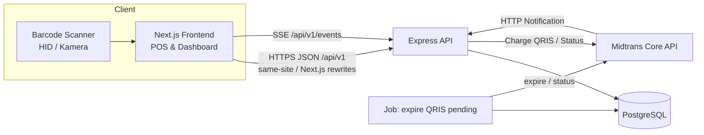
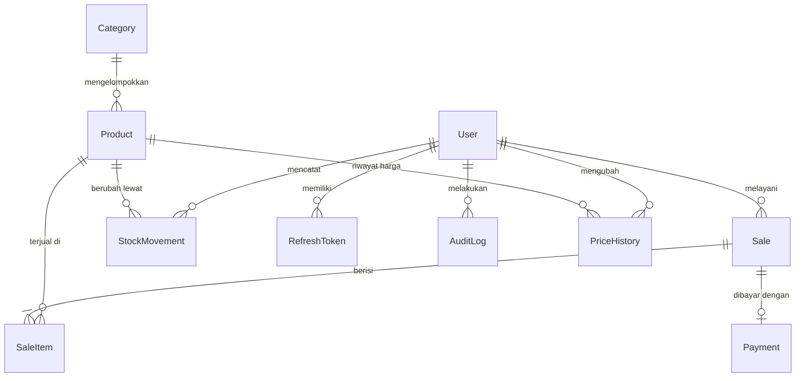
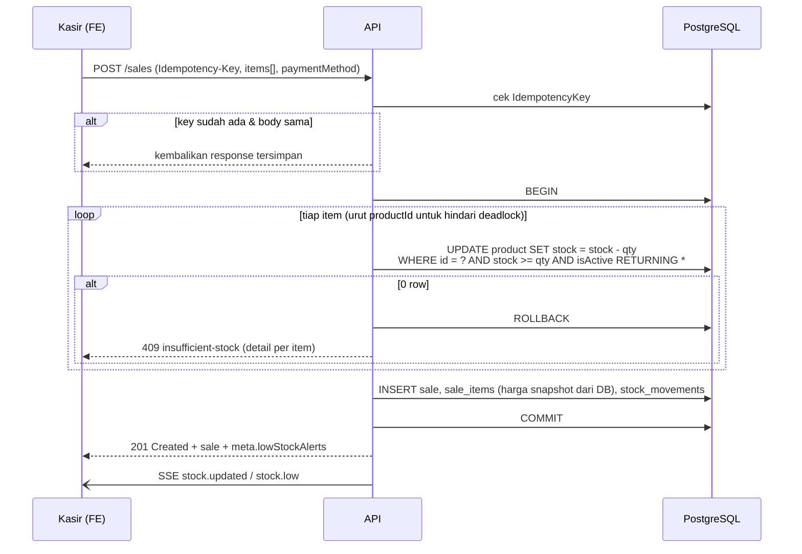
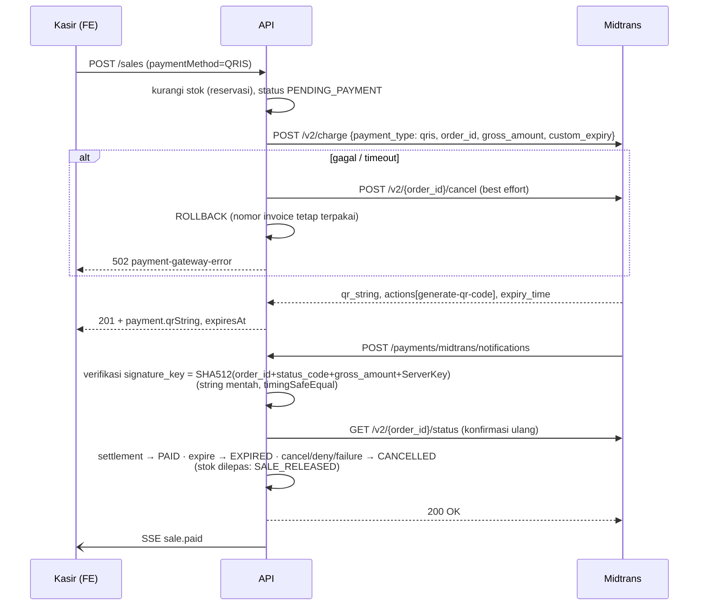

# Arsitektur Backend — Kasir & Manajemen Stok Toko Kelontong "Berkah"

> Status: **Draft v1 (rev. 2)** · Terakhir diperbarui: 2026-09-25
> Dokumen pendamping: [`api-contract.md`](./api-contract.md)

## 1. Latar Belakang

Toko Kelontong "Berkah" mencatat penjualan di dua tempat (buku catatan dan HP). Dampaknya:

| Masalah | Akar masalah | Jawaban sistem |
|---|---|---|
| Stok tidak cocok dengan rak | Tidak ada *single source of truth*; pengurangan stok manual | Stok dikurangi otomatis & atomik saat transaksi, setiap perubahan tercatat di *stock ledger* |
| Tidak tahu barang terlaris | Data penjualan tercerai-berai | Semua transaksi di satu database, laporan produk terlaris |
| Laporan harian melelahkan | Rekap manual tiap malam | Laporan omzet harian dihitung otomatis + ekspor |
| Stok habis tanpa disadari | Tidak ada pemantauan | Peringatan stok menipis berbasis ambang per produk |

Referensi produk sejenis: BukuWarung, Kasir Pintar, majoo, Qasir.

## 2. Ruang Lingkup

### 2.1 Fitur inti (wajib)
1. **Katalog produk** — nama, kategori, harga jual, stok, ambang stok minimum. Harga bisa berubah kapan saja.
2. **Transaksi penjualan** — mengurangi stok otomatis; harga di-*snapshot* ke item transaksi.
3. **Peringatan stok menipis** — ketika `stock <= lowStockThreshold` (ambang = stok minimum, inklusif); notifikasi hanya saat stok *melewati* batas agar tidak berulang.
4. **Laporan** — omzet harian dan produk terlaris.
5. **Otorisasi berbasis peran** — `OWNER` dan `CASHIER`.

### 2.2 Nilai tambah
1. Pembayaran **QRIS** via Midtrans Core API.
2. **Barcode** — lookup produk via kode barcode (scanner HID/kamera di frontend).
3. **Ekspor laporan** — CSV dan XLSX.

### 2.3 Di luar lingkup (v1)
Multi-cabang, pembelian ke supplier (*purchase order*), akuntansi/pajak, program loyalitas, mode offline penuh (hanya *retry-safe* lewat idempotency key).

## 3. Aktor & Matriks Wewenang

| Kapabilitas | OWNER | CASHIER |
|---|:-:|:-:|
| Login, lihat profil sendiri, ganti password | ✅ | ✅ |
| Lihat katalog produk & kategori, lookup barcode | ✅ | ✅ (read-only) |
| Buat, ubah, arsipkan produk/kategori; ubah harga | ✅ | ❌ |
| Penyesuaian stok (restock, opname, rusak) | ✅ | ❌ |
| Buat transaksi penjualan (tunai / QRIS) | ✅ | ✅ |
| Beri diskon transaksi | ✅ | ⚠️ ≤ `maxCashierDiscount` (default 0 = tidak boleh), wajib alasan |
| Lihat transaksi & struk | ✅ semua | ✅ milik sendiri, hari ini |
| Batalkan QRIS yang belum dibayar (*cancel*) | ✅ | ✅ milik sendiri |
| *Void* transaksi lunas; konfirmasi refund QRIS | ✅ | ❌ |
| Lihat peringatan stok menipis | ✅ | ✅ (read-only) |
| Lihat pengaturan toko | ✅ | ✅ (read-only) |
| Ubah pengaturan toko | ✅ | ❌ |
| Laporan & ekspor | ✅ | ❌ |
| Kelola akun pengguna | ✅ | ❌ |
| Lihat audit log | ✅ | ❌ |

> Keputusan: kasir **boleh melihat** stok & peringatan (agar bisa memberi tahu pembeli "stok habis"), tapi tidak mengubahnya. Void dan diskon adalah titik rawan kecurangan (menghapus penjualan tunai yang uangnya sudah diterima / menurunkan total diam-diam), sehingga void hanya oleh pemilik dan diskon kasir dibatasi + diaudit. *Cancel* berbeda dari void: hanya untuk QRIS yang belum dibayar, sehingga tidak ada uang yang hilang.

Otorisasi diterapkan di **dua lapis**:
1. **Route level** — middleware `authorize('OWNER')` menolak peran yang tidak berwenang (`403`). Peran dibaca dari DB pada tiap request (bukan dari klaim JWT), sehingga penurunan peran/penonaktifan berlaku seketika (`tokenVersion`, lihat §9).
2. **Resource level** — di service, mis. kasir hanya bisa `GET /sales/:id` miliknya pada hari ini (`404` bukan `403`, supaya tidak membocorkan keberadaan resource). Filter list untuk kasir dipaksa server dan dilaporkan di `meta.appliedFilters`.
3. **Aturan global** — minimal satu `OWNER` aktif harus selalu ada (`409 last-owner`).

## 4. Tech Stack

| Lapisan | Pilihan | Alasan |
|---|---|---|
| Runtime | Node.js ≥ 22.18 (rekomendasi 24 LTS) | Syarat minimum Prisma 7; `--watch`, `--env-file`, `node:test` bawaan → lebih sedikit devDependency |
| Framework | Express 5 | Kesepakatan tim; v5 otomatis meneruskan *rejected promise* ke error handler (tidak perlu `express-async-handler`) |
| Modul | ESM (`"type": "module"`) | Selaras dengan output generator `prisma-client` dan ekosistem modern |
| Database | PostgreSQL 16+ | Transaksi ACID, row-level lock, `CHECK` constraint untuk stok non-negatif |
| ORM | Prisma 7 + `@prisma/adapter-pg` | Prisma 7 wajib *driver adapter* dan generator `prisma-client` dengan `output` eksplisit; konfigurasi CLI di `prisma.config.ts` |
| Validasi | Zod 4 | Satu skema untuk validasi & pesan error; `z.treeifyError` untuk format error |
| Auth | JWT access token (Bearer, HS256, `iss`/`aud` dipin) + refresh token (cookie `__Secure-`, httpOnly, dirotasi) | Access token pendek; pencabutan instan via `tokenVersion` (1 lookup PK per request — murah untuk skala satu toko) |
| Hash password | bcryptjs | Pure JS, tanpa native build — aman di Windows/Linux anggota tim |
| Keamanan HTTP | helmet, cors, express-rate-limit | Header aman, whitelist origin, anti brute-force login |
| Logging | pino + pino-http | JSON terstruktur, `requestId` per request |
| Payment | midtrans-client (Core API, `payment_type: qris`) | QR ditampilkan langsung di layar kasir tanpa redirect Snap |
| Ekspor | exceljs (XLSX), CSV manual (streaming) | |
| Test | `node:test` + supertest | |

> Catatan Prisma 7: `prisma.config.ts` dibaca oleh CLI (migrate/generate), bukan oleh runtime. Runtime membuat `PrismaClient({ adapter: new PrismaPg({ connectionString }) })`. Client di-generate ke `src/generated/prisma` (di-*gitignore*, dibuat ulang lewat `npm run build`).

## 5. Arsitektur Aplikasi

### 5.1 Gambaran sistem



### 5.2 Layered architecture

```
HTTP ─► routes ─► middlewares (auth, authorize, validate, rateLimit, idempotency)
                     └─► controllers   (terjemahkan req → panggil service → bentuk response)
                            └─► services   (aturan bisnis, transaksi DB, otorisasi resource)
                                   └─► lib/prisma  (akses data)
```

Aturan antar-lapisan:
- **Controller** tidak menyentuh Prisma langsung dan tidak berisi aturan bisnis.
- **Service** tidak tahu soal `req`/`res`; menerima objek biasa dan melempar `AppError`.
- **Validator** (Zod) dijalankan sebelum controller; controller menerima `req.validated`.
- Error apa pun dibentuk ke satu format (RFC 9457 Problem Details) di satu error handler global.

> Opini: tanpa lapisan *repository* terpisah. Prisma sudah merupakan abstraksi data; repository tambahan hanya jadi *pass-through* untuk proyek sebesar ini.

### 5.3 Struktur folder backend

```
apps/backend/
├── prisma/
│   ├── schema.prisma          # model data
│   ├── migrations/            # hasil prisma migrate
│   └── seed.js                # akun owner awal, kategori contoh
├── prisma.config.ts           # konfigurasi Prisma CLI (schema, migrations, datasource)
├── src/
│   ├── config/                # env loader + validasi env (Zod), konstanta
│   ├── controllers/           # auth, users, settings, categories, products, stock, sales, payments, alerts, reports, events, audit-logs
│   ├── routes/                # satu router per resource + index.js (mount /api/v1)
│   ├── middlewares/           # requestId, authenticate, authorize, csrf, validate, idempotency, ifMatch, rateLimit, errorHandler, notFound
│   ├── services/              # logika bisnis per domain
│   ├── validators/            # skema Zod per domain
│   ├── lib/                   # prisma client, logger, midtrans client, sse hub
│   ├── utils/                 # AppError, money, date (zona waktu toko), pagination, csv
│   ├── jobs/                  # expire QRIS pending, cleanup idempotency key & refresh token, rekonsiliasi stok
│   ├── generated/             # Prisma Client (di-generate, tidak di-commit)
│   ├── app.js                 # rakit express app (tanpa listen) → bisa dites supertest
│   └── index.js               # entry point: listen + graceful shutdown
├── tests/
│   ├── unit/
│   └── integration/
├── .env.example
└── package.json
```

## 6. Model Data

### 6.1 ERD



### 6.2 Entitas

**User**
| Kolom | Tipe | Catatan |
|---|---|---|
| id | UUID v7 PK | Semua PK memakai `@default(uuid(7))` |
| name | varchar(100) | |
| username | varchar(50) unique | Kasir lebih mudah login dengan username daripada email |
| passwordHash | text | bcrypt cost 12 |
| role | enum `OWNER`/`CASHIER` | |
| isActive | boolean | Nonaktifkan, jangan hapus (FK ke transaksi) |
| tokenVersion | integer, default 0 | Naik saat nonaktif, ganti peran/password, `logout-all`; access token dengan `ver` lama ditolak |
| version | integer | *Optimistic concurrency* (`If-Match`) |
| createdAt, updatedAt | timestamptz | |

**Category** — `id`, `name` (unique case-insensitive, termasuk yang diarsipkan), `version`, `archivedAt` (nullable), `createdAt`, `updatedAt`. Tidak pernah dihapus permanen; arsip ditolak bila masih ada produk aktif.

**Settings** (satu baris) — `storeName`, `address`, `phone`, `receiptFooter`, `defaultLowStockThreshold`, `maxCashierDiscount`, `qrisExpiryMinutes`, `version`, `updatedAt`. `timezone` berasal dari env `STORE_TIMEZONE`, bukan dari tabel.

**Product**
| Kolom | Tipe | Catatan |
|---|---|---|
| id | UUID PK | |
| sku | varchar(50) nullable | Kode internal; unique partial `WHERE sku IS NOT NULL`, berlaku juga untuk produk arsip |
| barcode | varchar(64) nullable | EAN-13/UPC/kode internal; unique partial `WHERE barcode IS NOT NULL`, berlaku juga untuk produk arsip |
| name | varchar(150) | |
| categoryId | FK Category | |
| unit | varchar(20) | `pcs`, `bungkus`, `kg`, ... |
| price | integer | **Rupiah dalam bilangan bulat**, tanpa desimal. `CHECK (price >= 0)` |
| stock | integer | `CHECK (stock >= 0)` — pertahanan terakhir anti stok minus |
| lowStockThreshold | integer, default 5 | Per produk (rokok beda dengan korek) |
| version | integer | *Optimistic concurrency* untuk update oleh owner |
| isActive, archivedAt | boolean, timestamptz nullable | Diarsipkan lewat endpoint `archive`/`restore` (bukan `DELETE`); produk arsip tidak muncul di POS tetapi tetap dirujuk transaksi & laporan |
| createdAt, updatedAt | timestamptz | |

**PriceHistory** — `id`, `productId`, `oldPrice`, `newPrice`, `changedById`, `changedAt`. Menjawab "harga dapat berubah sewaktu-waktu" dengan jejak yang bisa diaudit.

**Sale** (transaksi penjualan)
| Kolom | Tipe | Catatan |
|---|---|---|
| id | UUID PK | |
| invoiceNumber | varchar unique | `INV-20260925-0001`. Nomor urut dari *sequence* PostgreSQL yang tidak ikut di-*rollback* → bisa melompat, **tidak pernah dipakai ulang** (invoice = `order_id` Midtrans, yang tidak boleh terulang meski charge sebelumnya gagal) |
| cashierId | FK User | |
| status | enum `PENDING_PAYMENT`, `PAID`, `VOIDED`, `CANCELLED`, `EXPIRED` | Tunai langsung `PAID`. `CANCELLED` = dibatalkan pengguna / ditolak Midtrans; `EXPIRED` = QR kedaluwarsa |
| paymentMethod | enum `CASH`, `QRIS` | |
| subtotal, discount, total | integer | `total = subtotal - discount` |
| discountReason | varchar(100) nullable | Wajib bila `discount > 0` |
| cashReceived, change | integer nullable | Hanya untuk `CASH` |
| businessDate | date | Tanggal bisnis (`Asia/Jakarta`) saat transaksi **dibuat**; tidak berubah walau QRIS dibayar lewat tengah malam |
| paidAt, voidedAt, cancelledAt, expiredAt | timestamptz nullable | |
| voidedById, voidReason, cancelledById, cancelReason | nullable | `cancelledById = null` bila dibatalkan oleh Midtrans |
| refundStatus | enum `NOT_REQUIRED`, `REQUIRED`, `REFUNDED` | `REQUIRED` saat void QRIS atau *late settlement* |
| refundedAt, refundedById, refundNote | nullable | Konfirmasi refund manual oleh owner |
| createdAt, updatedAt | timestamptz | |

> Idempotensi `POST /sales` ditangani generik oleh tabel `IdempotencyKey`, bukan kolom di `Sale`.

**SaleItem** — `id`, `saleId`, `productId`, `productName` (snapshot), `unitPrice` (snapshot), `quantity` (>0), `lineTotal`.
> Snapshot harga & nama wajib: kalau harga berubah besok, laporan kemarin tidak boleh ikut berubah.

**StockMovement** (ledger stok, *append-only*)
| Kolom | Catatan |
|---|---|
| productId | |
| createdById | Nullable — `null` untuk perubahan oleh sistem (webhook/job) |
| type | `INITIAL`, `RESTOCK`, `ADJUSTMENT`, `DAMAGED`, `SALE`, `SALE_VOID`, `SALE_RELEASED` (reservasi QRIS dilepas karena expired/cancelled) |
| quantityChange | Positif/negatif |
| stockBefore, stockAfter | Mempermudah rekonsiliasi |
| saleId | Nullable; terisi untuk `SALE`, `SALE_VOID`, `SALE_RELEASED` |
| note | Wajib untuk `ADJUSTMENT`/`DAMAGED` |

> `Product.stock` adalah *cache* dari ledger. Invariant: `stock == SUM(quantityChange)`. Dicek lewat `GET /reports/stock-reconciliation` dan job harian.

**Payment** — `id`, `saleId` (unique), `provider` (`MIDTRANS`), `method` (`QRIS`), `providerOrderId` (unique, = `invoiceNumber`), `providerTransactionId`, `status` ternormalisasi (`PENDING`, `SETTLED`, `EXPIRED`, `CANCELLED`, `DENIED`, `FAILED`, `REFUNDED`, `PARTIALLY_REFUNDED`), `providerStatus` (nilai mentah Midtrans), `amount`, `acquirer`, `qrString`, `qrImageUrl`, `expiresAt`, `settledAt`, `lastSyncedAt`, `rawNotification` (jsonb), timestamps. Hanya ada untuk transaksi QRIS.

**RefreshToken** — `id`, `userId`, `tokenHash` (SHA-256, token asli tidak disimpan), `familyId`, `expiresAt`, `revokedAt`, `replacedById`, `userAgent`, `ip`.

**IdempotencyKey** — unique `(userId, method, path, key)`, `requestHash` (SHA-256 body kanonik), `state` (`IN_PROGRESS`/`COMPLETED`), `responseStatus`, `responseHeaders`, `responseBody` (jsonb), `createdAt`, `expiresAt` (24 jam). Response 5xx tidak disimpan (baris dihapus agar bisa di-*retry*).

**AuditLog** — `id`, `actorId` (nullable untuk aksi sistem), `actorRole` (snapshot), `action` & `entityType` (enum, daftar lengkap di kontrak §11), `entityId`, `before` (jsonb), `after` (jsonb), `ip`, `userAgent`, `createdAt`. *Append-only*.

### 6.3 Index penting
- `Product(name)` — trigram (`pg_trgm`) untuk pencarian cepat di POS.
- `Product(barcode)`, `Product(sku)` unique partial (`WHERE … IS NOT NULL`).
- `Payment(status, expiresAt)` — job expire QRIS.
- `Sale(businessDate, status)` — laporan harian.
- `SaleItem(productId)` — produk terlaris.
- `StockMovement(productId, id DESC)` — riwayat stok (cursor).
- `Sale(cashierId, businessDate)` — list transaksi kasir.

## 7. Alur Bisnis Kritis

### 7.1 Membuat transaksi (inti sistem)



Keputusan penting:
- **Harga dari server, bukan dari client.** Client mengirim `productId`, `quantity`, dan **wajib** `expectedUnitPrice` (harga yang tampil di layar). Bila berbeda dengan harga DB, API membalas `409 price-changed` supaya kasir tidak menagih harga lama tanpa sadar. SSE `product.updated` membantu FE memperbarui keranjang lebih awal.
- **Pengurangan stok atomik & kondisional** (`WHERE stock >= qty`) di dalam *interactive transaction* Prisma. Ini mencegah *race* dua kasir menjual stok terakhir yang sama tanpa perlu lock eksplisit. `CHECK (stock >= 0)` menjadi pertahanan kedua.
- **Idempotency-Key** wajib: jaringan warung sering putus; tombol "Bayar" yang ditekan dua kali tidak boleh memotong stok dua kali.
- **Diskon** dibatasi `Settings.maxCashierDiscount` untuk kasir, wajib `discountReason`, dan dicatat di audit log.
- **Peringatan stok** dievaluasi setelah commit: hanya produk yang **baru melewati** batas (`stockBefore > lowStockThreshold >= stockAfter`) dikirim di `meta.lowStockAlerts` dan SSE `stock.low`; kondisi lengkap ada di `GET /alerts/low-stock`.

### 7.2 Pembayaran QRIS (Midtrans Core API)



- Stok dikurangi saat transaksi dibuat (**reservasi**) agar barang yang sedang dibayar tidak terjual ke pembeli lain; dikembalikan jika QRIS kedaluwarsa/dibatalkan.
- Notifikasi diproses **idempoten** (status yang sama berkali-kali tidak mengubah apa pun; transisi status hanya maju).
- Job `expire-pending-qris` berjalan tiap menit sebagai jaring pengaman kalau notifikasi tidak sampai: memanggil Midtrans `expire`/`status` dulu, stok baru dilepas setelah status final terkonfirmasi (mencegah stok dilepas padahal pembeli baru saja membayar).
- `gross_amount` dan `order_id` (= `invoiceNumber`) dibandingkan dengan data di DB sebelum menerima notifikasi.
- **Cancel oleh kasir** mengecek status Midtrans dulu; bila ternyata sudah `settlement`, transaksi disinkronkan jadi `PAID` dan cancel ditolak (`409 sale-already-paid`).
- **Late settlement** (pembayaran masuk setelah sale `EXPIRED`/`CANCELLED`): status sale tidak dibangkitkan (stok mungkin sudah terjual ke orang lain), tetapi `refundStatus = REQUIRED` dan owner diberi tahu via SSE `sale.refund_required`.

### 7.3 Void transaksi
Hanya `OWNER`, hanya transaksi `PAID` pada **hari bisnis yang sama** (opini: void lintas hari merusak laporan yang sudah ditutup; untuk itu gunakan penyesuaian stok manual). Wajib `reason`. Stok dikembalikan lewat `StockMovement` tipe `SALE_VOID`. Void QRIS tidak me-refund otomatis: `refundStatus` menjadi `REQUIRED`, owner mengembalikan dana di luar sistem lalu mencatatnya lewat `POST /sales/:id/refund-confirmation` (v1). Daftar yang belum di-refund: `GET /sales?refundStatus=REQUIRED`.

### 7.4 Perubahan harga
`PATCH /products/:id` dengan header `If-Match: "<version>"`. Bila versi tidak cocok → `412 Precondition Failed`. Setiap perubahan `price` menulis `PriceHistory` dan `AuditLog`. Transaksi yang sudah ada tidak terpengaruh (snapshot).

### 7.5 Stok opname / penyesuaian
Owner mengirim `type` + `quantity` (untuk `RESTOCK`/`DAMAGED`) atau `countedStock` + `expectedStock` (untuk `ADJUSTMENT`; sistem menghitung selisih). `expectedStock` adalah stok sistem saat owner mulai menghitung; bila berubah karena ada penjualan di tengah opname, server menolak (`409 stock-changed-since-count`) agar penjualan tersebut tidak ikut "terhapus" oleh penimpaan stok. Semua lewat ledger, tidak ada endpoint yang menulis `stock` secara langsung.

## 8. Laporan

- **Zona waktu:** semua "harian" berdasarkan `STORE_TIMEZONE=Asia/Jakarta`. Disimpan sebagai `businessDate` di `Sale` supaya query laporan tidak bergantung konversi zona waktu di SQL.
- **Omzet** hanya dari `Sale` berstatus `PAID` pada `businessDate`: `grossRevenue = SUM(subtotal)`, `discountTotal = SUM(discount)`, `netRevenue = SUM(total)`. Transaksi `VOIDED`/`CANCELLED`/`EXPIRED`/`PENDING_PAYMENT` tidak dihitung tapi ditampilkan jumlahnya.
- **`isFinal`**: laporan hari ini, atau hari yang masih punya QRIS `PENDING_PAYMENT`, belum final (QRIS yang dibuat sebelum tengah malam bisa lunas sesudahnya dan tetap masuk tanggal pembuatannya).
- **Produk terlaris** = agregasi `SaleItem` (join `Sale` status `PAID`) per `productId`, urut `quantity` atau `grossRevenue` (Σ `lineTotal`, sebelum diskon transaksi karena diskon tidak bisa dialokasikan per produk secara objektif).
- **Produk lambat laku** (*slow-moving*) dan **rekonsiliasi stok** sebagai laporan pendukung keputusan kulakan.
- **Ringkasan** tambahan: jumlah transaksi, rata-rata nilai transaksi (*average basket*), pembagian metode bayar, penjualan per jam (untuk tahu jam ramai).
- **Ekspor**: CSV (streaming, cocok untuk data besar) dan XLSX. Rentang maksimal 366 hari per request. Sel teks diamankan dari *formula injection* (awalan `'`).
- Untuk skala satu toko, agregasi *on-the-fly* dengan index di atas sudah cukup. Tabel `DailySummary` materialized bisa ditambahkan nanti bila lambat.

## 9. Keamanan

| Aspek | Penerapan |
|---|---|
| Autentikasi | Access token JWT 15 menit (header `Authorization: Bearer`, `typ: at+jwt`, `iss`/`aud`/`algorithms` dipin); refresh token 7 hari di cookie `__Secure-refresh_token; HttpOnly; Secure; SameSite=Strict; Path=/api/v1/auth` |
| Pencabutan sesi | `tokenVersion` dicek per request → user nonaktif / turun peran langsung ditolak, tidak menunggu 15 menit |
| Deployment | FE & API wajib *same-site* (`app.<domain>` + `api.<domain>`) atau di-*proxy* lewat Next.js `rewrites`. Lintas-site (mis. `*.vercel.app` → host lain) membuat cookie `SameSite=Strict` tidak terkirim |
| CSRF | Endpoint berbasis cookie (`/auth/refresh`, `/auth/logout`) mewajibkan `Origin` dalam allowlist + header `X-Requested-With: fetch` |
| Rotasi refresh token | Setiap refresh menerbitkan token baru; token lama yang dipakai ulang → seluruh *family* dicabut (deteksi pencurian) |
| Otorisasi | RBAC di route + cek kepemilikan di service; prinsip *deny by default* |
| Password | bcrypt cost 12, 8–64 karakter dan ≤ 72 byte (batas bcrypt); ganti password mencabut semua sesi. Minimal 8 menyimpang sadar dari NIST (15) demi kepraktisan kasir |
| Enumerasi user | Login gagal selalu `401 invalid-credentials` dengan waktu respons setara (bcrypt terhadap *dummy hash*) |
| Brute force | Rate limit login 5 / 15 menit per IP+username dan 20 / 15 menit per IP |
| Rate limit umum | 300 req / menit per user; header `RateLimit` & `RateLimit-Policy` (draft IETF ratelimit-headers-11) |
| Validasi input | Zod `strict` (tolak field tak dikenal) — mencegah *mass assignment* (mis. kasir mengirim `price`) |
| Header | helmet (CSP, HSTS di produksi, `X-Content-Type-Options`, dll.) |
| CORS | Whitelist origin frontend, `credentials: true`, `Access-Control-Expose-Headers` untuk `ETag`, `Location`, `RateLimit*`, dll. (daftar di kontrak §1.2) |
| Webhook | Verifikasi `signature_key` SHA-512 dari string mentah (`timingSafeEqual`) + cek nominal + cek ulang status ke Midtrans; endpoint tidak butuh JWT; signature salah → `403` |
| Ekspor | Anti CSV/formula injection |
| SQL injection | Prisma parameterized; `$queryRaw` hanya dengan *tagged template* |
| Rahasia | Env divalidasi saat start (Zod); aplikasi gagal start bila env wajib kosong |
| Audit | Aksi sensitif tercatat di `AuditLog` |
| Data sensitif | Password hash & token tidak pernah dikembalikan di response atau log (pino `redact`) |

## 10. Realtime

Server-Sent Events di `GET /api/v1/events` (satu arah server → client cukup; lebih sederhana dari WebSocket dan melewati proxy HTTP biasa).

- **Auth via tiket** (`POST /events/ticket`, berlaku 30 detik untuk koneksi pertama) karena `EventSource` tidak bisa mengirim header `Authorization`. Tiket tetap sah untuk *reconnect* otomatis (dengan `Last-Event-ID`) selama sesi user masih valid, maks. 12 jam.
- Event: `stock.updated`, `stock.low`, `product.updated`, `sale.created`, `sale.paid`, `sale.expired`, `sale.cancelled`, `sale.voided`, `sale.refund_required`, `session.revoked`. Penerima per event ada di kontrak §9.12.
- `retry: 3000`, heartbeat 15 detik, buffer *resume* 5 menit, header `X-Accel-Buffering: no`.
- Untuk satu instance server, *hub* in-memory cukup; bila di-*scale* horizontal, ganti ke PostgreSQL `LISTEN/NOTIFY`.

## 11. Observability & Operasional

- `GET /api/v1/health` (liveness) dan `GET /api/v1/health/ready` (cek koneksi DB).
- Setiap request mendapat `X-Request-Id` (diterima dari client atau dibuat), ikut di log dan di body error.
- Graceful shutdown: tangani `SIGTERM` → berhenti menerima koneksi → `prisma.$disconnect()`.
- Migrasi produksi: `prisma migrate deploy` di pipeline, bukan `migrate dev`.

## 12. Strategi Pengujian

| Level | Fokus |
|---|---|
| Unit | Perhitungan total/kembalian, business date zona waktu, verifikasi signature Midtrans, transisi status sale |
| Integration (supertest + DB test) | RBAC tiap endpoint, alur transaksi end-to-end, idempotency (replay, body berbeda, in-progress), stok tidak minus pada request konkuren (`Promise.all` 10 checkout untuk stok 5), void mengembalikan stok, opname vs penjualan konkuren, cancel vs settlement, user nonaktif langsung ditolak, laporan |
| Kontrak | Response dicocokkan dengan `api-contract.md` |

## 13. Migrasi dari Catatan Lama

1. **Stok awal** — owner melakukan opname; input lewat `POST /products` (field `initialStock` → `StockMovement` tipe `INITIAL`) atau impor CSV (`POST /products/import`, v1.1).
2. **Riwayat penjualan lama** tidak dimigrasikan (formatnya tidak konsisten); laporan dimulai dari tanggal *go-live*.
3. **Periode transisi** satu minggu: catatan buku tetap dipakai paralel, dicocokkan dengan laporan harian sistem untuk membangun kepercayaan.

## 14. Roadmap

| Fase | Isi |
|---|---|
| v1.0 (MVP) | Auth + RBAC, produk & kategori, transaksi tunai, ledger stok, peringatan stok, laporan omzet harian & terlaris |
| v1.1 | QRIS Midtrans, barcode lookup, ekspor CSV/XLSX, SSE realtime, impor CSV produk |
| v2 | Pembelian/supplier, HPP & laba kotor, multi-cabang, PWA offline |

## 15. Keputusan & Tradeoff (ADR ringkas)

| # | Keputusan | Alternatif | Alasan |
|---|---|---|---|
| 1 | Uang sebagai `integer` Rupiah | `Decimal` | Rupiah tidak memakai sen dalam praktik; integer bebas galat floating point dan mudah di JS |
| 2 | Ledger stok + kolom `stock` cache | Hanya kolom `stock` | Menjawab masalah utama "stok tidak cocok": setiap selisih bisa ditelusuri |
| 3 | Conditional `UPDATE ... WHERE stock >= qty` | `SELECT ... FOR UPDATE` | Satu round-trip, tanpa lock eksplisit, cukup untuk kasus ini |
| 4 | JWT + refresh cookie + `tokenVersion` | Session di DB | Access token pendek tanpa tabel session, tetapi tetap bisa dicabut instan dengan satu lookup PK. Syarat: FE & API same-site |
| 5 | Arsip produk & kategori (endpoint `archive`/`restore`) | Hard delete / `DELETE` + `deletedAt` | Data lama dirujuk transaksi & laporan; aksi eksplisit lebih jelas daripada `DELETE` yang tidak benar-benar menghapus |
| 6 | Core API QRIS | Snap | QR tampil di layar kasir tanpa pindah halaman |
| 7 | SSE | WebSocket / polling | Aliran satu arah, sederhana, native di browser |
| 8 | UUID v7 sebagai ID | UUID v4 / autoincrement | Tidak bisa ditebak (enumerasi); terurut waktu sehingga index B-tree lebih rapat dan cursor pagination cukup pakai `id`. Waktu pembuatan terbaca dari ID, tidak sensitif di sistem ini |
| 9 | Nomor invoice dari sequence non-rollback | Hitung `MAX()+1` per hari | Invoice = `order_id` Midtrans yang tidak boleh dipakai ulang; lompatan nomor diterima |
| 10 | Kasir boleh *cancel* QRIS pending, *void* hanya owner | Semua pembatalan oleh owner | Cancel tidak menghilangkan uang (belum dibayar) dan sering terjadi di kasir; void menghapus penjualan lunas |
